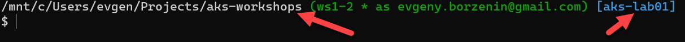

# lab-02 - setting up your shell (bash or PowerShell) for better AKS/kubectl experience

## Estimated completion time - 15 min

When you work with several of Kubernetes instances it's important to understand which instance/context you are currently working against. This is especially important when you work with Production. Luckily, it's very easy to configure both bash and PowerShell to display the cluster name of the current context as part of the shell prompt line. 

## Goals

* configure the prompt of shell of your choice to display the current Kubernetes cluster context

## Task #1 - configure your PowerShell prompt

Install Posh-Git and Oh-My-Posh

```PowerShell
Install-Module posh-git -Scope CurrentUser
Install-Module oh-my-posh -Scope CurrentUser
Install-Module -Name PSReadLine -AllowPrerelease -Scope CurrentUser -Force -SkipPublisherCheck
```

Edit your profile by running `code $PROFILE` or `notepad $PROFILE`  and add these lines to the end:

```PowerShell
Import-Module posh-git
Import-Module oh-my-posh
Set-Theme Material
```

save the file and restart your PowerShell session.

Note, here I use `Material` because I like it, but you feel free to use other theme theme that makes you happy and use that theme's name here. Read more over [here](https://github.com/JanDeDobbeleer/oh-my-posh#themes).

Install a couple of Unix tools using [Chocolatey](https://chocolatey.org/install). We wil use them to parse the Kubernetes config file.

```PowerShell
choco install grep
choco install sed
```

Locate the themes settings file by typing:

```PowerShell
$ThemeSettings

CurrentUser          : evgen
CurrentThemeLocation : C:\Users\evgen\Documents\PowerShell\Modules\oh-my-posh\2.0.492\Themes\Material.psm1
CurrentHostname      : DESKTOP-FOOBAR
ErrorCount           : 0
PromptSymbols        : {RootSymbol, UNCSymbol, PromptIndicator, SegmentBackwardSymbol…}
GitSymbols           : {OriginSymbols, AfterStashSymbol, BranchIdenticalStatusToSymbol, BeforeStashSymbol…}
Colors               : {WithForegroundColor, GitDefaultColor, CommandFailedIconForegroundColor, WithBackgroundColor…}
MyThemesLocation     : C:\Users\evgen\Documents\PowerShell\PoshThemes
Options              : {PreserveLastExitCode, OriginSymbols, ConsoleTitle}

```

use the value of `CurrentThemeLocation` variable and edit that file (in my case that was `code C:\Users\evgen\Documents\PowerShell\Modules\oh-my-posh\2.0.496\Themes\Material.psm1`). Add the following lines after line 44 that will retrieve the Kubernetes context and stuff it inside the prompt. Note that it might be a different location inside this file if you use different theme.

```PowerShell
...
$K8sContext=$(Get-Content ~/.kube/config | grep "current-context:" | sed "s/current-context: //")
If ($K8sContext) {
    $prompt += Write-Prompt -Object " [$K8sContext]" -ForegroundColor $sl.Colors.PromptSymbolColor
}
...
```

Save the file and restart Powershell session. Now your should have a pretty prompt that shows you you active cluster context.


Note that as a free bonus, most of the posh themes show you the status of you git repository as well!

For even better experience, you should install the [Cascadia code fonts](https://github.com/microsoft/cascadia-code#installation).

## Task #2 - configure your bash prompt

If you are running Linux or mac or [Windows Subsystem for Linux (WSL)](https://docs.microsoft.com/en-us/windows/wsl/install-win10?WT.mc_id=AZ-MVP-5003837), then here is how you can configure your prompt to display the name of the cluster of your current Kubernetes context. 

Go to your home folder

```bash
cd

#or

cd $HOME
```

Edit `.bashrc` file with editor you normally use and add the following code to the end of the file

```bash

# Kubernetes info
#----------------
generate_kube_info() {
    context=`kubectl config current-context 2>/dev/null`
    if test -n "$context"; then
      namespace=`kubectl config view --template "{{range .contexts}}{{if eq .name \"$context\"}}{{.context.namespace}}{{end}}{{end}}"  2>/dev/null  | grep -v '<no value>'`
      if test -n "$namespace"; then
        context="$context/$namespace"
      fi
    fi
    echo $context
}
# kube info
#---------
kube_info() {
    local BLUE="\[\033[0;36m\]"
    local BLACK="\[\033[0;39m\]"
    if test -f ~/.kube/config; then
        test -d ~/.cache || mkdir ~/.cache
        test -f ~/.cache/kubectx -a ~/.cache/kubectx -nt ~/.kube/config || generate_kube_info >~/.cache/kubectx
        kubectx=`cat ~/.cache/kubectx`
        if test -n "$kubectx"; then
            echo " ${BLUE}[${kubectx}]${BLACK}"
        else
            echo ""
        fi
    else
        echo ""
    fi
}
# Git info
#---------
export GIT_PS1_SHOWDIRTYSTATE=1
gitinfo() {
    if [ "\$(type -t __git_ps1)" ]; then # if we're in a Git repo, show current branch
        BRANCH="\$(__git_ps1 '[ %s ] ')"
        GITEMAIL=`git config user.email`
      __git_ps1 " \[\e[32m\](%s as $GITEMAIL)\[\e[39m\]"
    fi
}
# Set command prompt
#-------------------
prompt_command () {
    local lasterr=$?
    if [ $lasterr -eq 0 ]; then # set an error string for the prompt, if applicable
        ERRPROMPT=""
    else
        ERRPROMPT="\[\033[0;31m\]->($lasterr)\[\033[0;39m\]"
    fi
    export PS1="${debian_chroot:+$debian_chroot:}\w$(gitinfo)$(kube_info)$ERRPROMPT\n\\$ "
}
PROMPT_COMMAND=prompt_command
```

If you already customizing your prompt, you need to adjust/integrate this code into your current profile script.

Save the file and run

```bash
source .bashrc
```

Your prompt should now show both your git repository status (if you are inside git repo folder) and current cluster name



## Useful links

* [How to make a pretty prompt in Windows Terminal with Powerline, Nerd Fonts, Cascadia Code, WSL, and oh-my-posh](https://www.hanselman.com/blog/how-to-make-a-pretty-prompt-in-windows-terminal-with-powerline-nerd-fonts-cascadia-code-wsl-and-ohmyposh)
* [oh-my-posh themes](https://github.com/JanDeDobbeleer/oh-my-posh#themes)
* [Powershell prompt: How to display your current Kubernetes context](https://blog.guybarrette.com/powershell-prompt-how-to-display-your-current-kubernetes-context)

## Next: Containerizing your application

[Go to lab-03](../lab-03/readme.md)

## Feedback

* Visit the [Github Issue](https://github.com/evgenyb/aks-workshops/issues/3) to comment on this lab. 