# lab-03 - Containerizing your application

## Estimated completion time - xx min

To work with Kubernetes and learn `kubectl` commands we need a test application. I created the simplest default version of `ASP.NET Core Web API` app with `WeatherForecast` controller and extended it with a couple of additional controllers that we will need in later labs. During this lab you will add Docker support, will package application as Docker image, push image to the Azure Container Registry (ACR) and will run it in AKS. This application will be our `guinea pig` application we will use with all further labs.

## Goals

* Get familiar with our test web api application
* Add Docker support 
* Learn how to build docker image
* Learn how to build and push docker image to Azure Container Registry with Visual Studio, Docker and `az acr build` command 

## Prerequisites

First, check that the following prerequisites are installed:

* Install [Docker](https://docs.docker.com/docker-for-windows/install/)
* Check that Visual Studio `.NET Core cross-platform development` workload is installed. If you already have VS installed, you can modify it from `Visual Studio Installer`. If you do a fresh install, you can select workloads during installation. 


## Task #1 - open and build application

Use Visual Studio Community edition and open `app\apps.sln` solution. 
If you prefer to use other IDE, like Rider or VS Code, feel free to use them as long as you can follow along. Note, some of the VS functionality will not be available, but you can add files, generated by Visual Studio manually.

Now, build `Ctrl+Shift+B` and run your application. It should open the following URL `http://localhost:5000/WeatherForecast` in your default browser and show the json, with list of weather forecast items.
If it doesn't build, check the errors, fix them and build again.

## Task #2 - add Docker support

To add Docker support to your web api app, right-click the `api-a` project, navigate to `Add`, and select `Docker Support`.

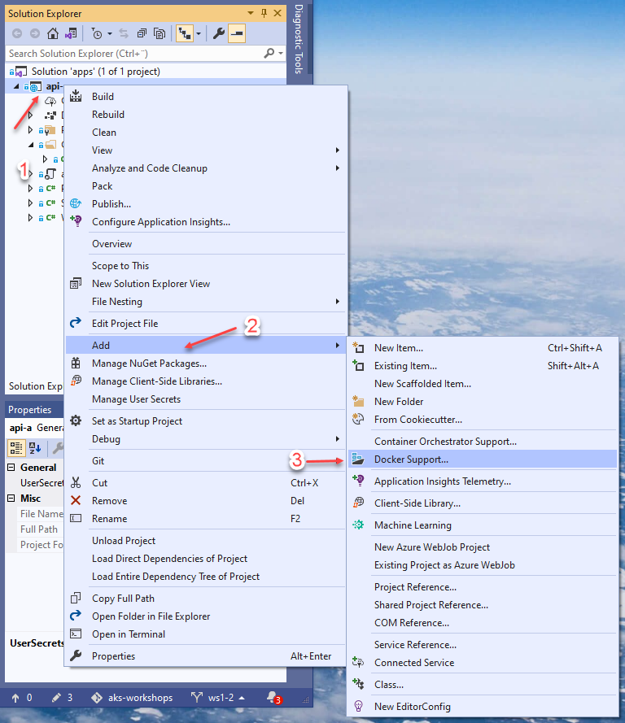

Make sure that `Linux` is selected and click `OK`.

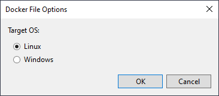

Visual Studio will create a `Dockerfile` for you, which defines how to create the container image for your web api project. It will also add new execution profile called `Docker`

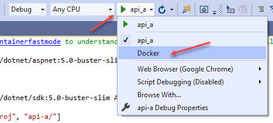

If you select it and run the application, it will be running in the Docker.

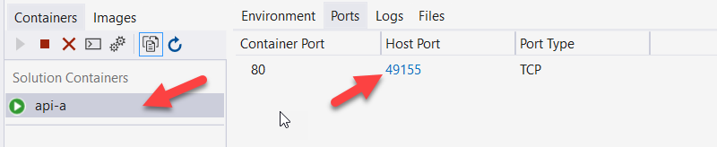

Once you have tested our application and it works, you can package it as a container image and publish it to the Azure Container Registry. There are multiple ways it can be done, so let's try three most common once.

## Task #3 - publish `api-a` container to a Azure Container Registry using Visual Studio

 The simplest way to Publish your image is to use Visual Studio click-ops:

1. Right-click your project in Solution Explorer and choose `Publish`.
2. On the Publish dialog, select `Docker Container Registry`.

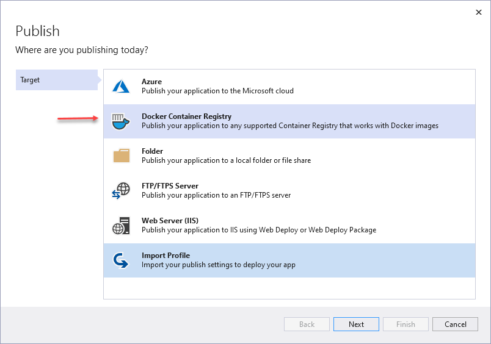

3. Choose Create New Azure Container Registry.

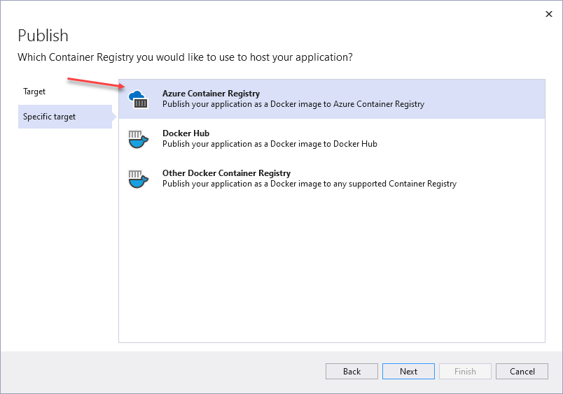

4. Fill in your desired values in the `Azure Container Registry` screen. At this step, you may be asked to login to your Azure account.

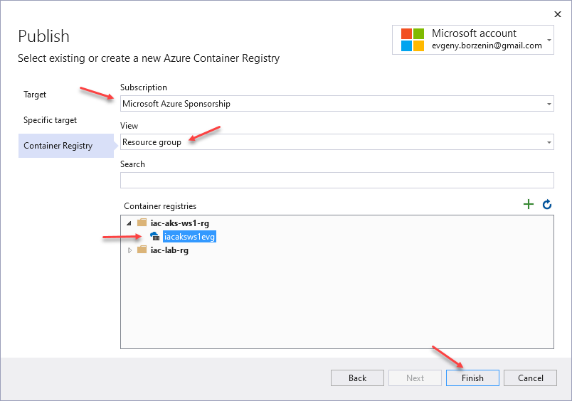

If you follow our naming convention, the resource group name will be `iac-aks-ws1-rg` and ACR name will be `iacaksws1<YOU-NAME>acr`.

5. When all is set, click `Publish`

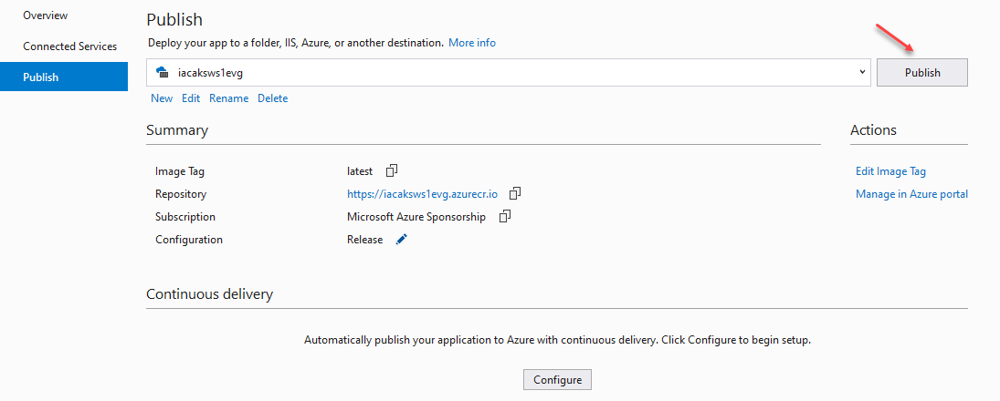

Visual Studio will now build and push container to the ACR registry. 

6. Check ACR registry at the Azure portal

Navigate to Azure portal and search for your ACR. You can use search at the top of the portal 

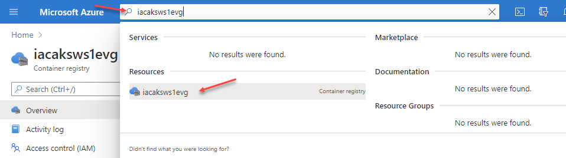

Navigate to `Repositories`, select repository `apia` and choose `latest` image. 

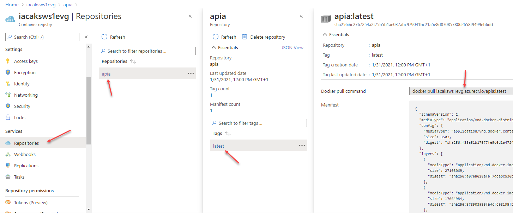

Here you can find metadata about container image, image url and example of command how to pull it with Docker.

## Task #4 - build and publish image with Docker command

Alternative to Visual Studio, you can Publish image using Docker.
Run the following command from within `api-a` project folder.

```bash
# Use the Dockerfile to build a new apia image.
docker build -t apia:1.0.0 -f Dockerfile ..

# Get list of available images, check that new image is in the list
docker image list
```

After building the image, use Docker to verify that it works as expected.

```bash
# Start an instance of your newly created docker image.
docker run -d apia:1.0.0

# Use docker ps to get the container's ID
docker ps

docker ps
CONTAINER ID   IMAGE                COMMAND               CREATED          STATUS          PORTS                   NAMES
41413d9e8c9d   apia:1.0.0           "dotnet api-a.dll"    19 seconds ago   Up 18 seconds   80/tcp                  awesome_montalcini
76ba439c94a4   apia:dev             "tail -f /dev/null"   18 minutes ago   Up 18 minutes   0.0.0.0:49154->80/tcp   api-a
```

And finally, Push the Image to ACR

```bash
# login to ACR
az acr login --name iacaksws1<YOU-NAME>acr
Login Succeeded

# Use docker tag to create an alias of the image with the fully qualified path to your ACR registry.
docker tag apia:1.0.0 iacaksws1<YOU-NAME>acr.azurecr.io/apia:1.0.0

# Now that you've tagged the image with the fully qualified path to your private registry, you can push it to the registry with docker push
docker push iacaksws1<YOU-NAME>acr.azurecr.io/apia:1.0.0
```
If command runs successful, check the ACR at the Azure portal. Now `apia` repository should have 2 tags of the `apia` image.

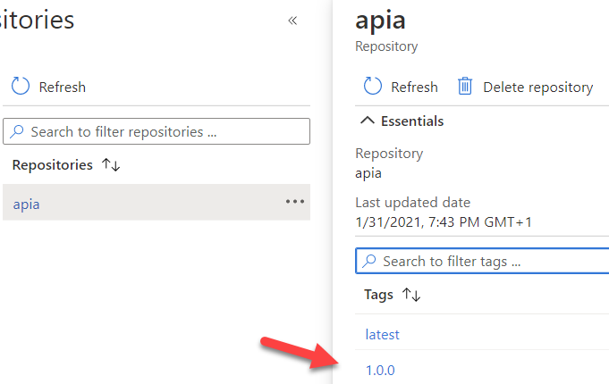


## Task #5 - build and publish container images with `az acr build` command

Yet another way you can build and push your images is by using [az acr build](https://docs.microsoft.com/en-us/cli/azure/acr?view=azure-cli-latest&WT.mc_id=AZ-MVP-5003837#az_acr_build) cli command. To do so, run the following command from within the `api-a` project folder. Note, that this time we used `:v1` as a image version.

```bash
az acr build --registry iacaksws1<YOU-NAME>acr --image apia:v1 --file Dockerfile ..
```
If command runs successful, check the ACR at the Azure portal. Now `apia` repository should have 3 tags of the `apia` image.

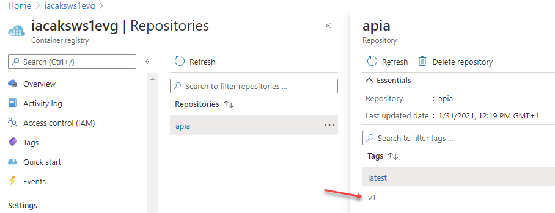

## Useful links

* [Visual Studio 2019 Community Edition](https://visualstudio.microsoft.com/downloads/?WT.mc_id=AZ-MVP-5003837)
* [Download .NET 5.0](https://dotnet.microsoft.com/download/dotnet/5.0?WT.mc_id=AZ-MVP-5003837)
* [Create your first Docker container with an ASP.NET web app](https://tutorials.visualstudio.com/aspnet-container/containerize?WT.mc_id=AZ-MVP-5003837)
* [Visual Studio Container Tools with ASP.NET Core](https://docs.microsoft.com/en-us/aspnet/core/host-and-deploy/docker/visual-studio-tools-for-docker?view=aspnetcore-5.0&WT.mc_id=AZ-MVP-5003837)
* [Container Tools in Visual Studio](https://docs.microsoft.com/en-us/visualstudio/containers/?view=vs-2019&WT.mc_id=AZ-MVP-5003837)
* [How to configure Visual Studio Container Tools](https://docs.microsoft.com/en-us/visualstudio/containers/container-tools-configure?view=vs-2019&WT.mc_id=AZ-MVP-5003837)
* [az acr build command](https://docs.microsoft.com/en-us/cli/azure/acr?view=azure-cli-latest&WT.mc_id=AZ-MVP-5003837#az_acr_build)
* [Push your first image to a private Docker container registry using the Docker CLI](https://docs.microsoft.com/en-us/azure/container-registry/container-registry-get-started-docker-cli?WT.mc_id=AZ-MVP-5003837)

## Next: Creating, managing and testing pods

[Go to lab-04](../lab-04/readme.md)
