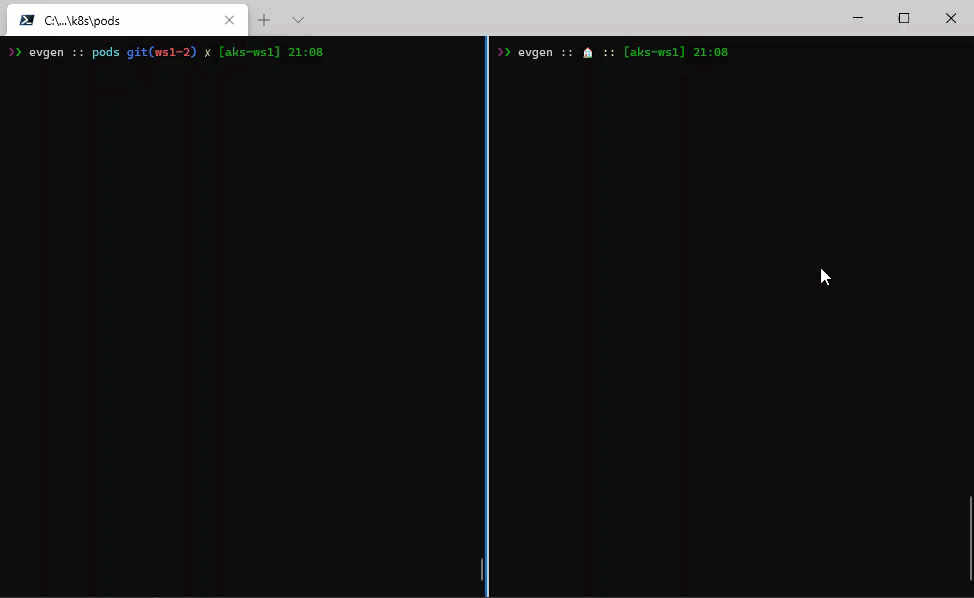

# lab-04 - Creating, managing and testing pods

## Estimated completion time - xx min

At the core of Kubernetes is the Pod. Pods represent a logical application and hold a collection of one or more containers. 

## Goals

In this lab you will learn how to:

* run application at AKS
* get list of pods
* get detailed information about the pod
* get pod description
* delete pods
* run pod as interactive shell for testing and debugging your apps
* get logs from the pod
* create pod from yaml definition file
* use port forward to test pod

## Task #0 - (only for Windows users) - setting up Windows Terminal

For the most of the labs, I recommend you to use Windows Terminal, because it allows to split Terminal windows in two (and more) sessions. One will be be used to run all commands included into the labs. In the second window you will run `kubectl get ... -w` command in watching mode and you will get a realtime feedback about what kubernetes does behind the scene.

You can install Windows Terminal from the [Microsoft Store](https://aka.ms/terminal). When installed, start it, maximize it (so you have enough space) and select shell of your choice.


To split current window, enter `Shift+Alt+D` and it will split your current window either vertically or horizontally:


In the right session run the "watcher" command:

```bash
# Watch what happens with pods
kubectl get pods -w
```

This command will be running and watching all state changes inside the cluster in regards to pods. 

At the left session you run all commands from the labs. 


## Task #1 - run image from ACR in AKS

Now that we published several versions of out application images into ACR, and our AKS cluster is integrated with ACR, we can run our application inside the AKS

```bash
# Run pod app-a
kubectl run app-a --image iacaksws1<YOU-NAME>acr.azurecr.io/apia:v1
pod/app-a created
```

As you can see, Kubernetes reporting that `pod` `app-a` was created.

Now, let's run another version of application (tagged with `:1.0.0`), this time let's call it `app-b`

```bash
# Run pod app-b
kubectl run app-b --image iacaksws1<YOU-NAME>acr.azurecr.io/apia:1.0.0
pod/app-b created
```

## Task #2 - get information about pods

To get all pods, use the following command

```bash
# List all pods 
kubectl get pod
NAME    READY   STATUS    RESTARTS   AGE
app-a   1/1     Running   0          5h18m
app-b   1/1     Running   0          13s
```

as you can see, there are 2 pods running. Both have status `Running` and `Ready` column contains `1/1`, which means that 1 out of 1 pods are in `Running` state. 
To get even more information about pods, use `-o wide` flag

```bash
# List all pods with expanded (aka "wide") output
kubectl get po -o wide
NAME    READY   STATUS    RESTARTS   AGE     IP            NODE                                NOMINATED NODE   READINESS GATES
app-a   1/1     Running   0          5h21m   10.244.0.9    aks-nodepool1-95835493-vmss000000   <none>           <none>
app-b   1/1     Running   0          2m49s   10.244.0.10   aks-nodepool1-95835493-vmss000000   <none>           <none>
```

as you can see, now report contains additional information about pods, such as IP address and node name where pods were created.

## Task #3 - get detailed information about pod 

You can get information about one concrete pod by running 

```bash
# Get pod app-a
kubectl get po app-a

# Note, I used `po` instead of `pod`. This is alias that you can use to save some keystrokes. Another alias is `pods` :)
# Get app-a pod with expanded (aka "wide") output
kubectl get po app-a -o wide

# Describe pod with verbose output
kubectl describe pod app-a

# Get pod app-a definition as YAML
kubectl get po app-a -o yaml

# Get pod app-a definition json
kubectl get po app-a -o json
```

## Task #4 - testing within cluster with interactive shell. Option #1

Quite often you need to test application from within your cluster. Because cluster is running inside it's own Virtual Network, nothing is accessible from your PC. 
Let's try to ping of the running `app-a|b|c` pods.

```bash
# Get pods IP addresses
kubectl get po -o wide
NAME    READY   STATUS    RESTARTS   AGE     IP            NODE                                NOMINATED NODE   READINESS GATES
app-a   1/1     Running   0          27h     10.244.0.9    aks-nodepool1-95835493-vmss000000   <none>           <none>
app-b   1/1     Running   0          21h     10.244.0.10   aks-nodepool1-95835493-vmss000000   <none>           <none>
app-c   1/1     Running   0          21h     10.244.0.11   aks-nodepool1-95835493-vmss000000   <none>           <none>

# try to ping `app-a`
ping 10.244.0.9

Pinging 10.244.0.9 with 32 bytes of data:
Request timed out.
```

How can we test our application? One common solution is to run a test pod that you can attach to and run interactive shell commands from inside the pod. There are several well known images for such a tasks, one of them called [busybox](https://busybox.net/), but the image we will use is [busyboxplus:curl](https://hub.docker.com/r/radial/busyboxplus). This is because it contains `curl` command that need for our testing. 

```bash
# Run pod as interactive shell
kubectl run curl -i --tty --rm --restart=Never --image=radial/busyboxplus:curl -- sh
# Here is prompt from withing the pod
[ root@curl:/ ]$ 

# Now, try to ping the same IP
[ root@curl:/ ]$ ping 10.244.0.9
PING 10.244.0.9 (10.244.0.9): 56 data bytes
64 bytes from 10.244.0.9: seq=0 ttl=64 time=0.134 ms
64 bytes from 10.244.0.9: seq=1 ttl=64 time=0.095 ms
64 bytes from 10.244.0.9: seq=2 ttl=64 time=0.094 ms
^C
--- 10.244.0.9 ping statistics ---
3 packets transmitted, 3 packets received, 0% packet loss
round-trip min/avg/max = 0.094/0.107/0.134 ms

# Exit from the pod
[ root@curl:/ ]$ exit
pod "curl" deleted
```

Couple of things to mention here:

1. As expected, IP address is now accessible from inside the pod. 
2. The `curl` pod was deleted when we exit. This is because of  `--rm` flag that tells Kubernetes to delete pod created by this command.

## Task #5 - deploy `apia` image using yaml pod definition 

Now, create new `app-d-pod.yaml` file with the following content

```yaml
apiVersion: v1
kind: Pod
metadata:
  name: app-d
spec:
  containers:
  - name: app-d
    image: iacaksws1<YOU-NAME>acr.azurecr.io/apia:v1
    imagePullPolicy: IfNotPresent
    resources: {}
  restartPolicy: Always
```

Now deploy it using [kubectl apply](https://kubernetes.io/docs/reference/generated/kubectl/kubectl-commands#apply) command

```bash
# deploy app-a pod
kubectl apply -f app-d-pod.yaml
pod/app-d created
```

## Task #6 - test your application

As we already know, we can't just test our application, because it's not accessible from our PC. We need to run our `curl` pod with interactive shell and do all testing from there.

```bash
# Get IP address of the app-a pod
kubectl get po app-a -o wide
NAME    READY   STATUS    RESTARTS   AGE   IP            NODE                                NOMINATED NODE   READINESS GATES
app-a   1/1     Running   0          14m   10.244.0.34   aks-nodepool1-95835493-vmss000000   <none>           <none>

# Start our test `curl` pod
kubectl run curl -i --tty --rm --restart=Never --image=radial/busyboxplus:curl -- sh

# test http://10.244.0.34/weatherforecast endpoint
[ root@curl:/ ]$ curl http://10.244.0.34/weatherforecast
[{"date":"2021-02-04T08:10:55.4596813+00:00","temperatureC":-1,"temperatureF":31,"summary":"Balmy"},{"date":"2021-02-05T08:10:55.4613436+00:00","temperatureC":23,"temperatureF":73,"summary":"Chilly"},{"date":"2021-02-06T08:10:55.461347+00:00","temperatureC":30,"temperatureF":85,"summary":"Cool"},{"date":"2021-02-07T08:10:55.4613473+00:00","temperatureC":30,"temperatureF":85,"summary":"Freezing"},{"date":"2021-02-08T08:10:55.4613475+00:00","temperatureC":22,"temperatureF":71,"summary":"Warm"}]

# exit from the pod
[ root@curl:/ ]$ exit
pod "curl" deleted
```

## Task #7 - get pod logs

You can dump pod logs by running [kubectl logs](https://kubernetes.io/docs/reference/generated/kubectl/kubectl-commands#logs) command

```bash
# dump pod logs (stdout)
kubectl logs app-a
info: Microsoft.Hosting.Lifetime[0]
      Now listening on: http://[::]:80
info: Microsoft.Hosting.Lifetime[0]
      Application started. Press Ctrl+C to shut down.
info: Microsoft.Hosting.Lifetime[0]
      Hosting environment: Production
info: Microsoft.Hosting.Lifetime[0]
      Content root path: /app
```

You can also stream logs by using `-f` flag. You can stop "watching" command in the right session and run the following command 

```bash
# Stream logs from pod app-a
kubectl logs app-a -f
info: Microsoft.Hosting.Lifetime[0]
      Now listening on: http://[::]:80
info: Microsoft.Hosting.Lifetime[0]
      Application started. Press Ctrl+C to shut down.
info: Microsoft.Hosting.Lifetime[0]
      Hosting environment: Production
info: Microsoft.Hosting.Lifetime[0]
      Content root path: /app
```

Now repeat Task #6 inside the left window, this time repeat `curl http://...` command several times and observe the right "monitoring" session, you should see new logs coming.

```bash
# Get IP address of the app-a pod
kubectl get po app-a -o wide
NAME    READY   STATUS    RESTARTS   AGE   IP            NODE                                NOMINATED NODE   READINESS GATES
app-a   1/1     Running   0          14m   10.244.0.34   aks-nodepool1-95835493-vmss000000   <none>           <none>

# Start our test `curl` pod
kubectl run curl -i --tty --rm --restart=Never --image=radial/busyboxplus:curl -- sh

# test http://10.244.0.34/weatherforecast endpoint
[ root@curl:/ ]$ curl http://10.244.0.34/weatherforecast
[ root@curl:/ ]$ curl http://10.244.0.34/weatherforecast
[ root@curl:/ ]$ curl http://10.244.0.34/weatherforecast
[ root@curl:/ ]$ curl http://10.244.0.34/weatherforecast
[ root@curl:/ ]$ curl http://10.244.0.34/weatherforecast

# exit from the pod
[ root@curl:/ ]$ exit
pod "curl" deleted
```



## Task #8 - use Port Forwarding to test your application in a cluster

Here is another technique you can use to test your applications. It's called [Port Forwarding](https://kubernetes.io/docs/tasks/access-application-cluster/port-forward-access-application-cluster/) and it allows you to access and interact with internal Kubernetes cluster processes from your localhost. The following command will start listening on port 7000 on the local machine and forward traffic to port 80 on `app-a` running in the cluster

```bash
# Listen on port 7000 on the local machine and forward to port 80 on app-a
kubectl port-forward app-a 7000:80
Forwarding from 127.0.0.1:7000 -> 80
Forwarding from [::1]:7000 -> 80
```

Now open new terminal (or split your current windows with `Shift+Alt+D`). In new terminal run the following command

```bash
curl http://localhost:7000/weatherforecast
[{"date":"2021-02-01T21:45:40.0602016+00:00","temperatureC":19,"temperatureF":66,"summary":"Warm"},{"date":"2021-02-02T21:45:40.0621127+00:00","temperatureC":30,"temperatureF":85,"summary":"Scorching"},{"date":"2021-02-03T21:45:40.0621165+00:00","temperatureC":-16,"temperatureF":4,"summary":"Sweltering"},{"date":"2021-02-04T21:45:40.0621169+00:00","temperatureC":45,"temperatureF":112,"summary":"Mild"},{"date":"2021-02-05T21:45:40.0621171+00:00","temperatureC":18,"temperatureF":64,"summary":"Sweltering"}]
```

## Task #9 - delete pod

To delete pod use [kubectl delete](https://kubernetes.io/docs/reference/generated/kubectl/kubectl-commands#delete) command. There are several ways you can delete pod, here are two common one:

```bash
# Delete single pod
kubectl delete pod app-a
pod "app-a" deleted

# Delete a pod using the type and name specified in app-d-pod.yaml
kubectl delete -f app-d-pod.yaml
pod "app-d" deleted
```

## Useful links

* [Kubernetes Pods](https://kubernetes.io/docs/concepts/workloads/pods/)
* [kubectl Cheat Sheet](https://kubernetes.io/docs/reference/kubectl/cheatsheet/)
* [kubectl apply](https://kubernetes.io/docs/reference/generated/kubectl/kubectl-commands#apply)
* [kubectl run](https://kubernetes.io/docs/reference/generated/kubectl/kubectl-commands#run)
* [kubectl delete](https://kubernetes.io/docs/reference/generated/kubectl/kubectl-commands#delete)
* [kubectl logs](https://kubernetes.io/docs/reference/generated/kubectl/kubectl-commands#logs)
* [kubectl exec](https://kubernetes.io/docs/reference/generated/kubectl/kubectl-commands#exec)
* [Interacting with running Pods](https://kubernetes.io/docs/reference/kubectl/cheatsheet/#interacting-with-running-pods)
* [Formatting output](https://kubernetes.io/docs/reference/kubectl/cheatsheet/#formatting-output)
* [Use Port Forwarding to Access Applications in a Cluster](https://kubernetes.io/docs/tasks/access-application-cluster/port-forward-access-application-cluster/)

## Next: Readiness and Liveness probes

[Go to lab-05](../lab-05/readme.md)