# lab-xx - AKS Kubernetes resources at the Azure portal

## Estimated completion time - xx min

The Azure portal includes a Kubernetes resource view for easy access to the Kubernetes resources in your Azure Kubernetes Service (AKS) cluster. Viewing Kubernetes resources from the Azure portal reduces context switching between the Azure portal and the kubectl command-line tool, streamlining the experience for viewing and editing your Kubernetes resources. The resource viewer currently includes multiple resource types, such as deployments, pods, and replica sets.

## Goals

In this lab you will learn how to:

* view Kubernetes resource from the Azure portal
* edit resource yaml definition 
* deploy an application
* apply the same change to `logging-appsettings` Configmap as we did at [lab-08](../lab-08/readme.md)
* scale up Deployment

## Task #1 - view workloads

Go to the Azure portal and find your `aks-ws1` cluster. All Kubernetes resource available from the Portal grouped under `Kubernetes resources` pane. 

Navigate to `Workloads` and select `default` namespace.

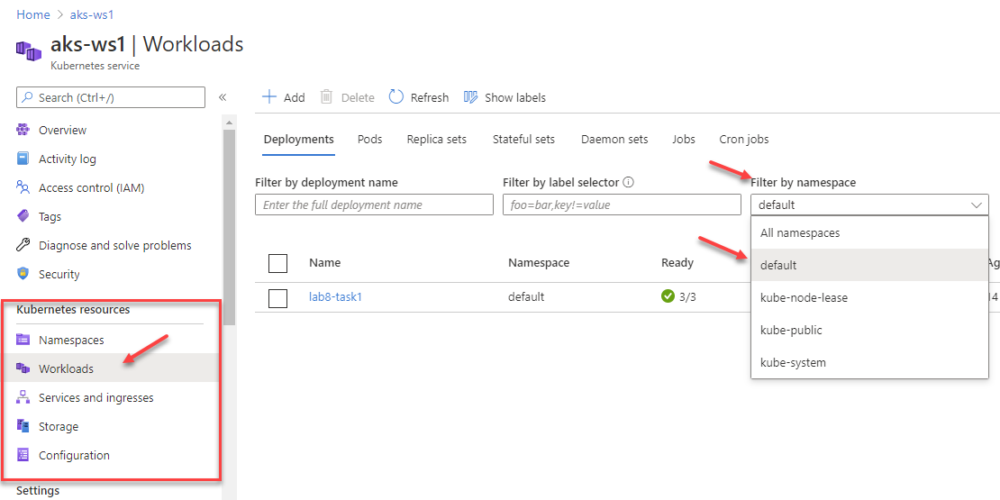

By default, you will see all deployments, but you can switch between `Deployments`, `Pods`, `ReplicaSets` etc...

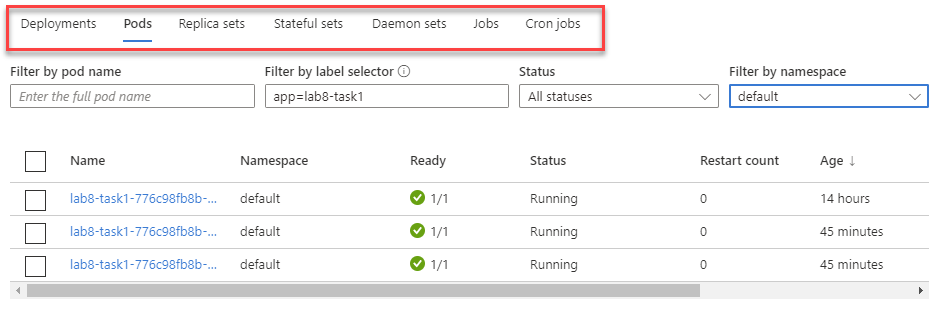

For example, if you want to see all pods from the same deployment, you can go to the `Pods` tab and filter by label. Set the following selector inside `Filter by label selector` field - `app=lab8-task1` and you should see all pods included into this deployment.

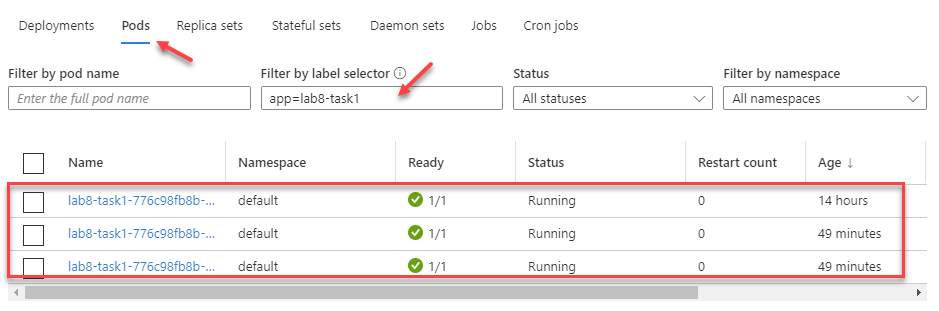

## Task #2 - manage Deployments

Navigate back to `Deployment` tab and click `+ Add` button.

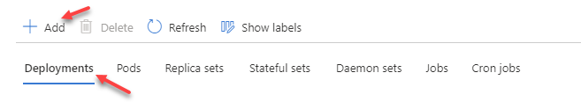

Paste the following yaml definition into the editor window. As always, don't forget to replace `iacaksws1<YOU-NAME>acr` with your ACR name.

```yaml
apiVersion: apps/v1
kind: Deployment
metadata:
  name: lab9-task1
  labels:
    app: lab9-task1
spec:
  replicas: 3
  selector:
    matchLabels:
      app: lab9-task1
  template:
    metadata:
      labels:
        app: lab9-task1
    spec:
      containers:
      - name: api
        image: iacaksws1<YOU-NAME>acr.azurecr.io/apia:v1
        imagePullPolicy: IfNotPresent
        resources: {}
        livenessProbe:
          httpGet:
            path: /health
            port: 80
          initialDelaySeconds: 3
          periodSeconds: 3    
        readinessProbe:
          httpGet:
            path: /readiness
            port: 80
          initialDelaySeconds: 3
          periodSeconds: 3
```

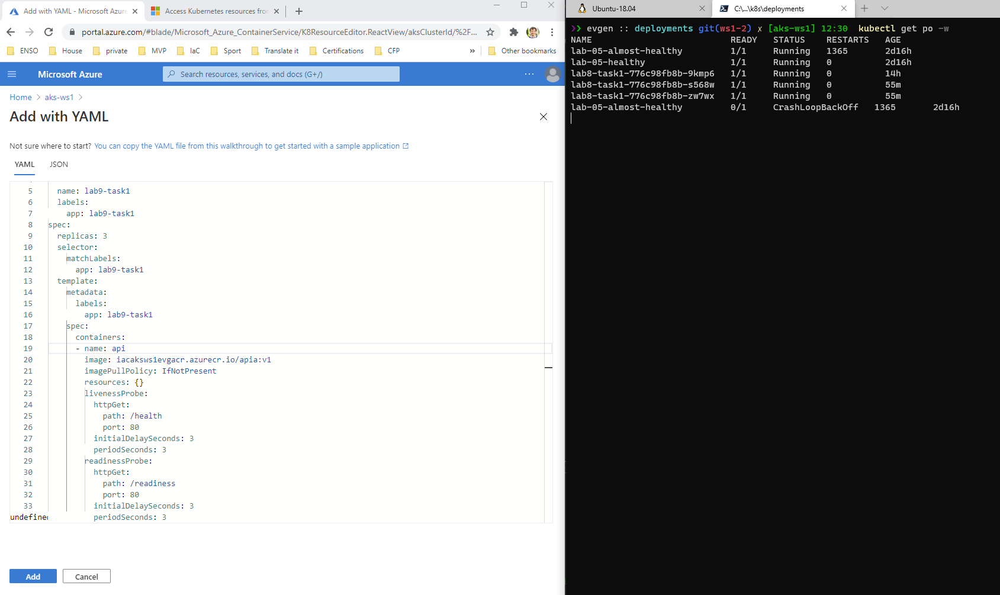

Click `Add`. Eventually, new Deployment will be created and UI will be updated 

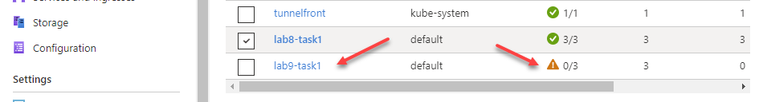


## Task #3 - Scale up Deployment

You can scale up or down you Deployment from the portal. Open `lab9-task1` Deployment and open `YAML`. Find and change `.spec.replicas` field to 5 and click `Review and save`. 

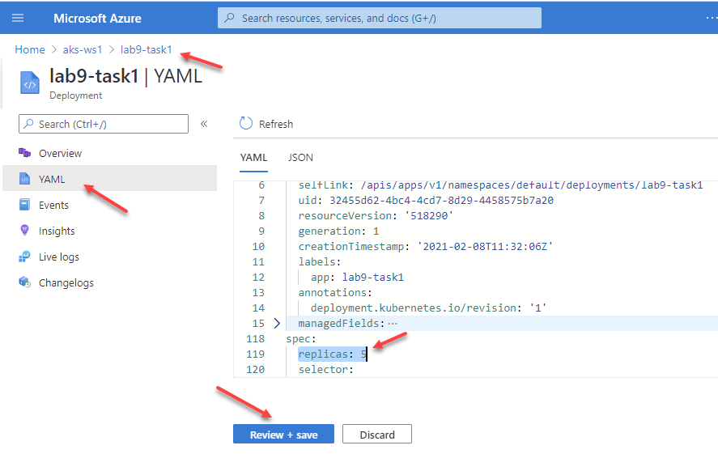

You will see a nice change review UI where you can see what will be changed. If you are happy, set `Confirm manifest changes` and click `Save`.

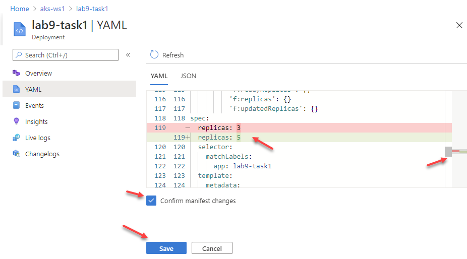

If you go to `Events`, you can find last scale up event at the list of events.

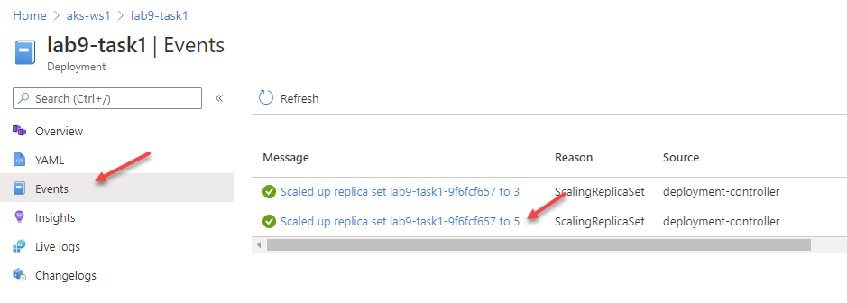

You can see live log stream from the portal. Navigate to `Live logs`, select one of the pods to monitor.

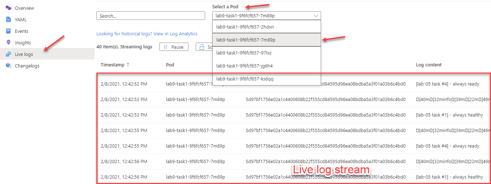


## Task #4 - working with ConfigMap

Both Config Maps and Secrets are available under `Configuration` pane.

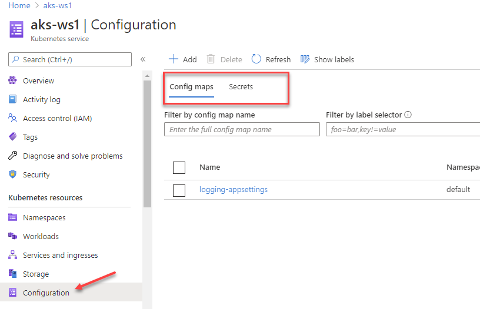

If you want to change `logging-appsettings` config map, select it, open `YAML`, edit yaml definition and click `Review and save`

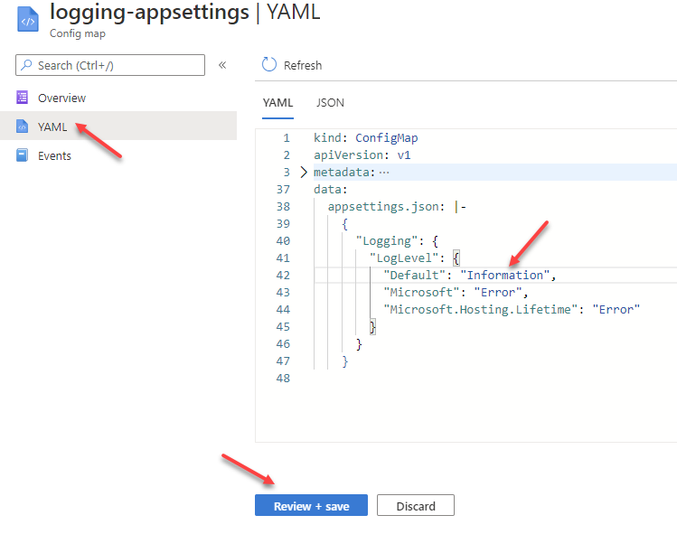

## Task #5 - view secret-appsettings Secret content

Open `secret-appsettings` secret

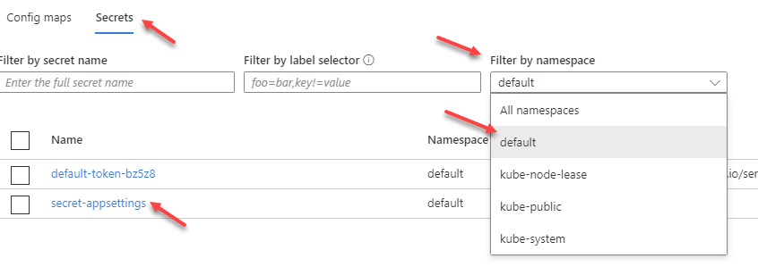

If you want to see decoded content of the secret data item, click to `Hide/Show` icon.

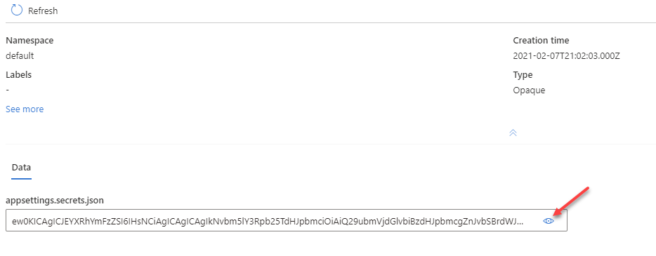

now content is decoded and you can check if it contains the correct value.


## Useful links

* [Access Kubernetes resources from the Azure portal](https://docs.microsoft.com/en-us/azure/aks/kubernetes-portal?WT.mc_id=AZ-MVP-5003837)

## Next: Cleaning up
[Go to lab-10](../lab-10/readme.md)
