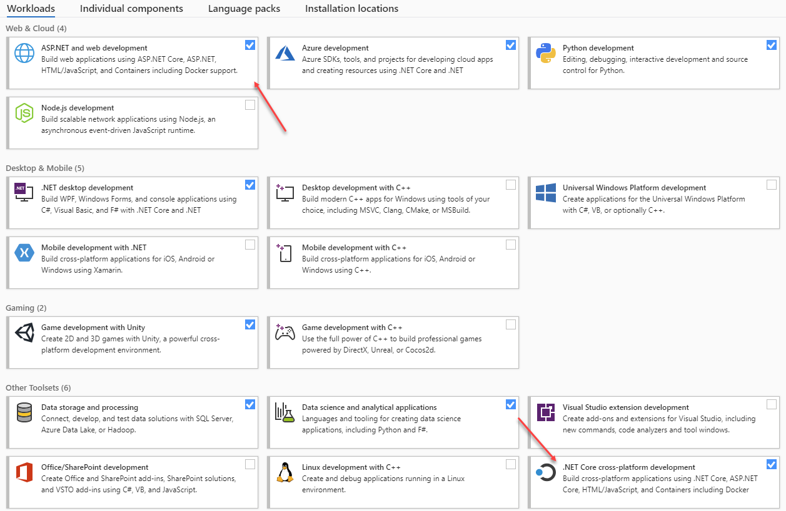

# Prerequisites

## Laptop

Of course you need an laptop. OS installed at this laptop doesn't really matter. The tools we will use all work cross platforms. I will be using Windows 10 with ubuntu (WSL) as a shell.

## Microsoft Teams

Download and install [Microsoft Teams](https://products.office.com/en-US/microsoft-teams/group-chat-software)

## Visual Studio Community Edition

Please download and install Visual Studio Community edition. 
[Download Visual Studio Code](https://visualstudio.microsoft.com/downloads/) and make sure that `ASP.NET and web development` and `.NET Core cross-platform development` workloads are installed. If you have already installed Visual Studio, you can modify workload set from `Visual Studio Installer`.



## Windows Terminal

Download and install [Windows Terminal](https://www.microsoft.com/en-us/p/windows-terminal/9n0dx20hk701?activetab=pivot:overviewtab&atc=true)

## Download and Install .NET 5.0

Download and install [.NET 5.0](https://dotnet.microsoft.com/download/dotnet/5.0)

## Docker

Download and install [Docker for Windows](https://docs.docker.com/docker-for-windows/install/)

## Active Azure account

If you don't have an Azure account, please create one before the workshop.
[Create your Azure free account](https://azure.microsoft.com/en-us/free/)

## Install `az cli`

Download and install latest version of `az cli` from this link  
[Install the Azure CLI](https://docs.microsoft.com/en-us/cli/azure/install-azure-cli?view=azure-cli-latest&WT.mc_id=AZ-MVP-5003837)

## Test your azure account with `az cli`

Open your terminal (bash, cmd or powershell) and login to your azure account by running this command

```bash
az login
```

You will be redirected to the browser where you will need to login with your azure account. Sometimes, you need to manually copy code and enter it at this page [https://microsoft.com/devicelogin](https://microsoft.com/devicelogin). Just follow the instructions.

```bash
$ az login
To sign in, use a web browser to open the page https://microsoft.com/devicelogin and enter the code DMBKTZBJL to authenticate.
```

Next (and this step is optional), you need to set your active subscription.
To get list of available subscriptions, use this command

```bash
az account list -o table
```
To set subscription use this command. You can use both subscription id or subscription name as value for `--subscription` argument.

```bash
az account set --subscription  xxxxxxxx-xxxx-xxxx-xxxx-xxxxxxxxxxxx
```

or

```bash
az account set --subscription subscription_name
```
