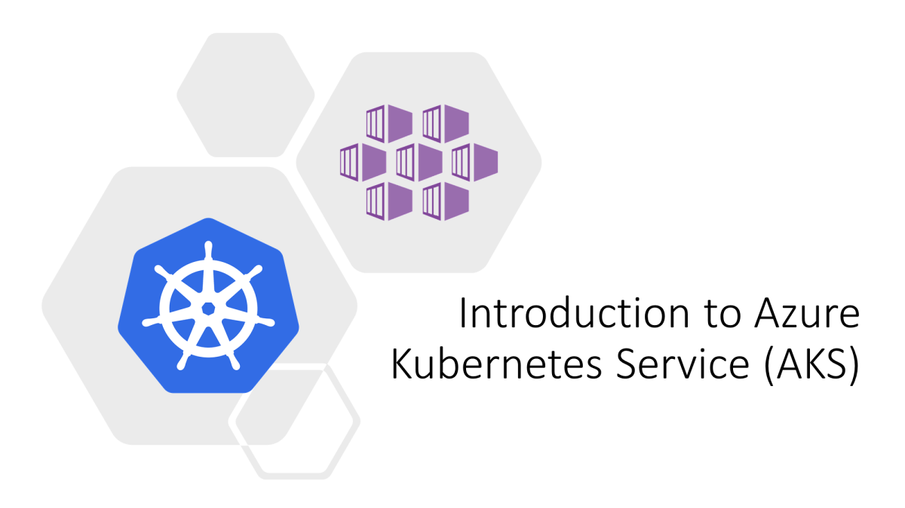

# Workshop #1 - AKS and Kubernetes 101

This is introduction level (101) workshop for those of you who have never worked with neither AKS nor Kubernetes. I expect that you have some basic understanding of containerization concept and know what docker and docker images are. 

This workshop covers the basics of using Kubernetes and you will learn how to:
 * Provision basic AKS cluster and integrate it with Azure Container Registry (ACR)
 * Take a simple dotnet api application and build it into a docker container
 * Use `kubectl` to deploy, configure, monitor, update and delete your apps 

Here is the agenda for the workshops:
 
 * Slides - Kubernetes and AKS introduction
 * [Lab-01](labs/lab-01/readme.md) - AKS setup
 * [Lab-02](labs/lab-02/readme.md) - setting up you shell for better AKS/kubectl experience
 * Slides - Introduce app
 * [Lab-03](labs/lab-03/readme.md) - Containerizing your application
 * Slides - Basic k8s Concepts 
 * [Lab-04](labs/lab-04/readme.md) - Creating, managing and testing pods
 * [Lab-05](labs/lab-05/readme.md) - Readiness and Liveness probes
 * [Lab-06](labs/lab-06/readme.md) - Deployments
 * Lab-07 - Creating and Managing Services
 * Lab-08 - Configmaps and secrets
 * [Lab-10](labs/lab-10/readme.md) - Cleaning up

## Links

* [Prerequisites](prerequisites.md)
