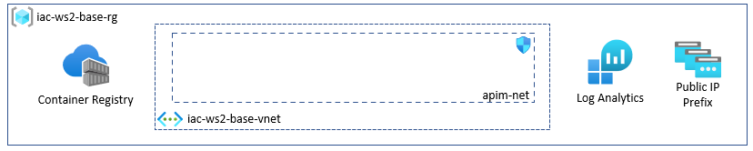

# lab-01 - provision supporting resources

## Estimated completion time - 15 min

We start by provisioning supporting resources such as Log Analytics, Application Insights, API Management, Container Registry and Public IP Prefix. Because supporting resources and AKS resources use different life cycle, they will be deployed to separate Resource Groups. API Management requires Private Virtual Network, we provision it as well.



## Goals

* Provision `Base` resource group
* Provision Private Virtual Network for APIM Management
* Provision Log Analytics workspace
* Provision Application Insight
* Provision Public IP Prefix

## Task #1 - provision supporting resources

We will use the following [naming conventions](../../naming-conventions.md)

Note, because Azure Log Analytics, Azure Container Registry and Azure KeyVault are global resource, they have to be named with unique name. I suggest we prefix them with your short name.

```bash
WS_PREFIX='iac-ws2'
YOUR_NAME='evg'                             # I am using "evg"
BASE_RG="$WS_PREFIX-base-rg"                # iac-ws2-base-rg
VNET_NAME=$WS_PREFIX-vnet                   # iac-ws2-vnet
LA_NAME="$WS_PREFIX-$YOUR_NAME-la"          # iac-ws2-evg-la
APPINSIGHTS_NAME="$WS_PREFIX-appinsights"   # iac-ws2-appinsights
PREFIX_NAME="$WS_PREFIX-pip-prefix"         # iac-ws2-pip-prefix
ACR_NAME="iacws2${YOUR_NAME}acr"            # iacws2evgacr

# Create base resource group
az group create -g $BASE_RG -l westeurope

# Create APIM VNet with AGW subnet
az network vnet create -g $BASE_RG -n $VNET_NAME --address-prefix 10.10.0.0/16 --subnet-name apim-net --subnet-prefix 10.10.0.0/27

# Create Public IP Prefix
az network public-ip prefix create --length 28 --location westeurope -n $PREFIX_NAME -g $BASE_RG

# Create AppInsight app
az monitor app-insights component create --app $APPINSIGHTS_NAME -l westeurope --kind web -g $BASE_RG --application-type web --retention-time 120

# Create Log Analytics
az monitor log-analytics workspace create -g $BASE_RG -n $LA_NAME

# Create Azure Container Registry
az acr create -g $BASE_RG -n $ACR_NAME --sku Basic
```

## Useful links

* [Azure Container Registry documentation](https://docs.microsoft.com/en-us/azure/container-registry/?WT.mc_id=AZ-MVP-5003837)
* [Overview of Log Analytics in Azure Monitor](https://docs.microsoft.com/en-us/azure/azure-monitor/logs/log-analytics-overview?WT.mc_id=AZ-MVP-5003837)
* [What is Application Insights?](https://docs.microsoft.com/en-us/azure/azure-monitor/app/app-insights-overview?WT.mc_id=AZ-MVP-5003837)
* [Public IP address prefix](https://docs.microsoft.com/en-us/azure/virtual-network/public-ip-address-prefix?WT.mc_id=AZ-MVP-5003837)
## Next: provision API Management

[Go to lab-02](../lab-02/readme.md)

## Feedback

* Visit the [Github Issue](https://github.com/evgenyb/aks-workshops/issues/15) to comment on this lab. 