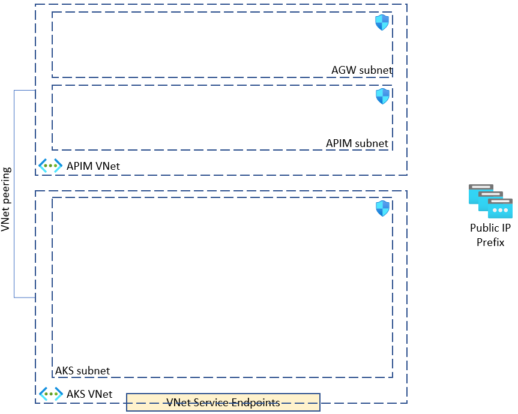

# lab-01 - AKS setup

## Estimated completion time - 15 min


* APIM Virtual Network
* AKS Virtual Network
* Peering between AKS and APIM VNets



## Goals

## Task #1 - create AKS resources

```bash
# Create base resource group
az group create -g iac-ws2-base-rg -l westeurope

# Create APIM VNet with AGW subnet
az network vnet create -g iac-ws2-base-rg -n iac-ws2-base-vnet --address-prefix 10.10.0.0/16 --subnet-name apim-net --subnet-prefix 10.10.0.0/27

# Create Public IP Prefix
az network public-ip prefix create --length 28 --location westeurope --name iac-ws2-pip-prefix -g iac-ws2-base-rg

# Create AKS resource group
az group create -g iac-ws2-aks-blue-rg -l westeurope 

# Create AKS Vnet
az network vnet create -g iac-ws2-aks-blue-rg -n iac-ws2-aks-blue-vnet --address-prefix 10.11.0.0/16 --subnet-name aks-net --subnet-prefix 10.11.0.0/20

# Get APIM Vnet Id
az network vnet show -g iac-ws2-base-rg -n iac-ws2-base-vnet --query id

# Establish VNet peering between from AKS VNet to APIM VNet
az network vnet peering create -g iac-ws2-aks-blue-rg -n aks-blue-to-base --vnet-name iac-ws2-aks-blue-vnet --remote-vnet "<APIM-VNET-ID>"

# Get AKS VNet ID
az network vnet show -g iac-ws2-aks-blue-rg -n iac-ws2-aks-blue-vnet --query id

# Establish VNet peering between from APIM VNet to AKS VNet
az network vnet peering create -g iac-ws2-base-rg -n base-to-aks-blue --vnet-name iac-ws2-base-vnet --remote-vnet "<AKS-VNET-ID>"

# Create AppInsight app
az monitor app-insights component create --app iac-ws2-appinsights --location westeurope --kind web -g iac-ws2-base-rg --application-type web --retention-time 120
```

## Useful links

* [Azure Container Registry documentation](https://docs.microsoft.com/en-us/azure/container-registry/?WT.mc_id=AZ-MVP-5003837)

## Next: 

[Go to lab-02](../lab-02/readme.md)

## Feedback

* Visit the [Github Issue](https://github.com/evgenyb/aks-workshops/issues/xx) to comment on this lab. 