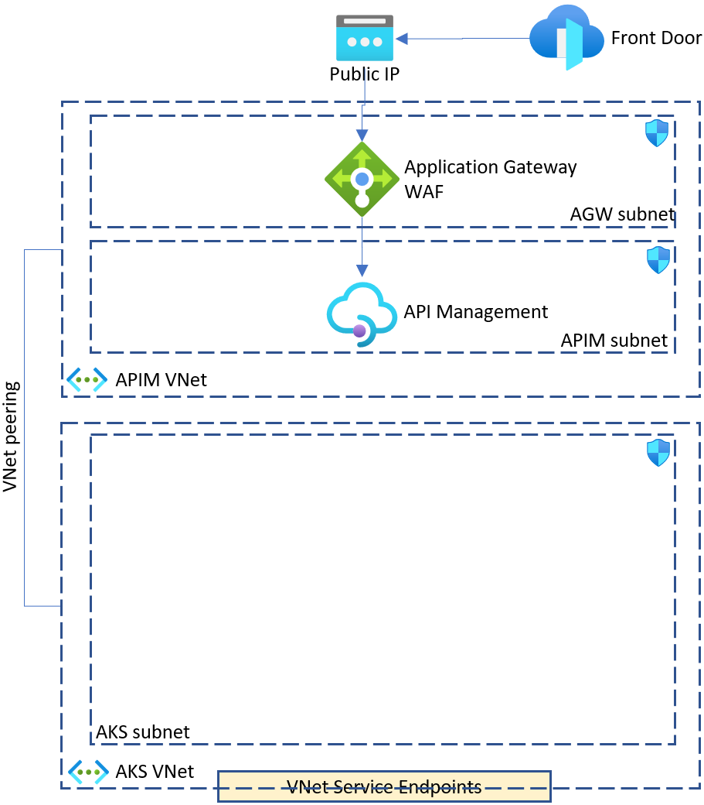

# lab-02 - ....

## Estimated completion time - 50 min




## Goals

## Task #1 - create AKS resources

```bash
# Validate APIM ARM template. Run this command from lab-02 folder
az deployment group validate -g iac-ws2-base-rg --template-file ARM/APIM/template.json --parameters ARM/APIM/parameters.json 

# If no errors, deploy APIM ARM template and create new APIM instance. APIM deployment takes approx. 50++ min
az deployment group create -g iac-ws2-base-rg --template-file ARM/APIM/template.json --parameters ARM/APIM/parameters.json 
```

## Useful links

* [Azure Container Registry documentation](https://docs.microsoft.com/en-us/azure/container-registry/?WT.mc_id=AZ-MVP-5003837)

## Next: 

[Go to lab-03](../lab-03/readme.md)

## Feedback

* Visit the [Github Issue](https://github.com/evgenyb/aks-workshops/issues/xx) to comment on this lab. 