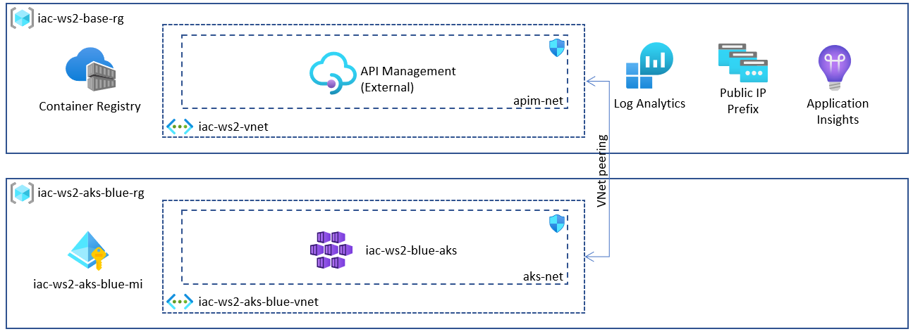

# lab-02 - provision AKS cluster

## Estimated completion time - 15 min

With supporting resource in place, we will configure and provision AKS. Our AKS cluster needs to fullfil the following requirements:

* Integrate AKS with Azure AD to implement Kubernetes RBAC based on a Azure AD identities
* Implement [advanced (aka Azure CNI)](https://docs.microsoft.com/en-us/azure/aks/concepts-network?WT.mc_id=AZ-MVP-5003837#azure-cni-advanced-networking) networking model
* Use [managed identities in AKS](https://docs.microsoft.com/en-us/azure/aks/use-managed-identity?WT.mc_id=AZ-MVP-5003837) to create additional resources like load balancers and managed disks in Azure
* Integrate AKS with Azure Log Analytics for monitoring
* Integrate AKS with Azure Container Registry



## Goals

* Provision `AKS` resource group
* Provision Private Virtual Network with subnet for AKS
* Establish peering between `base` VNet and `aks` VNet
* Provision User Assigned Managed Identity for AKS and Azure AD integration 
* Create new Azure AD group for AKS administrators
* Add your user into AKS admin Azure AD group

## Task #1 - create AKS resources

If you want to learn and provision resources yourself, follow the set of commands described in this lab. If you don't want to copy-paste all commands, feel free to use the script, located at `02-aks-advanced-configuration\scripts\02-provision-aks.sh` (which contains all these commands). 

If you use `PowerShell`, you need to prefix all variables with `$` when you initialize them, for example, instead of `YOUR_NAME="evg"`, use `$YOUR_NAME="evg"`. The line continuation character in `PowerShell` is the [backtick](https://www.computerhope.com/jargon/b/backquot.htm).

````
Replace \ with ` in "Create AKS cluster" command
````

```bash
# Set your user name for global resources (LogAnalytics, AppInsight, APIM etc...)
YOUR_NAME="evg"

# Create AKS resource group
az group create -g iac-ws2-blue-rg -l westeurope 

# Create AKS Vnet
az network vnet create -g iac-ws2-blue-rg -n iac-ws2-blue-vnet --address-prefix 10.11.0.0/16 --subnet-name aks-net --subnet-prefix 10.11.0.0/20

# Get base VNet Id
BASE_VNET_ID="$(az network vnet show -g iac-ws2-rg -n iac-ws2-vnet --query id -o tsv)"

# Establish VNet peering from AKS VNet to base VNet
az network vnet peering create -g iac-ws2-blue-rg -n aks-blue-to-base --vnet-name iac-ws2-blue-vnet --allow-vnet-access --allow-forwarded-traffic --remote-vnet $BASE_VNET_ID

# Get AKS VNet ID
AKS_BLUE_VNET_ID="$(az network vnet show -g iac-ws2-blue-rg -n iac-ws2-blue-vnet --query id -o tsv)"

# Establish VNet peering from base VNet to AKS VNet
az network vnet peering create -g iac-ws2-rg -n base-to-aks-blue --vnet-name iac-ws2-vnet --allow-vnet-access --allow-forwarded-traffic --remote-vnet $AKS_BLUE_VNET_ID

# Get workspace resource id
WORKSPACE_ID="$(az monitor log-analytics workspace show -g iac-ws2-rg -n iac-ws2-${YOUR_NAME}-la --query id -o tsv)"

# Create Azure AD group iac-ws2
az ad group create --display-name iac-ws2 --mail-nickname iac-ws2

# Get your user Azure AD objectId 
USER_ID="$(az ad user show --id "<AZURE-AD-USER-NAME>" --query objectId -o tsv)"

# Sometimes userPrincipalName is in really strange format. In that case, you can try to search
USER_ID="$(az ad user list --query "[?contains(userPrincipalName, '<PART-OF-USER-NAME>')].objectId" -o tsv)"

# Add user into iac-ws2 Azure AD group. Use object Id from previous query 
az ad group member add -g iac-ws2 --member-id ${USER_ID}

# Get iac-ws2 Azure AD group id)
ADMIN_GROUP_ID="$(az ad group show -g iac-ws2 --query objectId -o tsv)"

# Get subnet Id
SUBNET_ID="$(az network vnet subnet show -g iac-ws2-blue-rg --vnet-name iac-ws2-blue-vnet -n aks-net --query id -o tsv)"

# Create user assigned managed identity
az identity create --name iac-ws2-blue-aks-mi --resource-group iac-ws2-blue-rg

# Get managed identity ID
MANAGED_IDENTITY_ID="$(az identity show --name iac-ws2-blue-aks-mi --resource-group iac-ws2-blue-rg --query id -o tsv)"

# Create AKS cluster
az aks create -g iac-ws2-blue-rg -n iac-ws2-blue-aks \
    --nodepool-name systempool  \
    --node-count 1 \
    --max-pods 110 \
    --enable-aad --aad-admin-group-object-ids ${ADMIN_GROUP_ID} \
    --kubernetes-version 1.19.7 \
    --network-plugin azure \
    --vm-set-type VirtualMachineScaleSets \
    --docker-bridge-address 172.17.0.1/16 \
    --enable-managed-identity \
    --assign-identity ${MANAGED_IDENTITY_ID} \
    --vnet-subnet-id ${SUBNET_ID} \
    --no-ssh-key \
    --attach-acr iacws2${YOUR_NAME}acr \
    --enable-addons monitoring --workspace-resource-id ${WORKSPACE_ID}
```

If you decided to use `02-provision-aks.sh` script, you need to provide an input parameter - your user name that will be used to form unique resource names (Log Analytic Workspace, Azure Container Registry etc...). Please inspect the script to understand what it does.

```bash
# Go to the scripts folder
cd 02-aks-advanced-configuration\scripts\

# Use your user name and your Azure AD user name as an input parameters
./02-provision-aks.sh evg evgeny.borzenin
```

When cluster is successfully provisioned, connect to it and try run `kubectl nodes` commands. This time, because we configured integration with Azure AD, you will be asked to login to your Azure AD account. 

```bash
# Get AKS credentials
az aks get-credentials -g iac-ws2-blue-rg -n iac-ws2-blue-aks --overwrite-existing

# Get nodes
kubectl get nodes
To sign in, use a web browser to open the page https://microsoft.com/devicelogin and enter the code C9HNNZ8SE to authenticate.
# Because of we enabled RBAC, we need to authenticate with Azure AD
NAME                             STATUS   ROLES   AGE   VERSION
aks-system-40523769-vmss000000   Ready    agent   52m   v1.19.6
```

## Useful links

* [AKS-managed Azure Active Directory integration](https://docs.microsoft.com/en-us/azure/aks/managed-aad?WT.mc_id=AZ-MVP-5003837)
* [Network concepts for applications in Azure Kubernetes Service (AKS)](https://docs.microsoft.com/en-us/azure/aks/concepts-network?WT.mc_id=AZ-MVP-5003837)
* [Azure Container Registry documentation](https://docs.microsoft.com/en-us/azure/container-registry/?WT.mc_id=AZ-MVP-5003837)
* [Configure Azure CNI networking in Azure Kubernetes Service (AKS)](https://docs.microsoft.com/en-us/azure/aks/configure-azure-cni?WT.mc_id=AZ-MVP-5003837)
* [Use managed identities in Azure Kubernetes Service](https://docs.microsoft.com/en-us/azure/aks/use-managed-identity?WT.mc_id=AZ-MVP-5003837)
* [Best practices for advanced scheduler features in Azure Kubernetes Service (AKS)](https://docs.microsoft.com/en-us/azure/aks/operator-best-practices-advanced-scheduler?WT.mc_id=AZ-MVP-5003837)
[Create and manage multiple node pools for a cluster in Azure Kubernetes Service (AKS)](https://docs.microsoft.com/en-us/azure/aks/use-multiple-node-pools?WT.mc_id=AZ-MVP-5003837)
[Manage system node pools in Azure Kubernetes Service (AKS)](https://docs.microsoft.com/en-us/azure/aks/use-system-pools?WT.mc_id=AZ-MVP-5003837)
[Assigning Pods to Nodes](https://kubernetes.io/docs/concepts/scheduling-eviction/assign-pod-node)

## Next: build and push docker images to Container Registry

[Go to lab-03](../lab-03/readme.md)

## Feedback

* Visit the [Github Issue](https://github.com/evgenyb/aks-workshops/issues/16) to comment on this lab. 