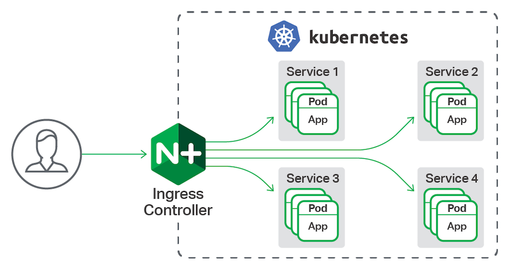
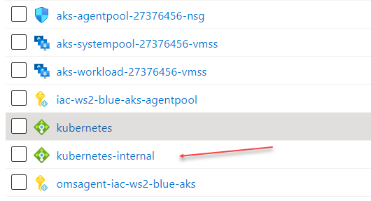
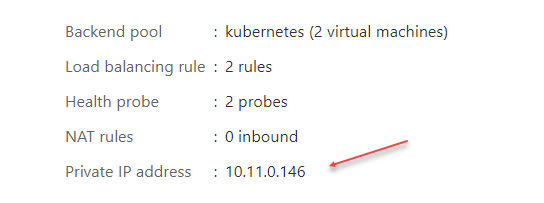

# lab-06 - deploy nginx ingress controller

## Estimated completion time - xx min

An ingress controller is a piece of software that provides reverse proxy, configurable traffic routing, and TLS termination for Kubernetes services. Kubernetes ingress resources are used to configure the ingress rules and routes for individual Kubernetes services. Using an ingress controller and ingress rules, a single IP address can be used to route traffic to multiple services in a Kubernetes cluster.



## Goals

This lab shows you how to deploy the NGINX ingress controller in an AKS cluster. The ingress controller is configured on an internal, private virtual network and IP address. No external access is allowed. Two applications are then run in the AKS cluster, each of which is accessible over the single IP address.

You will learn how to:

* Install and configure NGINX ingress controller
* Implement `ingress` routes to expose kubernetes services 

## Task #1 - deploy NGINX ingress controller

Cerate `internal-ingress.yaml` with the following content. 

```yaml
controller:
  replicaCount: 2
  service:
    annotations:
      service.beta.kubernetes.io/azure-load-balancer-internal: "true"
  tolerations:
    - key: "CriticalAddonsOnly"
      operator: "Equal"
      value: "true"
      effect: "NoSchedule"
  nodeSelector: 
    beta.kubernetes.io/os: linux
  affinity: 
    nodeAffinity:
      requiredDuringSchedulingIgnoredDuringExecution:
        nodeSelectorTerms:
        - matchExpressions:
          - key: agentpool
            operator: In
            values: 
            - systempool
  admissionWebhooks:
    patch:
      nodeSelector: 
        beta.kubernetes.io/os: linux    
defaultBackend:
  nodeSelector: 
    beta.kubernetes.io/os: linux
```

Since ingress controller is business critical component, I want to deploy it to the system nodes, therefore I need to configure `tolerations`. I also want to specify more than one replica count, in our case it's two.

Deploy NGINX ingress controller using helm. If you don't have `helm` installed, install it:

### For Windows, use `Chocolatey`
```powershell
# For Windows, use Chocolatey
choco install kubernetes-helm
```

### For Ubuntu, use Apt

```bash
# For Ubuntu, use Apt
curl https://baltocdn.com/helm/signing.asc | sudo apt-key add -
sudo apt-get install apt-transport-https --yes
echo "deb https://baltocdn.com/helm/stable/debian/ all main" | sudo tee /etc/apt/sources.list.d/helm-stable-debian.list
sudo apt-get update
sudo apt-get install helm
```

### For Mac, use brew

```bash
brew install helm
```

```bash
# Add the ingress-nginx repository
helm repo add ingress-nginx https://kubernetes.github.io/ingress-nginx

# Use Helm to deploy an NGINX ingress controller
helm install nginx-ingress ingress-nginx/ingress-nginx \
    --namespace kube-system \
    -f internal-ingress.yaml 

# Check that all pods are up and running. 
kubectl -n kube-system get po -l app.kubernetes.io/name=ingress-nginx
nginx-ingress-ingress-nginx-controller-54b75cbccd-4wl8p   1/1     Running   0          5m14s
nginx-ingress-ingress-nginx-controller-54b75cbccd-t8v5x   1/1     Running   0          5m14s

# Check load balancer external ip
kubectl --namespace kube-system get services -o wide -w nginx-ingress-ingress-nginx-controller
NAME                                     TYPE           CLUSTER-IP    EXTERNAL-IP   PORT(S)                      AGE   SELECTOR
nginx-ingress-ingress-nginx-controller   LoadBalancer   10.0.224.67   10.11.0.146   80:31456/TCP,443:31486/TCP   19m   app.kubernetes.io/component=controller,app.kubernetes.io/instance=nginx-ingress,app.kubernetes.io/name=ingress-nginx
```

It may take a few minutes for the LoadBalancer IP to be available. Initially, `EXTERNAL-IP` column will contain `<pending>`, but when Azure Load Balancer will be cerated and IP address will be assigned, `EXTERNAL-IP` will contain private IP address, in my case it was `10.11.0.146`. 

If you now go to the Azure Portal and navigate to cluster managed resource group (`MC_iac-ws2-blue-rg_iac-ws2-blue-aks_westeurope` or similar), you will find new instance of Azure Load Balancer called `kubernetes-internal`.

```bash
# Get cluster managed resource group
az aks show -g iac-ws2-blue-rg -n iac-ws2-blue-aks  --query nodeResourceGroup -otsv
```



If you open Overview page for this load balancer, you will find private IP address is assigned to it. In my case, it was `10.11.0.146`



No ingress rules have been created yet, so the NGINX ingress controller's default 404 page is displayed if you browse to the internal IP address. Ingress rules are configured in the following tasks.

```bash
# Start curl pod with interactive shell
kubectl run curl -i --tty --rm --restart=Never --image=radial/busyboxplus:curl -- sh

# Try to access our 
[ root@curl:/ ]$ curl http://10.11.0.146
<html>
<head><title>404 Not Found</title></head>
<body>
<center><h1>404 Not Found</h1></center>
<hr><center>nginx</center>
</body>
</html>
[ root@curl:/ ]$ exit
```

To see the ingress controller in action, let's deploy two applications in our AKS cluster. 

## Task #2 - deploy api-a application 

Create `api-a-deployment.yaml` file with the following k8s resources:

```yaml
apiVersion: apps/v1
kind: Deployment
metadata:
  name: api-a
  labels:
    app: api-a
spec:
  replicas: 2
  selector:
    matchLabels:
      app: api-a
  template:
    metadata:
      labels:
        app: api-a
    spec:
      containers:
      - name: api
        image: iacws2<YOUR-NAME>acr.azurecr.io/apia:v1
        imagePullPolicy: IfNotPresent
        resources: {}
        livenessProbe:
          httpGet:
            path: /health
            port: 80
          initialDelaySeconds: 3
          periodSeconds: 3    
        readinessProbe:
          httpGet:
            path: /readiness
            port: 80
          initialDelaySeconds: 3
          periodSeconds: 3
---
apiVersion: v1
kind: Service
metadata:
  name: api-a-service
  labels:
    app: api-a
spec:
  ports:
  - port: 8081
    protocol: TCP
    targetPort: 80
  selector:
    app: api-a
  type: ClusterIP
```

```bash
# Deploy api-a application
kubectl apply -f api-a-deployment.yaml
deployment.apps/api-a created
service/api-a-service created
```
As you can see, here we deployed two replicas of api-a and service exposed at port 8081. Now, let's test it:

```bash
# Get api-a-service IP
kubectl get svc
NAME            TYPE        CLUSTER-IP     EXTERNAL-IP   PORT(S)    AGE
api-a-service   ClusterIP   10.0.135.159   <none>        8081/TCP   4m15s

# Start test pod with interactive shell
kubectl run curl -i --tty --rm --restart=Never --image=radial/busyboxplus:curl -- sh

# Test api
[ root@curl:/ ]$ curl http://10.0.135.159:8081/api
[api-a] - OK.
[ root@curl:/ ]$ exit
```

## Task #3 - deploy api-b applications 

Create `api-b-deployment.yaml` file with the following k8s resources:

```yaml
apiVersion: v1
kind: ConfigMap
metadata:
  name: api-b-appsettings
data:
  appsettings.json: |-
    {
      "ApiAServiceUrl": "http://api-a-service:8081/api"      
    }
---    
apiVersion: apps/v1
kind: Deployment
metadata:
  name: api-b
  labels:
    app: api-b
spec:
  replicas: 1
  selector:
    matchLabels:
      app: api-b
  template:
    metadata:
      labels:
        app: api-b
        aadpodidbinding: api-b
    spec:
      containers:
      - name: api
        image: iacws2<YOUR-NAME>acr.azurecr.io/apib:v1
        imagePullPolicy: IfNotPresent
        resources: {}
        livenessProbe:
          httpGet:
            path: /health
            port: 80
          initialDelaySeconds: 3
          periodSeconds: 3    
        readinessProbe:
          httpGet:
            path: /readiness
            port: 80
          initialDelaySeconds: 3
          periodSeconds: 3
        volumeMounts:
        - name: appsettings
          mountPath: /app/config          
      volumes:
      - name: appsettings
        configMap:
          name: api-b-appsettings
---
apiVersion: v1
kind: Service
metadata:
  name: api-b-service
  labels:
    app: api-b
spec:
  ports:
  - port: 8081
    protocol: TCP
    targetPort: 80
  selector:
    app: api-b
  type: ClusterIP
```

```bash
# Deploy api-a application
kubectl apply -f api-b-deployment.yaml
configmap/api-b-appsettings created
deployment.apps/api-b created
service/api-b-service created
```
As you can see, here we deployed configmap with configuration, two replicas of api-b and service exposed at port 8081. Now, let's test it:

```bash
# Get api-b-service IP
kubectl get svc
NAME            TYPE        CLUSTER-IP     EXTERNAL-IP   PORT(S)    AGE
api-a-service   ClusterIP   10.0.135.159   <none>        8081/TCP   9m34s
api-b-service   ClusterIP   10.0.132.187   <none>        8081/TCP   46s

# Start test pod with interactive shell
kubectl run curl -i --tty --rm --restart=Never --image=radial/busyboxplus:curl -- sh

# Test api
[ root@curl:/ ]$ curl http://10.0.132.187:8081/api
[api-b] - OK.
[ root@curl:/ ]$ exit
```

## Task #4 - implement an ingress route

Create `api-b-ingress.yaml` file with the following ingress manifest:

```yaml
apiVersion: networking.k8s.io/v1
kind: Ingress
metadata:
  name: api-b-ingress
  namespace: default
  annotations:
    nginx.ingress.kubernetes.io/ssl-redirect: "false"
    nginx.ingress.kubernetes.io/use-regex: "true"
    nginx.ingress.kubernetes.io/rewrite-target: /
spec:
  ingressClassName: nginx
  rules:
  - http:
      paths:
      - path: /
        pathType: Prefix      
        backend:
          service:
            name: api-b-service
            port:
              number: 8081
```

```bash
# Deploy api-b-ingress ingress  
kubectl apply -f api-b-ingress.yaml 
ingress.networking.k8s.io/api-b-ingress created
```
It may take some time before private IP address is assigned to the ingress, you can watch the status by running the following command:

```bash
# Get all ingresses
kubectl get ingress -w
NAME              CLASS   HOSTS   ADDRESS   PORTS   AGE
api-b-ingress   nginx   *                 80      17s
api-b-ingress   nginx   *       10.11.0.146   80      51s

# Get api-b-ingress ingresses
kubectl get ingress api-b-ingress

# Describe api-b-ingress ingress
kubectl describe ing api-b-ingress
```

Now, let's test the ingress controller:

```bash
# Get ingress IP address
kubectl get ingress api-b-ingress
NAME            CLASS   HOSTS   ADDRESS       PORTS   AGE
api-b-ingress   nginx   *       10.11.0.146   80      11m

# Start test pod with interactive shell
kubectl run curl -i --tty --rm --restart=Never --image=radial/busyboxplus:curl -- sh

# Test api endpoint
[ root@curl:/ ]$ curl http://10.11.0.146/api
[api-b] - OK
[ root@curl:/ ]$ exit
```

## Task #5 - implement multiple ingress routes

Create `api-a-b-ingress.yaml` file with the following ingress manifest:

```yaml
apiVersion: networking.k8s.io/v1
kind: Ingress
metadata:
  name: api-a-b-ingress
  namespace: default
  annotations:
    nginx.ingress.kubernetes.io/ssl-redirect: "false"
    nginx.ingress.kubernetes.io/use-regex: "true"
    nginx.ingress.kubernetes.io/rewrite-target: /$2
spec:
  ingressClassName: nginx
  rules:
  - http:
      paths:
      - path: /apia(/|$)(.*)
        pathType: Prefix      
        backend:
          service:
            name: api-a-service
            port:
              number: 8081
      - path: /apib(/|$)(.*)
        pathType: Prefix      
        backend:
          service:
            name: api-b-service
            port:
              number: 8081
```

In this ingress definition, any characters captured by (.*) will be assigned to the placeholder `$2`, which is then used as a parameter in the [rewrite-target](https://kubernetes.github.io/ingress-nginx/examples/rewrite/) annotation. The ingress definition above will result in the following rewrites:

* `10.11.0.146/apia` rewrites to `10.11.0.146/`
* `10.11.0.146/apia/` rewrites to `10.11.0.146/`
* `10.11.0.146/apia/api` rewrites to `10.11.0.146/api`
* `10.11.0.146/apib/api` rewrites to `10.11.0.146/api`

```bash
# Deploy api-a-b-ingress ingress  
kubectl apply -f api-a-b-ingress.yaml 
ingress.networking.k8s.io/api-a-b-ingress created

# Describe api-b-ingress ingress and check the Rules section
kubectl describe ingress api-a-b-ingress
```

As you can see in the `Rules`, there are two path pointing to corresponding services

```yaml
Rules:
  Host        Path  Backends
  ----        ----  --------
  *
              /apia(/|$)(.*)   api-a-service:8081 (10.11.0.118:80,10.11.0.142:80)
              /apib(/|$)(.*)   api-b-service:8081 (10.11.0.119:80)
```

Now, let's test new ingress controller:

```bash
# Get ingress IP address, but as you already noticed, all ingress will have the same private IP used by NGINX ingress controller
kubectl get ingress api-a-b-ingress
NAME            CLASS   HOSTS   ADDRESS       PORTS   AGE
api-b-ingress   nginx   *       10.11.0.146   80      11m

# Start test pod with interactive shell
kubectl run curl -i --tty --rm --restart=Never --image=radial/busyboxplus:curl -- sh

# Test apia endpoint
[ root@curl:/ ]$ curl http://10.11.0.146/apia/api
[api-a] - OK

# Test apia endpoint
[ root@curl:/ ]$ curl http://10.11.0.146/apib/api
[api-b] - OK

[ root@curl:/ ]$ exit
```

## Useful links

* [Create an ingress controller to an internal virtual network in Azure Kubernetes Service (AKS)](https://docs.microsoft.com/en-us/azure/aks/ingress-internal-ip?WT.mc_id=AZ-MVP-5003837)
* [Create an HTTPS ingress controller on Azure Kubernetes Service (AKS)](https://docs.microsoft.com/en-us/azure/aks/ingress-tls?WT.mc_id=AZ-MVP-5003837)
* [Create an HTTPS ingress controller and use your own TLS certificates on Azure Kubernetes Service (AKS)](https://docs.microsoft.com/en-us/azure/aks/ingress-own-tls?WT.mc_id=AZ-MVP-5003837)
* [Ingress](https://kubernetes.io/docs/concepts/services-networking/ingress/)
* [About Ingress in Azure Kubernetes Service (AKS)](https://vincentlauzon.com/2018/10/10/about-ingress-in-azure-kubernetes-service-aks/)
* [nginx: Default backend](https://kubernetes.github.io/ingress-nginx/user-guide/default-backend/)
* [nginx: Installation with Helm](https://docs.nginx.com/nginx-ingress-controller/installation/installation-with-helm/)
* [Wait, Which NGINX Ingress Controller for Kubernetes Am I Using?](https://www.nginx.com/blog/wait-which-nginx-ingress-controller-kubernetes-am-i-using/)
* [Taints and Tolerations](https://kubernetes.io/docs/concepts/scheduling-eviction/taint-and-toleration/)
* [Rewrite Target](https://kubernetes.github.io/ingress-nginx/examples/rewrite/)


## Next: deploy api-b API to API Management

[Go to lab-07](../lab-07/readme.md)

## Feedback

* Visit the [Github Issue](https://github.com/evgenyb/aks-workshops/issues/20) to comment on this lab. 