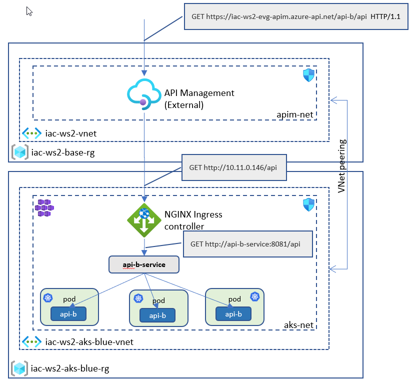

# lab-07 - deploy API to API Management

## Estimated completion time - xx min

Now that we have private ingress controller is available and API Management is deployed into Private Virtual Network that is peered with AKS VNet, we can expose our API publicly by using API Management. API Management is a complicated product and itself is a subject for several workshops. For our workshop we will keep it at the simplest level. Here is what we will implement during this lab:



## Goals


## Task #1 - 


```bash
# Import api-b API to APIM using OpenAPI swagger.json file
az apim api import \
	--resource-group iac-ws2-rg --service-name iac-ws2-evg-apim \
	--path '/api-b' \
	--api-id api-b --display-name api-b \
	--service-url 'http://10.11.0.146' \
	--specification-format OpenApiJson --specification-path swagger.json \
	--subscription-required false	
```

## Useful links
* [az apim api](https://docs.microsoft.com/en-us/cli/azure/apim/api?WT.mc_id=AZ-MVP-5003837&view=azure-cli-latest)
* [az apim api import
](https://docs.microsoft.com/en-us/cli/azure/apim/api?WT.mc_id=AZ-MVP-5003837&view=azure-cli-latest#az_apim_api_import)
* [az apim nv](https://docs.microsoft.com/en-us/cli/azure/apim/nv?WT.mc_id=AZ-MVP-5003837&view=azure-cli-latest)

## Next: 

[Go to lab-08](../lab-08/readme.md)

## Feedback

* Visit the [Github Issue](https://github.com/evgenyb/aks-workshops/issues/22) to comment on this lab. 