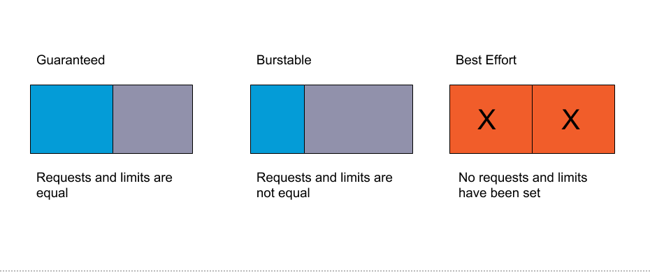

# lab-09 - Resource Management

## Estimated completion time - xx min

Kubernetes provides built-in mechanisms to provide both soft and hard limits on CPU and Memory. Resource Management is about maintaining resources to serve your workloads. It's important to understand how request and limits work as it will ensure you provide the best (or worst) resource utilization for your cluster.

`Requests` are what the container is guaranteed to get. If a container requests a resource then Kubernetes will only schedule it on a node that satisfies the request. `Limits` ensure a container never goes above a certain configured value. The container is only allowed to go up to this limit, and then it is restricted.

If the node where a Pod is running has enough of a resource available, it's possible (and allowed) for a container to use more resource than its `request` for that resource specifies. However, a container is not allowed to use more than its resource `limit`.

When a process in the container tries to consume more than the allowed amount of memory, the system kernel terminates the process that attempted the allocation, with an out of memory (OOM) error.

There are two types of resources, you can set requests and limits for - `CPU` and `Memory`

### Meaning of CPU
Limits and requests for CPU resources are measured in `cpu` units. One `cpu`, in Kubernetes, is equivalent to 1 vCPU/Core for cloud providers. Fractional requests are allowed. The expression `0.1` is equivalent to the expression `100m`, which can be read as `one hundred millicpu`.

### Meaning of memory
Limits and requests for memory are measured in bytes. You can express memory as a plain integer or as a fixed-point number using one of these suffixes: E, P, T, G, M, K. You can also use the power-of-two equivalents: Ei, Pi, Ti, Gi, Mi, Ki. 


## Goals

## Task #1 - create a `mem-example` namespace 

```bash
# Create a namespace so that the resources you create in this exercise are isolated from the rest of your cluster.
kubectl create namespace mem-example
```

To get a better insights what kubernetes does behind the scene, I recommend you to use Windows Terminal with two sessions (use `Shift+Alt+D` to split the current window). In the right-hand session, run watcher command for `mem-example` namespace `kubectl get po -w -n mem-example`. In the left-hand session run labs commands.

## Task #2 - specify a memory request and a memory limit

Follow the instructions described at the [Specify a memory request and a memory limit](https://kubernetes.io/docs/tasks/configure-pod-container/assign-memory-resource/#specify-a-memory-request-and-a-memory-limit) section of the original Kubernetes tutorial.

## Task #3 - exceed a Container's memory limit

Follow the instructions described at the [Exceed a Container's memory limit](https://kubernetes.io/docs/tasks/configure-pod-container/assign-memory-resource/#exceed-a-container-s-memory-limit) section of the original Kubernetes tutorial.

## Task #4 - specify a memory request that is too big for your Nodes

Follow the instructions described at the [Specify a memory request that is too big for your Nodes](https://kubernetes.io/docs/tasks/configure-pod-container/assign-memory-resource/#specify-a-memory-request-that-is-too-big-for-your-nodes) section of the original Kubernetes tutorial.


## Task #5 - create a `cpu-example` namespace 

```bash
# Create a Namespace so that the resources you create in this exercise are isolated from the rest of your cluster.
kubectl create namespace cpu-example
```

As with tasks #1-#4, use Windows Terminal with two sessions. In the right-hand session, run watcher command for `cpu-example` namespace `kubectl get po -w -n cpu-example`. In the left-hand session run labs commands.

## Task #6 - specify a CPU request and a CPU limit

Follow the instructions described at the [Specify a CPU request and a CPU limit](https://kubernetes.io/docs/tasks/configure-pod-container/assign-cpu-resource/#specify-a-cpu-request-and-a-cpu-limit) section of the original Kubernetes tutorial.

## Task #7 - specify a CPU request that is too big for your Nodes 

Follow the instructions described at the [Specify a CPU request that is too big for your Nodes](https://kubernetes.io/docs/tasks/configure-pod-container/assign-cpu-resource/#specify-a-cpu-request-that-is-too-big-for-your-nodes) section of the original Kubernetes tutorial.

## Quality of Service for Pods

It's important to understand how Kubernetes assigns QoS classes when scheduling pods, as it has an effect on pod scheduling and eviction. Below is the different QoS classes that can be assigned when a pod is scheduled:

Priority|QoS class name|Description
---|---|----
1 (highest) | Guaranteed | If limits and optionally requests are set (not equal to 0) for all resources and they are equal
2 | Burstable | If requests and optionally limits are set (not equal to 0) for all resources, and they are not equal
3 (lowest) | BestEffort | If requests and limits are not set for any of the resources



Therefore, if the developer does not declare CPU/Memory requests and limits, the container will be terminated first. We should protect the critical pods in production projects by setting limits so they are classified as `Guaranted`.


## Task #8 - create a `qos-example` namespace 

```bash
# Create a qos-example Namespace so that the resources you create in this exercise are isolated from the rest of your cluster.
kubectl create namespace qos-example
```

As with previous tasks, use Windows Terminal with two sessions. In the right-hand session, run watcher command for `qos-example` namespace `kubectl get po -w -n qos-example`. In the left-hand session run labs commands.

## Task #9 - create a Pod that gets assigned a QoS class of `Guaranteed` 

Follow the instructions described at the [Create a Pod that gets assigned a QoS class of Guaranteed](https://kubernetes.io/docs/tasks/configure-pod-container/quality-service-pod/#create-a-pod-that-gets-assigned-a-qos-class-of-guaranteed) section of the original Kubernetes tutorial.

## Task #10 - create a Pod that gets assigned a QoS class of `Burstable` 

Follow the instructions described at the [Create a Pod that gets assigned a QoS class of Guaranteed](https://kubernetes.io/docs/tasks/configure-pod-container/quality-service-pod/#create-a-pod-that-gets-assigned-a-qos-class-of-burstable) section of the original Kubernetes tutorial.

## Task #11 - create a Pod that gets assigned a QoS class of `BestEffort` 

Follow the instructions described at the [Create a Pod that gets assigned a QoS class of BestEffort](https://kubernetes.io/docs/tasks/configure-pod-container/quality-service-pod/#create-a-pod-that-gets-assigned-a-qos-class-of-besteffort) section of the original Kubernetes tutorial.

## Task #12 - configure Default Memory Requests and Limits for a Namespace

Follow the instructions described at the [Configure Default Memory Requests and Limits for a Namespace](https://kubernetes.io/docs/tasks/administer-cluster/manage-resources/memory-default-namespace/) original Kubernetes tutorial. You can ignore the `Before you begin` section, since we already have a cluster.


## Useful links

* [Managing Resources for Containers](https://kubernetes.io/docs/concepts/configuration/manage-resources-containers/)
* [Assign Memory Resources to Containers and Pods](https://kubernetes.io/docs/tasks/configure-pod-container/assign-memory-resource/)
* [Assign CPU Resources to Containers and Pods](https://kubernetes.io/docs/tasks/configure-pod-container/assign-cpu-resource/)
* [Kubernetes Pod Resource Limitations and Quality of Service](https://www.weave.works/blog/kubernetes-pod-resource-limitations-and-quality-of-service)
* [Kubernetes Resources Management – QoS, Quota, and LimitRange](https://www.cncf.io/blog/2020/06/10/kubernetes-resources-management-qos-quota-and-limitrangeb/)
* [Limit Ranges](https://kubernetes.io/docs/concepts/policy/limit-range/)
* [AKS managed Resource reservations](https://docs.microsoft.com/en-us/azure/aks/concepts-clusters-workloads#resource-reservations)

## Next: 

[Go to lab-10](../lab-10/readme.md)

## Feedback

* Visit the [Github Issue](https://github.com/evgenyb/aks-workshops/issues/xx) to comment on this lab. 