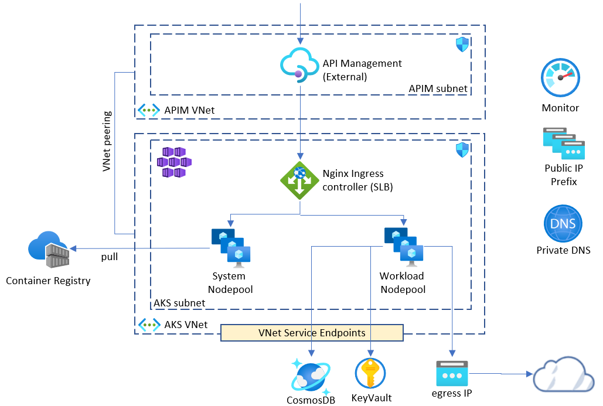

# Workshop #2 - Advanced AKS Configuration

Here is the preliminary agenda for the workshops (still work in progress):
 
 * Slides - Workshop introduction
 * Slides - Workshop architecture overview
 * [Lab-01](labs/lab-01/readme.md) - provision supporting resources
 * Lab-02 - provision API Management 
 * Slides - AKS configuration (Network, egress, RBAC, Managed Identity, Network Policy, Node Pools, )  
 * Lab-03 - provision AKS and all prerequisites
 * Slides - guinea pig apps walk through
 * Lab-04 - build and push docker images
 * Lab-05 - deploy applications and services to AKS
 * Slides - AKS node pools
 * Lab-06 - add new node pool for our workload
 * Slides - AAD Pod Identity
 * Lab-07 - add aad-pod-identity support into AKS 
 * Slides - Kubernetes Ingress Controller
 * Lab-08 - deploy nginx ingress controller
 * Slides - API Management 101 
 * Lab-09 - deploy api-b API to API Management
 * Lab-10 - AKS egress 
 * Slides - AKS upgrade options
 * Lab-11 - upgrade AKS - mutable approach
 * Lab-12 - upgrade AKS - immutable approach
 * Lab-13 - cleaning up resources

 
 * Slides - AAD Pod Identity

## Links

* [Prerequisites](prerequisites.md)

## Feedback

* Visit the [Github Issue](https://github.com/evgenyb/aks-workshops/issues/11) to comment on this workshop. 