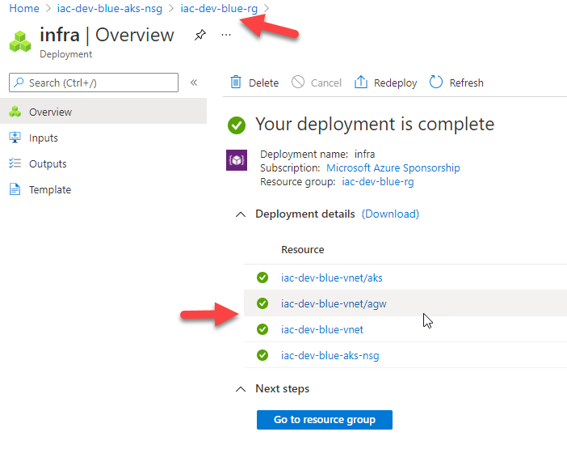

# lab-01 - create and deploy your first "non Storage Account" Bicep template

## Estimated completion time - 20 min

Bicep templates are the files that you author. They define the Azure resources to be deployed.
If you use Visual Studio Code with [Bicep plugin](https://marketplace.visualstudio.com/items?itemName=ms-azuretools.vscode-bicep), then you use `.bicep` as a file extension. 

## Goals

In this lab you will learn:
* how to define a resources in a Bicep template
* how to generate ARM templates from Bicep template
* how to deploy Bicep template using `az cli`

## Task #1 - create resource group

As always, we start by creating new resource group and we start with "base" resource group called `iac-dev-rg`.

```bash
# Create new resource group
az group create -n iac-dev-rg -l westeurope
```

## Task #2 - create and review Bicep template

Create `infra.bicep` file in Visual Studio Code with Bicep templates for vnet and API Management resources as shown below. 

```yaml
resource vnet 'Microsoft.Network/virtualNetworks@2020-11-01' = {
  location: 'westeurope'
  name: 'iac-dev-vnet'
  properties: {
    addressSpace: {
      addressPrefixes: [
        '10.10.0.0/16'
      ]
    }
    subnets: [
      {        
        name: 'apim'    
        properties: {
          addressPrefix: '10.10.0.0/27'
        }
      }
    ]
  }
}

resource apimSubnet 'Microsoft.Network/virtualNetworks/subnets@2020-11-01' = {
  name: 'apim'    
  dependsOn: [
    vnet
  ]
  parent: vnet
  properties: {
    addressPrefix: '10.10.0.0/27'
  }
}

resource apim 'Microsoft.ApiManagement/service@2020-12-01' = {
  name: 'iac-dev-${uniqueString(resourceGroup().id)}-apim'
  location: resourceGroup().location
  sku: {
    name: 'Developer'
    capacity: 1
  }
  identity: {
    type: 'SystemAssigned'
  }
  dependsOn: [
    vnet
  ]
  properties: {
    virtualNetworkType: 'External'
    publisherEmail: '<YOUR EMAIL ADDRESS>'
    publisherName: '<YOUR NAME>'
    virtualNetworkConfiguration: {
      subnetResourceId: apimSubnet.id
    }    
  }  
}
```

Let's review this Bicep template. 

### Bicep resource declaration structure

Each Bicep resource declaration has four components:

* `resource` keyword
* `symbolic name` - a name that is is used as an identifier for referencing the resource throughout your bicep file. In our template, these are `vnet`, `apim` and `apimSubnet`. `symbolic names` are not a resource name and used only within the Bicep template and don't appear in Azure.
* `resource type` -  It is composed of the resource provider (`Microsoft.Network`), resource type (`virtualNetworks`), and apiVersion (`2020-11-01`)
* `properties` - these are the specific properties you would like to specify for the given resource type. In most of the cases, you have to provide the resource `name` and `location` 

### Resource dependencies

When you provision several resources you may have dependencies between them. In our example, we can't provision API Management until Private Virtual Network is ready. That means that APIM resource depends on VNet resource. To define dependencies between resources, use `dependsOn` field to define resource dependencies. Resource Manager then evaluates the dependencies between resources and deploys them in the correct order. 

In our example, `apim` resource has a dependency to `vnet` resource and it's implemented using this code snippet:

```yaml
resource apim 'Microsoft.ApiManagement/service@2020-12-01' = {
...
  dependsOn: [
    vnet
  ]
...
}
```

where `vnet` is a symbolic name of the Private Virtual Network resource described within Bicep template.

### Child resources 

Child resources are resources that exist only within the context of another resource. 
Each parent resource accepts only certain resource types as child resources. The resource type for the child resource includes the resource type for the parent resource. For example, `Microsoft.Network/virtualNetworks/subnets` is child resource of the `Microsoft.Network/virtualNetworks`. 

There are several ways you can define child resources with Bicep. There is a [dedicated module](https://docs.microsoft.com/en-us/learn/modules/child-extension-bicep-templates?WT.mc_id=AZ-MVP-5003837) on that subject under Microsoft Learning.

In our case, we use `parent` property to assign child resource `apimSubnet` to the parent resource `vnet`

```yaml
resource apimSubnet 'Microsoft.Network/virtualNetworks/subnets@2020-11-01' = {
...
  parent: vnet
...
}
```
where `vnet` is a symbolic name of the Private Virtual Network resource described within Bicep template.

### Use resource id to refer to another resource

Quite often one resource uses some information about other resource. In most of the cases it's either resource name of resource id (including subscription id, resource group name, resource type and resource name). When you define resource in Bicep template, you can use the `symbolic` name of the resource from other resource. For example, if you deploy your API Management to the private vnet, you need to specify subnet id. With Bicep we can easily do it by referencing `apimSubnet` id from `apim` resource.


```yaml
...
virtualNetworkConfiguration: {
  subnetResourceId: apimSubnet.id
}    
...
```

where `apimSubnet` is a symbolic name of the Private Virtual Network subnet resource described within Bicep template.


### String Interpolation

API Management is global resource, therefore it should have unique name. At the same time, we still want to follow our [naming convention](../../naming-conventions.md). One possible technique is to use [uniqueString](https://docs.microsoft.com/en-us/azure/azure-resource-manager/templates/template-functions-string?tabs=bicep#uniquestring) function and generate unique id based on resource group id and use it as part of the apim instance name. 

Azure Bicep supports a simpler syntax for performing string concatenation like this with a programming feature called string interpolation. String interpolation allows to use a syntax to embed the name of a variable, parameter of function within a string value that will get replaced at deploy time to perform the string concatenation necessary.

```yaml
resource apim 'Microsoft.ApiManagement/service@2020-12-01' = {
  name: 'iac-dev-${uniqueString(resourceGroup().id)}-apim'
...
```

In our example, we combine a result of `uniqueString(resourceGroup().id)` function with a name followed our naming convention.

## Task #3 - generate ARM templates from bicep file

The Bicep CLI provides a command to convert Bicep to JSON. To generate a JSON file from your Bicep template, use:

```bash
# Generate ARM templates from Bicep template.
# Run this command from the folder containing your sa.bicep file.
az bicep build -f infra.bicep
```

If no errors, you should see the `infra.json` file with storage account ARM templates next to your `infra.bicep` template. 

> Note that you can use [Bicep playground](https://bicepdemo.z22.web.core.windows.net/) to view your ARM and Bicep templates side by side. 

## Task 4 - deploy Bicep template

Bicep files can be directly deployed via the `az cli` or PowerShell Az module, so the standard deployment commands (i.e. `az deployment group create` or `New-AzResourceGroupDeployment`) will "just work" with a `.bicep` files. You will need `az cli` version 2.20.0+ or PowerShell Az module version 5.6.0+.

```bash
# Deploy Bicep template to a resource group
az deployment group create -g iac-dev-rg -f ./infra.bicep
```

If you go to to `Deployment` tab of the `iac-dev-rg` resource group you should see new deployment running. Open it and check `Template` section and you will see that it contains standard ARM templates. 



## Useful links

* [What is Bicep](https://docs.microsoft.com/en-us/azure/azure-resource-manager/templates/bicep-overview/?WT.mc_id=AZ-MVP-5003837)
* [Tutorial: Create and deploy first Azure Resource Manager Bicep file](https://docs.microsoft.com/en-us/azure/azure-resource-manager/templates/bicep-tutorial-create-first-bicep?tabs=azure-cli&WT.mc_id=AZ-MVP-5003837)
* [Deploy child and extension resources by using Bicep](https://docs.microsoft.com/en-us/learn/modules/child-extension-bicep-templates?WT.mc_id=AZ-MVP-5003837)
* [Bicep playground](https://bicepdemo.z22.web.core.windows.net/)

## Next: working with variables

[Go to lab-02](../lab-02/readme.md)

## Feedback

* Visit the [Github Issue](https://github.com/evgenyb/aks-workshops/issues/26) to comment on this lab. 