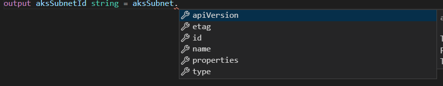

# lab-03 - Outputs

## Estimated completion time - 15 min

There are (at least) two use-cases where Bicep `outputs` can be useful:

* You can use `outputs` to return values from the template. You might need to capture properties from a newly created resource so they're available later for reference. For example, it might be helpful to get the endpoints for your new storage account, or to get subnet id and use it later as a reference at AKS cluster template. This is especially useful when you compose your resources using `Modules`.
* You can use `outputs` to debug your Bicep template.

## Goals

In this lab you will learn:

* How to debug your Bicep template using `outputs`
* How to return resource resource properties as Bicep `outputs`

## Task #1 - trace variables values as template outputs

Let's keep working with Bicep file from [lab-02](../lab-02/readme.md). If you didn't manage to finish it, use this template as an example.

```yaml
param environment string
param slot string
param vnetAddressPrefixBase string

var vnetAddressPrefix = '${vnetAddressPrefixBase}.0.0/16'
var aksSubnetAddressPrefix = '${vnetAddressPrefixBase}.0.0/20'
var agwSubnetAddressPrefix = '${vnetAddressPrefixBase}.16.0/25'
var vnetName = '${environment}-${slot}-vnet' 

resource vnet 'Microsoft.Network/virtualNetworks@2020-11-01' = {
  location: resourceGroup().location
  name: vnetName
  properties: {
    addressSpace: {
      addressPrefixes: [
        vnetAddressPrefix
      ]
    }
  }
}

resource aksSubnet 'Microsoft.Network/virtualNetworks/subnets@2020-11-01' = {
  name: 'aks'    
  dependsOn: [
    vnet
  ]
  parent: vnet
  properties: {
    addressPrefix: aksSubnetAddressPrefix
  }
}

resource agwSubnet 'Microsoft.Network/virtualNetworks/subnets@2020-11-01' = {
  name: 'agw'  
  dependsOn: [
    vnet
  ]
  parent: vnet
  properties: {
    addressPrefix: agwSubnetAddressPrefix
  }
}
```

Let's imagine that we want to trace the value of `vnetName` and `vnetAddressPrefix` variables to verify if we compose these values correctly in our template. To do so, add two new `outputs` to the end of the file like this:

```yaml
...
output agwSubnetAddressPrefix string = agwSubnetAddressPrefix
output vnetName string = vnetName
```

> Note, that you need to specify the type of the output parameter.

```bash
# Deploy Bicep template
az deployment group create -g iac-ws3-blue-rg -f ./vnet.bicep -p iac-ws3-blue.json
```

Check the `outputs` section of the script output. You should see something similar to: 

```json
...
"outputs": {
    "agwSubnetAddressPrefix": {
    "type": "String",
    "value": "10.10.16.0/25"
    },
    "vnetName": {
    "type": "String",
    "value": "iac-ws3-blue-vnet"
    }
},
...
```

## Task #2 - use output to return subnet id

Quite often you need to use one resource id as a reference inside other resource template. For instance, when you deploy your AKS cluster into your own VNet, you need to provide subnet id as a reference. Let's expose `aks` subnet id as an Bicep `output`.

In our Bicep template `aks` subnet is implemented as an individual resource called `aksSubnet` type of `subnets`. [subnets](https://docs.microsoft.com/en-us/azure/templates/microsoft.network/virtualnetworks/subnets?tabs=bicep&WT.mc_id=AZ-MVP-5003837) is a Bicep resource, containing several properties, including `id`. 

To expose `aks` subnet id, add the following code to the end of the Bicep file:

```yaml
output aksSubnetId string = aksSubnet.id
```

> Note, if you use Bicep plugin, you will get intellisense showing you all available properties of the object.




```bash
# Deploy Bicep template
az deployment group create -g iac-ws3-blue-rg -f ./vnet.bicep -p iac-ws3-blue.json
```

and check the `outputs` section of the script output. You should now see new output item called `aksSubnetId`:

```json
...
"outputs": {
...    
    "aksSubnetId": {
      "type": "String",
      "value": "/subscriptions/8878beb2-xxxx-xxxx-xxxx-783674eea324/resourceGroups/iac-ws3-blue-rg/providers/Microsoft.Network/virtualNetworks/iac-ws3-blue-vnet/subnets/aks"   
      },
...      
}
...
```

## Useful links

* [Tutorial: Add outputs to Azure Resource Manager Bicep file](https://docs.microsoft.com/en-us/azure/azure-resource-manager/templates/bicep-tutorial-add-outputs?tabs=azure-cli&WT.mc_id=AZ-MVP-5003837)
* [Bicep playground](https://bicepdemo.z22.web.core.windows.net/)

## Next: refactoring: group resources by using modules

[Go to lab-04](../lab-04/readme.md)

## Feedback

* Visit the [Github Issue](https://github.com/evgenyb/aks-workshops/issues/28) to comment on this lab. 