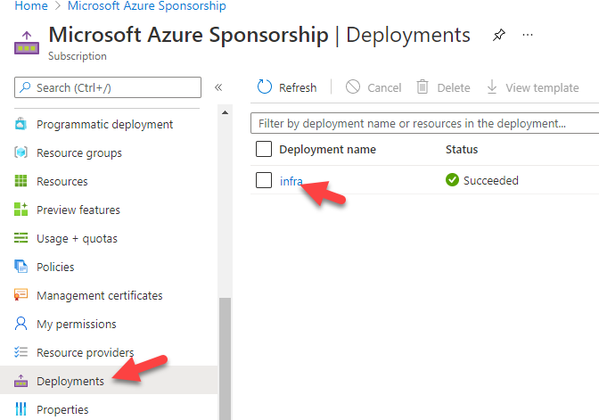
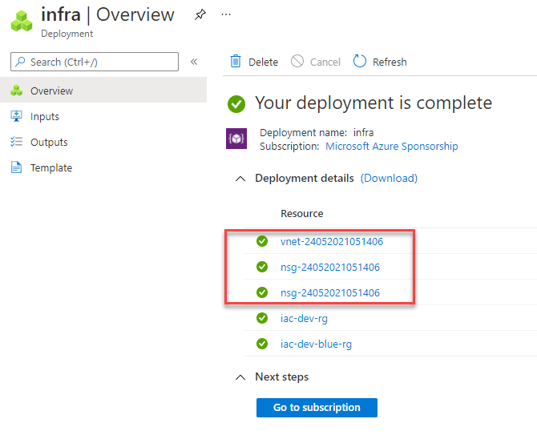
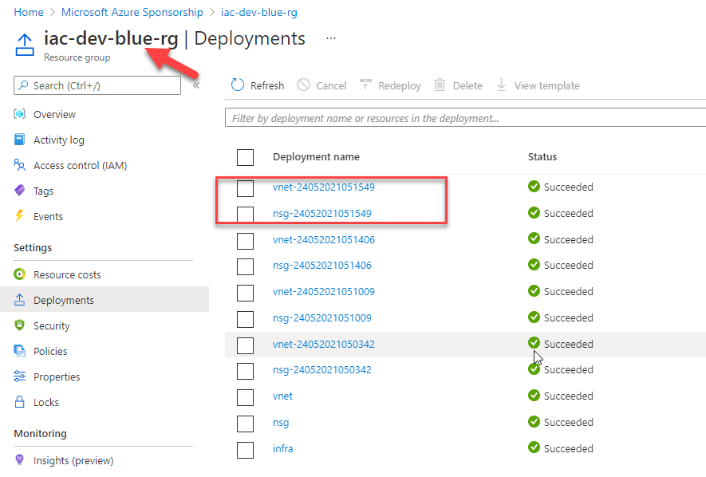

# lab-05 - scopes

## Estimated completion time - 15 min

A deployment in ARM has an associated scope, which dictates the scope that resources within that deployment are created in. There are various ways to deploy resources across multiple scopes today in ARM templates; this spec describes how similar functionality can be achieved in Bicep.

Unless otherwise specified, Bicep will assume that a given `.bicep` file is to be deployed at a resource group scope, and will validate resources accordingly. If you wish to change this scope, or define a file that can be deployed at multiple scopes, you must use the `targetScope` keyword.

## Goals

In this lab you will learn:

* How to create a resource group and deploy a module to the resource group
* How to configure module scopes

## Task #1 - create Bicep file to create resource groups

Create new `infra.bicep` file with the following content:

```yaml
targetScope = 'subscription'

param environment string = 'dev'
param slot string = 'blue'

resource baseRg 'Microsoft.Resources/resourceGroups@2021-01-01' = {
  name: 'iac-${environment}-rg'
  location: deployment().location
}

resource slotRg 'Microsoft.Resources/resourceGroups@2021-01-01' = {
  name: 'iac-${environment}-${slot}-rg'
  location: deployment().location
}
```

Let's review this Bicep template. 

* It uses the `targetScope` field which is set to `subscription` and that means that all resources defined within this template file will be deployed to the subscription scope
* It has two input parameters `environment` and `slot`
* It contains two resources definitions for two resource groups: `iac-dev-blue-rg` and `iac-dev-rg`

Let's deploy this template

```bash
# Deploy BIcep template to subscription
az deployment sub create -l westeurope -f ./infra.bicep  
```

Note, because the scope of the template is set to `subscription`, we need to use `az deployment sub` command.
You can now find your deployment under subscription `Deployments` tab



## Task #2 - specify module scope

Let's use Bicep modules from [lab-04](../lab-04/readme.md). If you didn't manage to finish it, take them from [infra.bicep](../../completed-labs/lab-04) folder from the completed labs folder.

Edit `infra.bicep` file with the following content:

```yaml
targetScope = 'subscription'

param environment string = 'dev'
param slot string = 'blue'
param vnetAddressPrefixBase string = '10.10'
param timestamp string = utcNow('ddMMyyyyhhmmss')

resource baseRg 'Microsoft.Resources/resourceGroups@2021-01-01' = {
  name: 'iac-${environment}-rg'
  location: deployment().location
}

resource slotRg 'Microsoft.Resources/resourceGroups@2021-01-01' = {
  name: 'iac-${environment}-${slot}-rg'
  location: deployment().location
}

module nsg 'nsg.bicep' = {
  name: 'nsg-${timestamp}'
  scope: slotRg
  params: {
    environment: environment
    slot: slot
    vnetAddressPrefixBase: vnetAddressPrefixBase
  }
}

module vnet 'vnet.bicep' = {
  name: 'vnet-${timestamp}'
  scope: slotRg
  dependsOn: [
    nsg
  ]
  params: {
    environment: environment
    slot: slot
    vnetAddressPrefixBase: vnetAddressPrefixBase
    aksNsgid: nsg.outputs.aksNsgId
  }
}
```

Let's review this Bicep template:

* It uses `subscription` as a target scope
* It has two input parameters `environment` and `slot`
* It creates two resource groups: `iac-dev-blue-rg` and `iac-dev-rg`
* It uses `vnet.bicep` and `nsg.bicep` modules to create NSGa nd VNet resources. Note that for each of the modules, the `scope` field is set to `slotRg`. That means that all resources described inside modules will be deployed to the `slotRg` resource group.
* The name of the `vnet` and `nsg` modules are suffixed with `${timestamp}` value. `timestamp` is calculated as UTC timestamp `utcNow('ddMMyyyyhhmmss')`. This is done to make sure that each deployment at the resource group level has a unique deployment name.  

Let's deploy this template

```bash
# Deploy Bicep template
az deployment sub create -l westeurope -f ./infra.bicep  -p dev-blue.json
```

Now check the `Deployments` at the subscription level. You should see deployment name with timestamps.



If you navigate to the `Deployments` tab of the  `iac-dev-blue-rg` resource group, you should see the corresponding `vnet` and `nsg` modules deployments:



## Useful links

* [Resource Scopes](https://github.com/Azure/bicep/blob/main/docs/spec/resource-scopes.md)
* [Bicep playground](https://bicepdemo.z22.web.core.windows.net/)

## Next: Convert an existing ARM to Bicep

[Go to lab-06](../lab-06/readme.md)

## Feedback

* Visit the [Github Issue](https://github.com/evgenyb/aks-workshops/issues/30) to comment on this lab. 