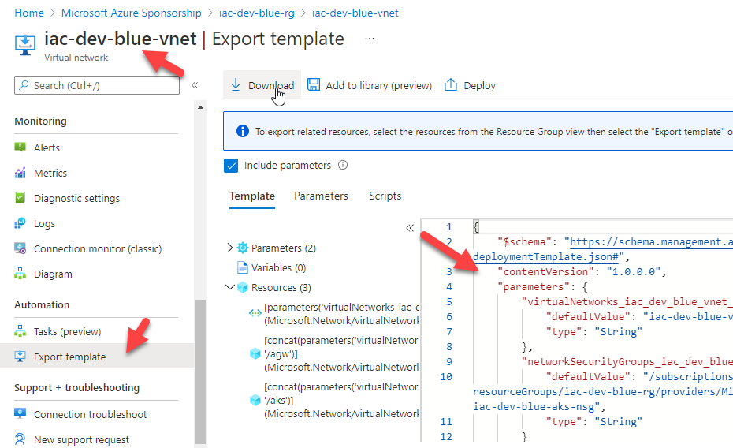
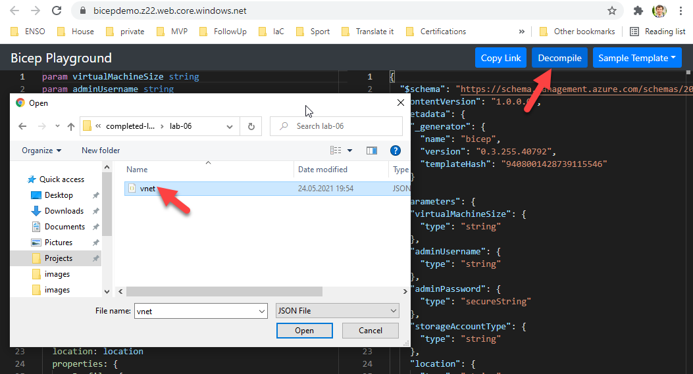

# lab-06 - convert an existing ARM to Bicep

## Estimated completion time - 15 min

Bicep is relatively new and you most likely already have a bunch of resources provisioned. How to adopt existing resources with Bicep? 

## Goals

In this lab you will learn:

* How to convert ARM templates to Bicep using Bicep playground
* How to convert ARM templates to Bicep using `az cli`

## Task #1 - convert ARM templates to Bicep using Bicep playground

Take any of the existing Azure resource and export it as ARM template from the portal. If you don't have any resource other than ones we created during this workshop, use `iac-dev-blue-vnet` as an example. 

Navigate to `iac-dev-blue-vnet` resource in Azure portal and export it as ARM templates.



Save the content of the `Template` window as a `vnet.json` file. 
Navigate to [Bicep playground](https://bicepdemo.z22.web.core.windows.net/) and click `Decompile`



At the left side window you should see the decompiled Bicep version of ARM templates.

## Task #2 - convert ARM templates to Bicep using `az cli`

You can use `bicep` add-on of `az cli` to decompile ARM templates.

```bash
# Decompile ARM templates
az bicep decompile -f .\vnet.json
```

You should now see `vnet.bicep` file with Bicep version of ARM templates.

## Useful links

* [Bicep playground](https://bicepdemo.z22.web.core.windows.net/)
* [az bicep decompile](https://docs.microsoft.com/en-us/cli/azure/bicep?WT.mc_id=AZ-MVP-5003837&view=azure-cli-latest#az_bicep_decompile)

## Next: 

[Go to lab-06](../lab-07/readme.md)

## Feedback

* Visit the [Github Issue](https://github.com/evgenyb/aks-workshops/issues/31) to comment on this lab. 