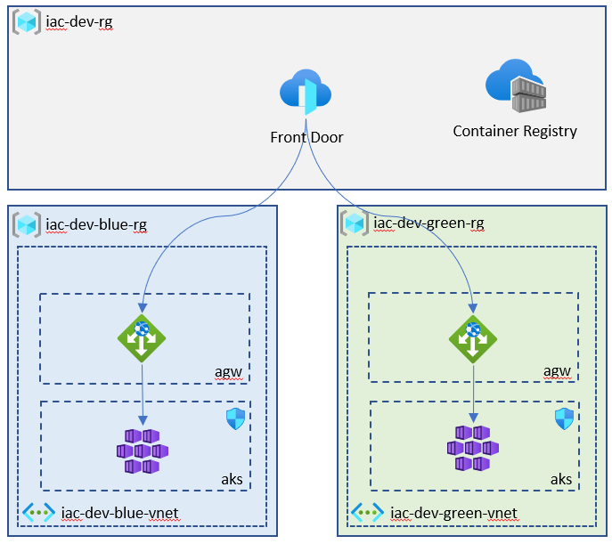
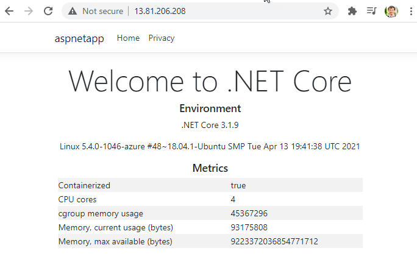

# lab-08 - Implement AKS infrastructure

## Estimated completion time - 15 min

Now that you've learned basics of Bicep, let's implement Immutable AKS infrastructure. Here is what you will implement:



* We will use Azure Front Door to orchestrate the traffic 
* We will use Application Gateway Ingress Controller for Kubernetes ingress
* AKS will be provisioned into it's own VNet 
* AGW will be provisioned to the same VNet, but dedicated `agw` subnet 
* We will provision two (or three) resource groups: `iac-dev-rg`,  `iac-dev-blue-rg` and `iac-dev-green-rg`
* Azure Front Door will be deployed to `iac-dev-rg` resource group 

## Goals

In this lab you will:

* refactor one big Bicep template into two templates with set of modules
* introduce two parameter files, representing two immutable slots
* deploy AKS infrastructure into `blue` slot
* verify that all connectivity is working as expected
* deploy AKS infrastructure into `green` slot
* switch traffic to the new slot

## Task #1 - remove `iac-dev-blue-rg`

First, let's remove all resource we already created by removing `iac-dev-blue-rg` resource group

```bash
# Delete `iac-dev-blue-rg` resource group
az group delete -g iac-dev-blue-rg --yes
```

## Task #2 - create `iac-dev-blue-rg` resource group

```bash
# Create  `iac-dev-blue-rg` resource group
az group create -g iac-dev-blue-rg -l westeurope
```

## Task #3 - deploy AKS infrastructure using one monolithic Bicep template

The [slot.bicep](slot.bicep) Bicep template contains the following resources:

* Network Security Group
* VNet with two subnets 
* Private Public IP address
* Azure Application Gateway
* Azure Kubernetes Service

Let's deploy it to the `iac-dev-blue-rg` resource group

```bash
# Deploy slot.bicep template to iac-dev-blue-rg resource group
az deployment group create -g iac-dev-blue-rg -f slot.bicep
```

Deployment will take between 8-15 min, so you can move on to the next task.

## Task #4 - refactor Bicep template for slot infrastructure

You need to refactor `slot.bicep` template so it fulfills the following requirements:

1. It should request the following input parameters: `environment`, `slot` and `vnetAddressPrefixBase` with `dev`, `blue` and `10.10` as a default values
2. It should create resource group if one doesn't exist
3. It should implement the following modules:
 * `vnet.bicep` - should contain NGS and VNEt resources 
 * `agw.bicep` - should contain Public IP and Application Gateway resources
 * `aks.bicep` - should contain Azure Container Service resource
4. `agw` module depends on `vnet` module
5. `aks` module depends on `vnet` and `agw` modules
6. The "master" Bicep template should be named `infra-slot.bicep`
7. Use `outputs` and `parameters` to send subnet id from `vnet` module to `aks` and `agw` modules
8. Slot specific parameters for `blue` and `green` slots should be implemented as `dev-blue.json` and `dev-green.json` parameter files
9. To review slot infrastructure changes the following command should be used:

```bash
# Review changes 
az deployment sub what-if -f infra-slot.bicep -p dev-blue.json  -l westeurope
```
10. To deploy slot infrastructure changes the following command should be used:

```bash
# Deploy changes
az deployment sub create -f infra-slot.bicep -p dev-blue.json  -l westeurope
```

## Task #4 - enable Application Gateway Ingress Controller (AGIC) and deploy test application

It looks like there is a bug in AKS ARM templates, but it's not possible to implement AGIC add-on using ARM templates or Bicep, therefore we will use `az aks ` command to enable the plugin

```bash
# Get agw resource id
agwId=$(az network application-gateway show -g iac-dev-blue-rg -n iac-dev-blue-aks-agw --query id -otsv)

# Enable ingress-appgw addon
az aks enable-addons -n iac-dev-blue-aks -g iac-dev-blue-rg -a ingress-appgw --appgw-id $agwId

# Get AKS credentials
az aks get-credentials -n iac-dev-blue-aks -g iac-dev-blue-rg --overwrite-existing

# Deploy simple `aspnetapp` app, containing kubernetes pod, service and ingress
kubectl apply -f https://raw.githubusercontent.com/Azure/application-gateway-kubernetes-ingress/master/docs/examples/aspnetapp.yaml

# Check ingress resource 
kubectl get ing -w
NAME        CLASS    HOSTS   ADDRESS         PORTS   AGE
aspnetapp   <none>   *          80      19s
```

Eventually, you should see the public ip address is assigned to the ingress. 
When IP is assigned, try to `curl` it or open it in the browser. 

```bash
# Test that app is up and running and accessible from 
curl http://13.81.206.208/
```

You should see the following page:



## Task #5 - re-create `iac-dev-rg` resource group

Let's delete and create `iac-dev-rg` resource group

```bash
# Delete iac-dev-rg resource group
az group delete -g iac-dev-rg --yes

# Create `iac-dev-rg` resource group
az group create -g iac-dev-rg -l westeurope
```

## Task #6 - deploy Front Door infrastructure using one monolithic Bicep template

The [base.bicep](base.bicep) Bicep template contains the following resources:

* Azure Front Door
* Reference to the Public IP address resource from slot resource group

Let's deploy this template to the `iac-dev-rg` resource group

```bash
# Deploy base.bicep template to iac-dev-rg resource group
az deployment group create -g iac-dev-rg -f base.bicep
```
## Task #7 - refactor Bicep template for base infrastructure

You need to refactor `base.bicep` template so it fulfills the following requirements:

1. It should request the following input parameters: `environment` and `slot` with `dev` and `blue` as a default values
2. It should create resource group if one doesn't exist
3. It should implement the following modules:
 * `fd.bicep` - should contain Azure Front Door resource
 * `acr.bicep` - should contain Azure COntainer Registry resource
4. The "master" Bicep template should be named `infra-base.bicep`
5. To deploy base group infrastructure changes the following command should be used:

```bash
# Deploy changes
az deployment sub create -f infra-base.bicep -p environment=dev -p slot=blue  -l westeurope
```

## Useful links

* [What is Application Gateway Ingress Controller?](https://docs.microsoft.com/en-us/azure/application-gateway/ingress-controller-overview)
* [What is Azure Front Door?](https://docs.microsoft.com/en-us/azure/frontdoor/front-door-overview)
* [Bicep playground](https://bicepdemo.z22.web.core.windows.net/)

## Next: 

[Go to lab-09](../lab-09/readme.md)

## Feedback

* Visit the [Github Issue](https://github.com/evgenyb/aks-workshops/issues/33) to comment on this lab. 