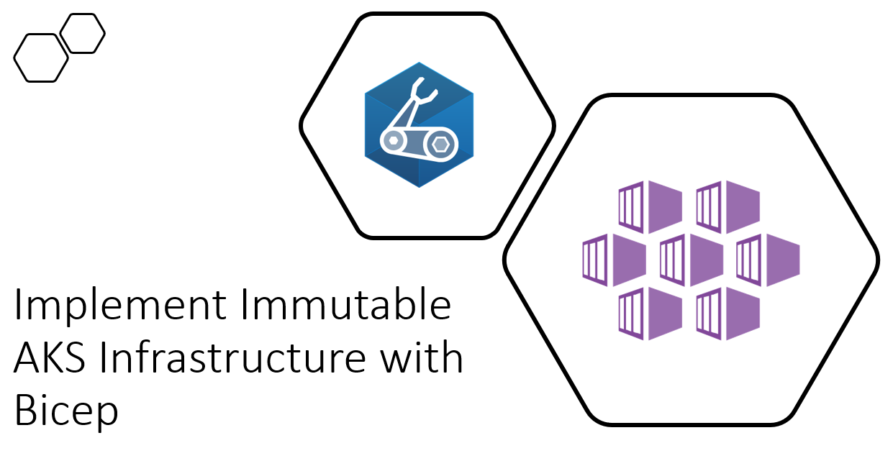

# Workshop #3 - Implement Immutable AKS Infrastructure on Azure with Bicep

Here is the agenda for the workshops:

 * Slides - Workshop introduction
 * Slides - Bicep intro
 * [Lab-01](labs/lab-01/readme.md) - create and deploy your first Bicep template
 * Slides - Variables, Parameters, Modules, Scopes, Output
 * Lab-02 - working with variables 
 * Lab-03 - Parameters
 * Lab-04 - Modules
 * Lab-05 - Outputs
 * Lab-06 - Scopes
 * Slides - Loos, Conditions and Converting existing ARM templates to Bicep
 * Lab-07 - Loops
 * Lab-08 - Conditions
 * Lab-09 - Convert an existing ARM to Bicep
 * Slides - Implement AKS infrastructure
 * Lab-10 - Implement AKS infrastructure
 * Slides - CI/CD with github actions
 
## Links

* [Prerequisites](prerequisites.md)
* [Introduction to infrastructure as code using Bicep](https://docs.microsoft.com/en-us/learn/modules/introduction-to-infrastructure-as-code-using-bicep/)
* [Deploy Azure resources by using Bicep templates](https://docs.microsoft.com/en-us/learn/modules/deploy-azure-resources-by-using-bicep-templates/)
* [Bicep playground](https://bicepdemo.z22.web.core.windows.net/)

## Feedback

* Visit the [Github Issue](https://github.com/evgenyb/aks-workshops/issues/11) to comment on this workshop. 