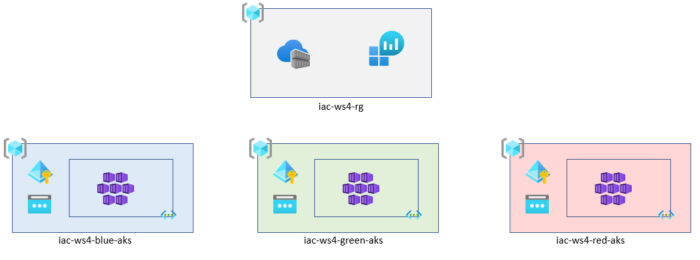
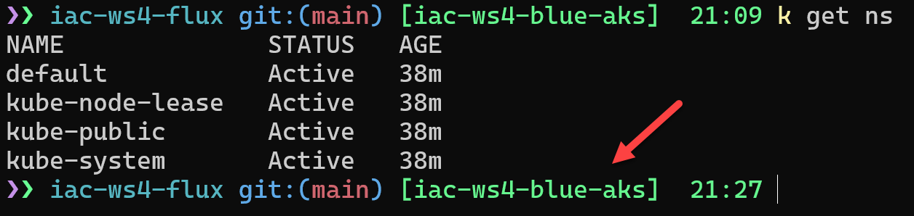

# lab-01 - provision AKS cluster and supporting resources

## Estimated completion time - 20 min

To start working with labs, we need to provision Azure Kubernetes Service (AKS) instance. There are multiple ways you can provision AKS. For this workshop we will use `Bicep`. AKS and supporting resources are not free and the compute power will come with some costs. We will use the smallest Virtual Machine size for our nodes and we will use only one node. We will also delete all resources when we are finished working with the labs. Here is the list of resources we need to provision:

* Resource Groups
* Azure Container Registry (ACR)
* Azure Log Analytics (ACR)
* Azure Kubernetes Service (AKS)

Our AKS cluster will fullfil the following requirements:

* Integrate AKS with Azure AD to implement Kubernetes RBAC based on a Azure AD identities
* Implement [advanced (aka Azure CNI)](https://docs.microsoft.com/en-us/azure/aks/concepts-network?WT.mc_id=AZ-MVP-5003837#azure-cni-advanced-networking) networking model
* Use [managed identities in AKS](https://docs.microsoft.com/en-us/azure/aks/use-managed-identity?WT.mc_id=AZ-MVP-5003837) to create additional resources like load balancers and managed disks in Azure
* Integrate AKS with Azure Log Analytics for monitoring
* Integrate AKS with Azure Container Registry

Here is the complete visualization of resources we will provision.



## Goals

* Provision `AKS` resource group
* Provision Private Virtual Network with subnet for AKS
* Establish peering between `base` VNet and `aks` VNet
* Provision User Assigned Managed Identity for AKS and Azure AD integration 
* Create new Azure AD group for AKS administrators
* Add your user into AKS admin Azure AD group

## Task #1 - create new Azure AD group for AKS administrators


```powershell
# Set your Azure AD username
$YOUR_AAD_NAME="<YOUR AZURE AD USERNAME>"

# Create Azure AD group iac-ws4
az ad group create --display-name iac-ws4 --mail-nickname iac-ws4

# Get your Azure AD user objectId 
$USER_ID="$(az ad user show --id "$YOUR_AAD_NAME" --query objectId -o tsv)"

# Add your user  into iac-ws4 Azure AD group.
az ad group member add -g iac-ws4 --member-id $USER_ID

# Get iac-ws4 Azure AD group object id
az ad group show -g iac-ws4 --query objectId -o tsv
```

## Task #2 - deploy workshop resources

`Bicep` templates are located under `infra` folder and are split into two modules: `base.bicep` and `aks.bicep`. 

`base.bicep` contains shared resources such as `ACR` and Log Analytics. 
`aks.bicep` contains resourced used by AKS such as Private Virtual Network, Managed Identity, Egress Public IP address and AKS instance.

Deployment is orchestrated by the `deployment.bicep` template. There are two parameter files `parameters-blue.json`, `parameters-green.json` and `parameters-red.json` representing the `blue`, `green` and `red` instance of clusters. 

Let's provision `blue` cluster first.

```bash
# Select subscription
az account set --subscription <YOUR-SUBSCRIPTION-ID>

# Deploy your blue cluster
az deployment sub create --location westeurope --template-file ./deployment.bicep  --parameters './parameters-blue.json'
 \ Running ..

# When provisioning of blue cluster is ready (it takes approx. 5 min), connect to your blue cluster
az aks get-credentials --resource-group iac-ws4-blue-rg --name iac-ws4-blue-aks --overwrite-existing

# Get list of namespaces and authenticate with Azure AD
kubectl get ns

# You will be prompted to enter devicelogin code.
To sign in, use a web browser to open the page https://microsoft.com/devicelogin and enter the code <...> to authenticate.

NAME              STATUS   AGE
default           Active   14m
kube-node-lease   Active   14m
kube-public       Active   14m
kube-system       Active   14m
```

At this point the `blue` cluster is active one. If you use [Oh My Posh](https://ohmyposh.dev/docs/), you can configure that the active cluster is shown at the command line prompt, as it's shown below:



Learn how you can [setup your shell (bash or PowerShell) for better AKS/kubectl experience](https://github.com/evgenyb/aks-workshops/tree/main/01-aks-and-k8s-101/labs/lab-02)

## Task #3 - deploy `red` cluster

```bash
# Deploy red cluster
az deployment sub create --location westeurope --template-file ./deployment.bicep  --parameters './parameters-red.json'
 \ Running ..
```

Note, do not connect to this cluster yet. We will use it at `lab-08`.

## Useful links

* [AKS-managed Azure Active Directory integration](https://docs.microsoft.com/en-us/azure/aks/managed-aad?WT.mc_id=AZ-MVP-5003837)
* [Network concepts for applications in Azure Kubernetes Service (AKS)](https://docs.microsoft.com/en-us/azure/aks/concepts-network?WT.mc_id=AZ-MVP-5003837)
* [Azure Container Registry documentation](https://docs.microsoft.com/en-us/azure/container-registry/?WT.mc_id=AZ-MVP-5003837)
* [Configure Azure CNI networking in Azure Kubernetes Service (AKS)](https://docs.microsoft.com/en-us/azure/aks/configure-azure-cni?WT.mc_id=AZ-MVP-5003837)
* [Use managed identities in Azure Kubernetes Service](https://docs.microsoft.com/en-us/azure/aks/use-managed-identity?WT.mc_id=AZ-MVP-5003837)
* [Best practices for advanced scheduler features in Azure Kubernetes Service (AKS)](https://docs.microsoft.com/en-us/azure/aks/operator-best-practices-advanced-scheduler?WT.mc_id=AZ-MVP-5003837)
* [Create and manage multiple node pools for a cluster in Azure Kubernetes Service (AKS)](https://docs.microsoft.com/en-us/azure/aks/use-multiple-node-pools?WT.mc_id=AZ-MVP-5003837)
* [Manage system node pools in Azure Kubernetes Service (AKS)](https://docs.microsoft.com/en-us/azure/aks/use-system-pools?WT.mc_id=AZ-MVP-5003837)

## Next: post provisioning configuration

[Go to lab-02](../lab-02/readme.md)