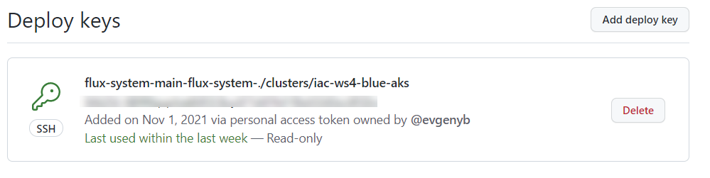

# lab-03 - install Flux CLI to your PC and bootstrap Flux onto your cluster

## Estimated completion time - xx min

Now, let's install flux CLI and bootstrap our cluster. 

## Goals

* Install `flux cli` to your PC 
* Create new ``github` repository
* Install `flux` onto your cluster 

## Task #1 - install Flux CLI 

The Flux CLI is available as a binary executable for all major platforms, the binaries can be downloaded form GitHub releases page.

```bash
# Install the Flux CLI  with Homebrew for macOS and Linux:
brew install fluxcd/tap/flux
```

```powershell
# Install the Flux CLI with Chocolatey for Windows:
choco install flux
```

## Task #2 - create github repository iac-ws4-lab03 for flux manifests

You can manually create new repository at github portal using. I am currently learning the [github cli](https://cli.github.com/), so I will create repo using `gh`. Let's use `iac-ws4-lab03` as a repository name. That will make troubleshooting easier. If, for some reason, you can't create new repository and you have to re-use the existing one, use your repository name instead.

```bash
# Create a new repository. Make sure that you run this command outside of github repository, otherwise you will get the following error message  'error: remote origin already exists.' and you will need to clone iac-ws4-lab03 to some other folder.
gh repo create iac-ws4-lab03 --private -g VisualStudio -y

✓ Created repository evgenyb/iac-ws4-lab03 on GitHub
Cloning into 'iac-ws4-lab03'...
remote: Enumerating objects: 3, done.
remote: Counting objects: 100% (3/3), done.
remote: Compressing objects: 100% (2/2), done.
remote: Total 3 (delta 0), reused 0 (delta 0), pack-reused 0
Receiving objects: 100% (3/3), done.
```

## Task #3 - bootstrap new cluster

```bash
# Export your GitHub access token and username
$Env:GITHUB_TOKEN='ghp_....'
$Env:GITHUB_USER='<your-github-username>'

# Check you have everything needed to run Flux by running 
flux check --pre

# Bootstrap the iac-ws4-blue-aks cluster
flux bootstrap github --owner=$Env:GITHUB_USER --repository=iac-ws4-lab03 --branch=main --personal --path=clusters/iac-ws4-blue-aks

# ... eventually you will see 
✔ notification-controller: deployment ready
✔ source-controller: deployment ready
✔ all components are healthy
```

## Task #4 - check what Flux bootstrap command above does 

The bootstrap command above does following:

### Adds Flux component manifests to the repository

Goto your `iac-ws4-lab03` repo folder and run pull latest changes

```bash
# Get latest
git pull
Fast-forward
 .../flux-system/gotk-components.yaml               | 4107 ++++++++++++++++++++
 .../iac-ws4-blue-aks/flux-system/gotk-sync.yaml    |   26 +
 .../flux-system/kustomization.yaml                 |    5 +
 3 files changed, 4138 insertions(+)
 create mode 100644 clusters/iac-ws4-blue-aks/flux-system/gotk-components.yaml
 create mode 100644 clusters/iac-ws4-blue-aks/flux-system/gotk-sync.yaml
 create mode 100644 clusters/iac-ws4-blue-aks/flux-system/kustomization.yaml
```

As you can see it added three files. 
`gotk-components.yaml` contains Flux k8s manifests such as namespace, Flux Custom Resource Definitions, Flux controllers, Network Policies etc...
`gotk-sync.yaml` contains [GitRepository](https://fluxcd.io/docs/components/source/gitrepositories/#artifact) resource configured towards newly created `iac-ws4-lab03` repository and [Kustomization](https://fluxcd.io/docs/components/kustomize/kustomization/#source-reference) resource configured against `./clusters/iac-ws4-blue-aks` folder in `iac-ws4-lab03` repo. 


### Adds deployment key

Navigate to the `https://github.com/<YOUR-USER-NAME>/iac-ws4-lab03/settings/keys` folder and you will find new deployment key called `flux-system-main-flux-system-./clusters/iac-ws4-blue-aks`



### Deploys Flux Components to your Kubernetes Cluster

```bash
# Get list of flux controllers 
kubectl -n flux-system get po
helm-controller-74b45cbc97-gwvgg           1/1     Running   0          46m
kustomize-controller-5c74dd5db-pxqth       1/1     Running   0          46m
notification-controller-7484478487-grlp9   1/1     Running   0          46m
source-controller-7b4b67684-sfgn5          1/1     Running   0          46m
```

As you can see, by default Flux installs the following controllers:
* [Helm controller](https://fluxcd.io/docs/components/helm/)
* [Source controller](https://fluxcd.io/docs/components/source/)
* [Kustomize controller](https://fluxcd.io/docs/components/kustomize/)
* [Notification controller](https://fluxcd.io/docs/components/notification/)


### Configures Flux components to track the path /clusters/my-cluster/ in the repository

```bash
# Get list GitRepository resource
kubectl -n flux-system get GitRepository

# Get flux-system GitRepository details
kubectl -n flux-system get GitRepository flux-system -oyaml
```

Note, that deployment key is stored at the secret called `flux-system`

```yaml
  secretRef:
    name: flux-system
```
    
```bash
# Get flux-system secret details
kubectl -n flux-system get secret flux-system -oyaml

# Get list of Kustomization resources
kubectl -n flux-system get Kustomization 

# Get flux-system Kustomization details
kubectl -n flux-system get Kustomization flux-system -oyaml
```

## Task #5 - change kustomization interval

At this point, `flux` is installed and "self configured". Now, let's change interval at which the kustomize build output is applied on the cluster. 

```bash
# Go to the iac-ws4-lab03 folder and get latest
git pull
Already up to date.

```

Open `clusters/iac-ws4-blue-aks/flux-system/gotk-sync.yaml` file and change `interval` property `flux-system` kustomization manifests file from `10m0s` to `5m0s`

```yaml
apiVersion: kustomize.toolkit.fluxcd.io/v1beta2
kind: Kustomization
metadata:
  name: flux-system
  namespace: flux-system
spec:
  interval: 5m0s
  ...
```

```bash
# Commit and push the manifests to Git
git status
...
modified:   clusters/iac-ws4-blue-aks/flux-system/gotk-sync.yaml
...

# Add, commit and push changes
git add -A
git commit -m "change interval from 10 to 5 min"
git push

# Wait for Flux to reconcile your previous commit with
flux get kustomizations --watch

# After about a minute, the applied revision will change and that means that changes we committed to the github are deployed

# Verify that changes are deployed.
kubectl -n flux-system get ks flux-system -oyaml | grep interval
interval: 5m0s
``` 

If you are on Windows and don't have `grep` installed, you can install it by using [chocolaty](https://chocolatey.org/install). 

```bash
# install GNU grep
choco install grep
```


## Useful links

* [FLux: Install the Flux CLI](https://fluxcd.io/docs/installation/#install-the-flux-cli)
* [FLux: GitRepository](https://fluxcd.io/docs/components/source/gitrepositories/#artifact)
* [FLux: Kustomization](https://fluxcd.io/docs/components/kustomize/kustomization/#source-reference)
* [FLux: Helm controller](https://fluxcd.io/docs/components/helm/)
* [FLux: Source controller](https://fluxcd.io/docs/components/source/)
* [FLux: Kustomize controller](https://fluxcd.io/docs/components/kustomize/)
* [FLux: Notification controller](https://fluxcd.io/docs/components/notification/)
* [CHOCOLATEY - SOFTWARE MANAGEMENT FOR WINDOWS](https://chocolatey.org/install)

## Next: use Flux to deploy Kubernetes manifests

[Go to lab-04](../lab-04/readme.md)

## Feedback

* Visit the [Github Issue](https://github.com/evgenyb/aks-workshops/issues/xx) to comment on this lab. 