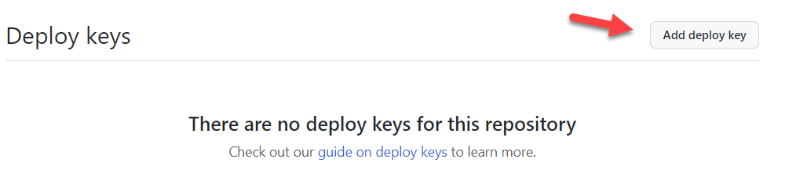
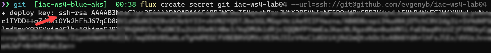
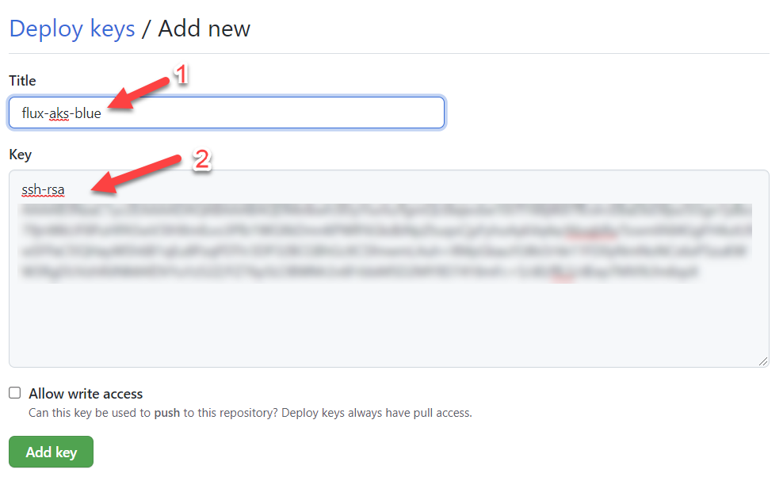

# lab-04 - use Flux Kustomize Controller to deploy Kubernetes manifests

## Estimated completion time - xx min

The kustomize-controller is a Kubernetes operator, specialized in running continuous delivery pipelines for infrastructure and workloads defined with Kubernetes manifests and assembled with Kustomize.

 

When you bootstrap Flux with `flux bootstrap` command, it creates "system" `flux-system` git repository source and `flux-system` Kustomization resources. But quite often k8sKubernetes manifests and helm charts are stored at different github repositories, therefore you might need to configure several `GitRepository` resources and corresponding `Kustomization` resources that will fetch the k8s manifests from the source and apply it on the cluster. 

Flux provides you with [flux create source git](https://fluxcd.io/docs/cmd/flux_create_source_git/) and  [flux create kustomization](https://fluxcd.io/docs/cmd/flux_create_kustomization/) set of commands that create these resources.

## Goals

The goal for this lab is to learn how to create and configure Flux  `GitRepository` and `Kustomization` resources.

* Create Kubernetes secret with Git SSH authentication key
* Create GitRepository using `flux cli`
* Generate GitRepository manifest using `flux cli`
* Create Kustomization using `flux cli`
* Generate Kustomization manifest using `flux cli`

## Task #1 - create new github repository

```bash
# Create new iac-ws4-lab04 repository. Make sure that you run this command outside of github repository, otherwise you will get the following error message  'error: remote origin already exists.' and you will need to clone iac-ws4-lab04 to some other folder.
gh repo create iac-ws4-lab04 --private -g VisualStudio -y

# Go ito the repo folder
cd iac-ws4-lab04
```

## Task #2 - create deployment key

```bash
# Create a Git SSH authentication secret
flux create secret git iac-ws4-lab04 --url=ssh://git@github.com/evgenyb/iac-ws4-lab04 --ssh-key-algorithm=rsa  --ssh-rsa-bits 4096

✚ deploy key: ssh-rsa AAAAB...==

► git secret 'iac-ws4-lab04' created in 'flux-system' namespace
```

At this point, you need to create new deployment key at the `iac-ws4-lab04` repository. Navigate to `https://github.com/<YOUR-GITHUB-USER>/iac-ws4-lab04/settings/keys` and click `Add deployment key`



At the form, give the new deployment key a name, for instance `flux-aks-blue` and then copy `deploy key` ssh key from the output of the `flux create secret git` command



into the `Key` field 



and click `Add key`.

## Task #3 - create new GitRepository using `flux cli`

There are two ways you can create GitRepository. You can manually create k8s manifest file or you can use `flux create source git` command. You can execute `flux create source git` command and it will deploy `GitResource` to the cluster. If you only want `flux` to generate `GitResource` manifest, use `--export` flag. 

```bash
# Create new github repository 
flux create source git iac-ws4-lab04-1 --url=ssh://git@github.com/evgenyb/iac-ws4-lab04 --secret-ref iac-ws4-lab04 --branch=main --interval=1m

✚ generating GitRepository source
► applying GitRepository source
✔ GitRepository source created
◎ waiting for GitRepository source reconciliation
✔ GitRepository source reconciliation completed
✔ fetched revision: main/7657e4a6680283f530b618d5afb31542dd4a9f05
```

Note that here we referenced `iac-ws4-lab04` secret created at the step 1.

## Task #4 - use `flux cli` to generate `GitRepository` manifest 

Sometimes, you only want to generate k8s manifest without actually creating resource in Kubernetes. You can still use `flux create source git` command, but with additional `--export` flag.

```bash
# Make sure that you are inside iac-ws4-lab04 repo folder
pwd
Path
----
C:\Users\evgen\git\iac-ws4-lab04

# Generate GitRepository manifest 
flux create source git iac-ws4-lab04-2 --url=ssh://git@github.com/evgenyb/iac-ws4-lab04 --secret-ref iac-ws4-lab04 --branch=main --interval=1m --export > iac-ws4-lab04-2-source.yaml
```

Check the content of the `iac-ws4-lab04-2-source.yaml` file. It should look like this:

```yaml
---
apiVersion: source.toolkit.fluxcd.io/v1beta1
kind: GitRepository
metadata:
  name: iac-ws4-lab04-2
  namespace: flux-system
spec:
  interval: 1m0s
  ref:
    branch: main
  secretRef:
    name: iac-ws4-lab04
  url: ssh://git@github.com/<YOUR-GITHUB-USER>/iac-ws4-lab04
```
## Task #5 - create `Kustomization` resource using `flux cli`

A `Kustomization` object defines the source of Kubernetes manifests by referencing an object managed by source-controller, for this lab `GitRepository`, the path to the manifest files within that source, and the interval at which the kustomize build output is applied on the cluster.

Let's create new `Kustomization` resource that will use `iac-ws4-lab04-1` git repository as a source and use path `./k8s/manifests`.

```bash
flux create kustomization iac-ws4-lab04-1 --source=iac-ws4-lab04-1 --path="./k8s/manifests" --interval=1m

✚ generating Kustomization
► applying Kustomization
✔ Kustomization created
◎ waiting for Kustomization reconciliation
✗ kustomization path not found: stat /tmp/iac-ws4-lab04-1823367980/k8s/manifests: no such file or directory 
```

It fails because `k8s/manifests` folder is not found under the `iac-ws4-lab04-1` repo. Let's fix it. 

```bash
# Make sure that you are inside iac-ws4-lab04 repo folder
pwd
Path
----
...\iac-ws4-lab04

# Create k8s/manifests folder structure
mkdir k8s/manifests

# Move iac-ws4-lab04-2-source.yaml into k8s/manifests folder
mv ./iac-ws4-lab04-2-source.yaml ./k8s/manifests

# Add, commit and push change to the repo
git status
git add -A
git commit -m "Add k8s/manifests folders"
git push

# Check the status of iac-ws4-lab04-1 kustomization 
flux get kustomization iac-ws4-lab04-1 -w

# After about one minute the READY status should be set to True and MESSAGE should contain the current revision
NAME            READY   MESSAGE                                                                                                         REVISION        SUSPENDED
iac-ws4-lab04-1 False   kustomization path not found: stat /tmp/iac-ws4-lab04-1483509593/k8s/manifests: no such file or directory                       False
iac-ws4-lab04-1 Unknown reconciliation in progress              False
iac-ws4-lab04-1 True    Applied revision: main/cfdea4cb46314c387b624dcd954f4aa5f2d5c27d main/cfdea4cb46314c387b624dcd954f4aa5f2d5c27d   False
```

## Task #6 - use `flux cli` to generate `Kustomization` manifest file 

Quite often, you only need to generate Kubernetes manifest without actually creating resource in Kubernetes. You can still use `flux create kustomization` command with additional `--export` flag.

```bash
# Make sure that you are inside iac-ws4-lab04 repo folder
pwd
Path
----
C:\Users\evgen\git\iac-ws4-lab04

# Generate Kustomization manifest 
flux create kustomization iac-ws4-lab04-2 --source=iac-ws4-lab04-2 --path="./k8s/manifests" --interval=1m --export > k8s/manifests/iac-ws4-lab04-2-kustomization.yaml
```

Check the content of the `iac-ws4-lab04-2-kustomization.yaml` file. It should look similar to this one:

```yaml
---
apiVersion: kustomize.toolkit.fluxcd.io/v1beta2
kind: Kustomization
metadata:
  name: iac-ws4-lab04-2
  namespace: flux-system
spec:
  interval: 1m0s
  path: ./k8s/manifests
  prune: false
  sourceRef:
    kind: GitRepository
    name: iac-ws4-lab04-2
```

## Task #7 - add namespaces.yaml under source control

If you managed to complete `lab-02`, just copy `namespaces.yaml` file into the `k8s/manifests` folder, otherwise create new file with the following content:

```yaml
---
apiVersion: v1
kind: Namespace
metadata:
  name: team-b
---
apiVersion: v1
kind: Namespace
metadata:
  name: team-c
```

Add, commit and push changes 
```bash
# Add, commit and push change to the repo
git status
git add -A
git commit -m "Add namespaces"
git push
```

## Task #7 - deploy `green` cluster and get some coffee

```bash
# Deploy green cluster
az deployment sub create --location westeurope --template-file ./deployment.bicep  --parameters './parameters-green.json'
 \ Running ..
```

## Useful links

* [Kustomize Controller](https://fluxcd.io/docs/components/kustomize/)
* [flux create source git](https://fluxcd.io/docs/cmd/flux_create_source_git/)
* [flux create kustomization](https://fluxcd.io/docs/cmd/flux_create_kustomization/)

## Next: manage Helm Releases with Flux

[Go to lab-05](../lab-05/readme.md)

## Feedback

* Visit the [Github Issue](https://github.com/evgenyb/aks-workshops/issues/xx) to comment on this lab.