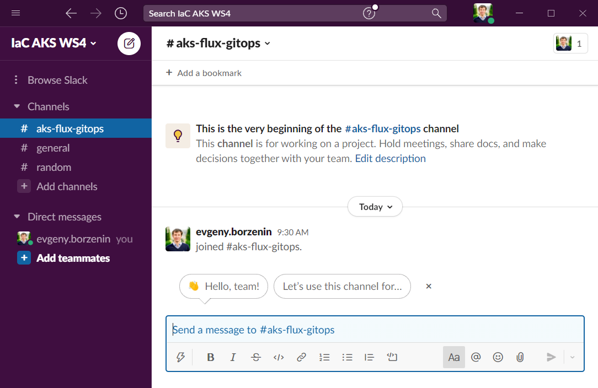
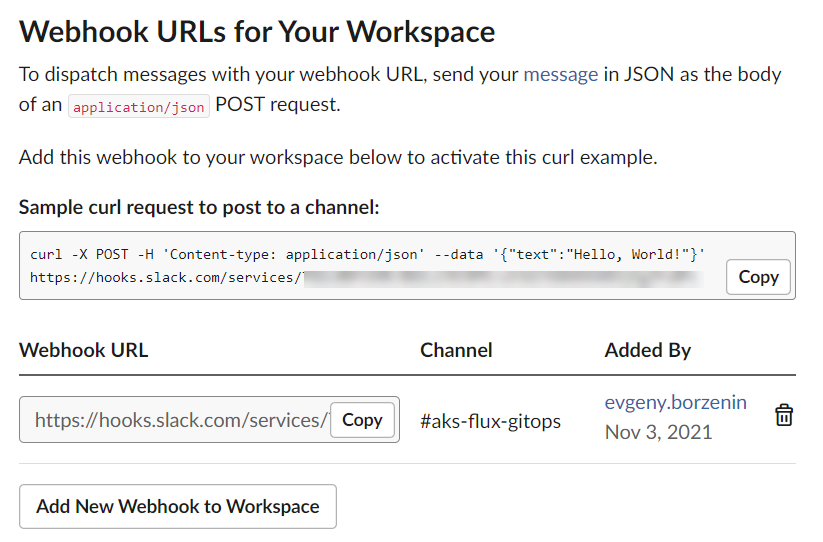
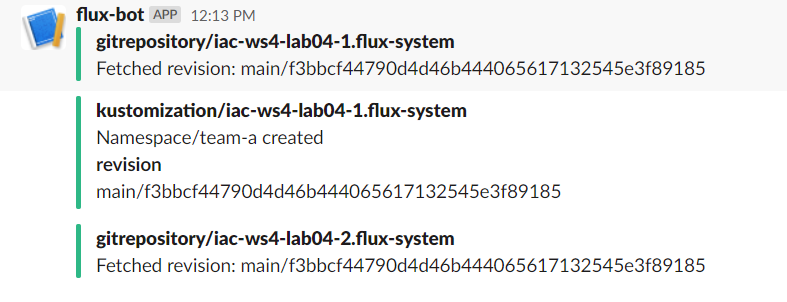
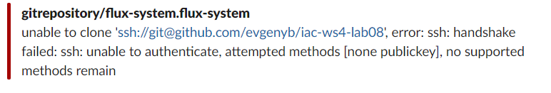

# lab-08 - working with notifications

## Estimated completion time - xx min

When operating a cluster, you may want to receive notifications about the status of GitOps pipelines. For example, the on-call team would receive alerts about reconciliation failures in the cluster, while the dev team may wish to be alerted when a new version of an app was deployed and if the deployment is healthy.


The Flux controllers emit Kubernetes events whenever a resource status changes. You can use the notification-controller to forward these events to `Slack` or `Microsoft Teams`. The notification controller is part of the default Flux installation.


## Goals

* Setup Flux Notifications into the `Slack`

## Task #0 - switch back to `blue` cluster

Since we already deployed `Kustomization` int the `blue` cluster, let's switch back to it.

```bash
# Switch to the to iac-ws4-blue-aks
kubectl config use-context iac-ws4-blue-aks
```

## Task #1 - Install Slack and create workspace

If you already using `Slack`, you can skip this step. 

First, [download](https://slack.com/downloads/windows) install Slack.
Next, create new Slack workspace by following the following [instructions](https://slack.com/help/articles/206845317-Create-a-Slack-workspace).

Here is how my newly created Workspace looks like



## Task #2 - set up incoming webhook

Follow the following [instructions](https://slack.com/help/articles/115005265063-Incoming-webhooks-for-Slack) to create a new webhook.

The last step at this process should look similar to this



and you need tp copy this URL. 


## Task #3 - create a secret with your Slack incoming webhook

```bash
# Create a secret with your Slack incoming webhook
kubectl -n flux-system create secret generic slack-url --from-literal=address=your_slack_webhook
secret/slack-url created

# Create slack alert provider
flux create alert-provider slack --type slack --channel aks-flux-gitops --secret-ref slack-url 
✚ generating Provider
► applying Provider
✔ Provider created
◎ waiting for Provider reconciliation
✔ Provider slack is ready
```

I want my alerts to be sent into the `aks-flux-gitops` Slack channel. Change it if you use different channel name.

```bash
# Create an alert definition for all github repositories and kustomizations
flux create alert slack-alert --event-severity info --event-source Kustomization/* --event-source GitRepository/* --provider-ref slack
✚ generating Alert
► applying Alert
✔ Alert created
◎ waiting for Alert reconciliation
✔ Alert slack-alert is ready
```

As always, if you need to generate Kubernetes manifest files without creating resources, use `--export` flag.

## Task #4 - test alert

To test alert, we need to apply a change at manifests under the `Kustomization`. During `lab-04` we added `namespaces.yaml` file under the `k8s/manifests` folder of `iac-ws4-lab04` repo. Let's add new namespace into this file and push the change.

```yaml
---
apiVersion: v1
kind: Namespace
metadata:
  name: team-a
```

```bash
# Add, commit and push changes
git add -A
git commit -m "Add team-a namespace"
git push

# Check namespaces
kubectl get ns -w
NAME              STATUS   AGE
default           Active   60m
flux-system       Active   22m
kube-node-lease   Active   60m
kube-public       Active   60m
kube-system       Active   60m
team-b            Active   15m
team-c            Active   15m
team-a            Active   0s
```

Eventually `team-a` namespace will be created and you should also see the notification alert in your `Slack` channel



If something is broken, Flux can't get sources or deployment fails, you will receive alerts into `Slack`. Here is another example of Flux reacting when I removed repository that was still in use.



## Useful links

* [Notification Controller](https://fluxcd.io/docs/components/notification/)
* [Flux: Alert](https://fluxcd.io/docs/components/notification/alert/)
* [Flux: Provider](https://fluxcd.io/docs/components/notification/provider/)
* [flux create alert-provider](https://fluxcd.io/docs/cmd/flux_create_alert-provider/)
* [flux create alert](https://fluxcd.io/docs/cmd/flux_create_alert/)
* [Incoming webhooks for Slack](https://slack.com/help/articles/115005265063-Incoming-webhooks-for-Slack)
* [Create a Slack workspace](https://slack.com/help/articles/206845317-Create-a-Slack-workspace)

## Next: monorepo as Flux repository structure

[Go to lab-08](../lab-08/readme.md)

## Feedback

* Visit the [Github Issue](https://github.com/evgenyb/aks-workshops/issues/xx) to comment on this lab.