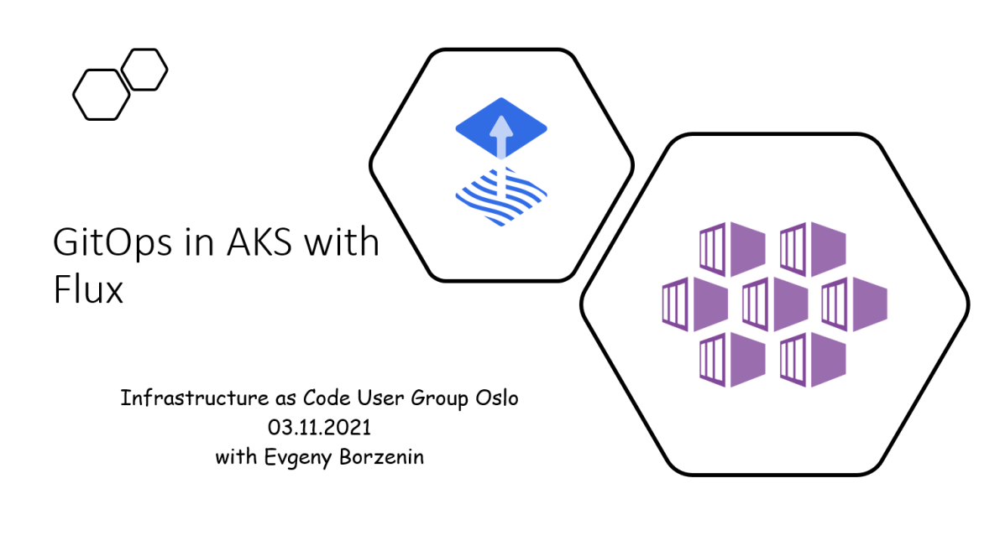

# Workshop #4 - GitOps in AKS with Flux

This is an introduction level workshop for those of you who have never worked with GitOps in Kubernetes. This workshop covers the basics of GitOps in Kubernetes with [Flux](https://fluxcd.io/) and you will learn:
 * How to install Flux to AKS cluster
 * How to configure Flux with your git repository
 * How to continuous deliver infrastructure and workloads changes defined with Kubernetes manifests and assembled with [Kustomize](https://kustomize.io/)
 * How to declaratively manage Helm chart releases with Kubernetes manifests 
 * Different ways how you can structure your repositories
 * How to upgrade flux 
 * How to monitor flux
 
Here is the preliminary agenda for the workshops (this is subject to change):
 
 * Welcome
 * GitOps at AKS with Flux (slides)
 * [Lab-01](labs/lab-01/readme.md) - provision AKS cluster (20 min)
 * [Lab-02](labs/lab-02/readme.md) - post provisioning configuration: namespaces, RBAC, deploy [kured](https://github.com/weaveworks/kured) and [NGINX ingress controller](https://docs.microsoft.com/en-us/azure/aks/ingress-internal-ip?WT.mc_id=AZ-MVP-5003837) (xx min)
 * [Lab-03](labs/lab-03/readme.md) - install Flux CLI to your PC and Flux onto your cluster (xx min)
 * Lab-04 - add repository to Flux with Kubernetes manifests (xx min)
 * Lab-05 - manage Helm Releases with Flux  (xx min)
 * Leb-06 - implement and deploy new AKS environment with Flux
 * Lab-07 - setup notifications (xx min)
 * Lab-08 - cleaning up

## Links

* [Prerequisites](prerequisites.md)
* [Azure Kubernetes Service (AKS)](https://docs.microsoft.com/en-us/azure/aks/?WT.mc_id=AZ-MVP-5003837)
* [GitOps for Azure Kubernetes Service](https://docs.microsoft.com/en-us/azure/architecture/example-scenario/gitops-aks/gitops-blueprint-aks?WT.mc_id=AZ-MVP-5003837)
* [Flux - the GitOps family of projects](https://fluxcd.io/)

## Feedback

* Visit the [Github Issue](https://github.com/evgenyb/aks-workshops/issues/35) to comment on this workshop. 
