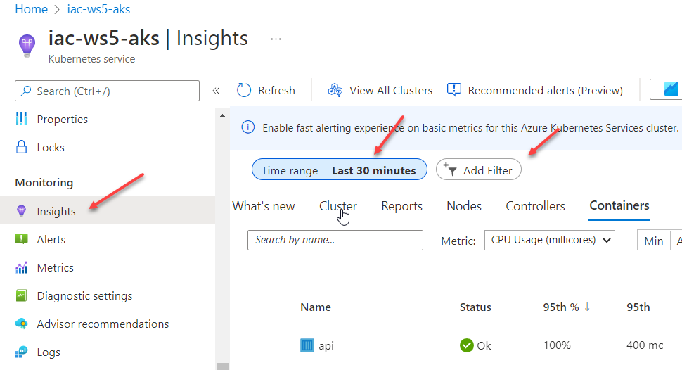
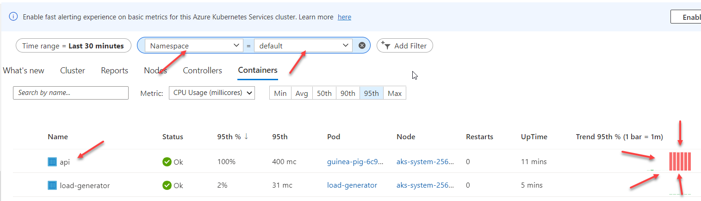

```bash
kubectl scale --replicas=3 deployment/guinea-pig
```

## Useful links

* [Manually scale pods](https://docs.microsoft.com/en-us/azure/aks/tutorial-kubernetes-scale?WT.mc_id=AZ-MVP-5003837&tabs=azure-cli#manually-scale-pods)


## Next: manually scale applications in AKS

[Go to lab-04](../lab-04/readme.md)