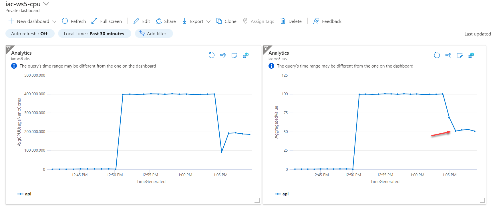

# lab-04 - manually scale applications in AKS

You can manually scale replicas (pods) to test how your application responds to a change in available resources and state. Manually scaling resources also lets you define a set amount of resources to use to maintain a fixed cost. To manually scale, you define the replica count. The Kubernetes API then schedules creating additional pods based on that replica count.

## Task #1 - manually scale guinea-pig application to 3 instances

Make sure that the load script is still running. If not run it again 

```bash
# Generate some load to guinea-pig application
kubectl run -i --tty load-generator --rm --image=busybox --restart=Never -- /bin/sh -c "while sleep 0.01; do wget -q -O- http://guinea-pig-service/api/highcpu; done"
```

Now, let's scale `guinea-pig` application to 3 instances and see how it will affect the performance. 

```bash
# Scaling guinea-pig to 3 instances
kubectl scale deployment/guinea-pig --replicas=3

# Check that new pods are up and running
kubectl get po -w
NAME                          READY   STATUS    RESTARTS   AGE
guinea-pig-6c994669b7-4p4b4   1/1     Running   0          7s
guinea-pig-6c994669b7-95n75   1/1     Running   0          7s
guinea-pig-6c994669b7-xnvnr   1/1     Running   0          36m
load-generator                1/1     Running   0          15m
```

Wait about 1-2 mins and refresh your dashboard. You should see that CPU usage dropped and our application is performing within acceptable CPU range (below 70%).



## Task #2 - scale down application to one replica

```bash
# Scaling guinea-pig to 3 instances
kubectl scale deployment/guinea-pig --replicas=1

# Check that we are back to one pod
kubectl get po -w
NAME                          READY   STATUS    RESTARTS   AGE
guinea-pig-6c994669b7-xnvnr   1/1     Running   0          59m
load-generator                1/1     Running   0          38m
```

## Useful links

* [Manually scale pods](https://docs.microsoft.com/en-us/azure/aks/tutorial-kubernetes-scale?WT.mc_id=AZ-MVP-5003837&tabs=azure-cli#manually-scale-pods)
* [kubectl scale](https://kubernetes.io/docs/reference/generated/kubectl/kubectl-commands#scale)

## Next: use Horizontal Pod Autoscaling (HPA) to automatically scale applications

[Go to lab-05](../lab-05/readme.md)