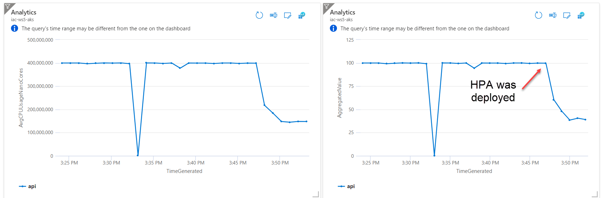
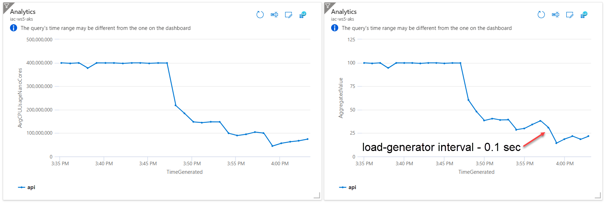

# lab-05 - use Horizontal Pod Autoscaling (HPA) to automatically scale applications

Kubernetes uses the horizontal pod autoscaler (HPA) to monitor the resource demand and automatically scale the number of replicas. By default, the horizontal pod autoscaler checks the Metrics API every 30 seconds for any required changes in replica count. When changes are required, the number of replicas is increased or decreased accordingly. 
When you configure the horizontal pod autoscaler for a given deployment, you define the minimum and maximum number of replicas that can run. You also define the metric to monitor and base any scaling decisions on, such as CPU usage.

## Task #1 - create the HorizontalPodAutoscaler 

Let's create new `HorizontalPodAutoscaler` that maintains between 1 and 10 replicas of the `guinea-pig` Pods.

The HPA controller will increase and decrease the number of replicas (by updating the Deployment) to maintain an average CPU utilization across all Pods of `70%`. The Deployment then updates the ReplicaSet - this is part of how all Deployments work in Kubernetes - and then the ReplicaSet either adds or removes Pods based on the change to its `.spec`.
Since we configured that each `guinea-pig` pod requests 400 milli-cores by kubectl run, this means an average CPU usage of 280 milli-cores. 

If you are on Windows and use Windows Terminal, I recommend you to setup it up with two windows. Use left terminal to execute commands and use right terminal to watch what is going on at the kubernetes side. 

Execute the following command at the right terminal to watch the status changes at the `HorizontalPodAutoscaler`.

```bash
# check the current status of the HorizontalPodAutoscaler
kubectl get hpa -w
```

In the left terminal, create new  HorizontalPodAutoscaler. 

```bash
# Create the HorizontalPodAutoscaler
kubectl autoscale deployment guinea-pig --cpu-percent=70 --min=1 --max=10
horizontalpodautoscaler.autoscaling/guinea-pig autoscaled
```

Observe the HPA status changes at the left window.

```bash
kubectl get hpa -w
NAME         REFERENCE               TARGETS         MINPODS   MAXPODS   REPLICAS   AGE
guinea-pig   Deployment/guinea-pig   <unknown>/70%   1         10        0          0s
guinea-pig   Deployment/guinea-pig   200%/70%        1         10        1          15s
guinea-pig   Deployment/guinea-pig   200%/70%        1         10        3          30s
```

As you can see, HPA was created first, it calculated that `guinea-pig` uses 200% of CPU allocated to it and immediately scaled the number of replicas up to 3. After a while it scaled number of replicas to 4 and then CPU usage stabilized at around 70%.

```bash
kubectl get hpa -w
NAME         REFERENCE               TARGETS   MINPODS   MAXPODS   REPLICAS
guinea-pig   Deployment/guinea-pig   168%/70%        1         10        3          45s
guinea-pig   Deployment/guinea-pig   90%/70%         1         10        3          105s
guinea-pig   Deployment/guinea-pig   90%/70%         1         10        4          2m1s
guinea-pig   Deployment/guinea-pig   74%/70%         1         10        4          2m46s
guinea-pig   Deployment/guinea-pig   71%/70%         1         10        4          4m46s
```

Let's check metrics at the dashboard. You should see something similar.



## Task #2 - decrease the load

Now, let's decrease the load to see how the autoscaler reacts to load decrease. If your `load-generator` command is still running, stop it. If you lost your command, but your `load-generator` pod is still running, kill it.

```bash
# check if load-generator pos is up and running
kubectl get po
NAME                          READY   STATUS    RESTARTS   AGE
load-generator                1/1     Running   0          14m

# if it does, delete it
kubectl delete po load-generator
pod "load-generator" deleted
```

Now, load-generator will run an infinite loop, sending `wget -q -O- http://guinea-pig-service/api/highcpu` query to the `guinea-pig-service` every 0.1 sec. 

```bash
kubectl run -i --tty load-generator --rm --image=busybox --restart=Never -- /bin/sh -c "while sleep 0.1; do wget -q -O- http://guinea-pig-service/api/highcpu; done"
```
Observe the HPA status changes at the left window.
```bash
get hpa -w
NAME         REFERENCE               TARGETS   MINPODS   MAXPODS   REPLICAS   AGE
guinea-pig   Deployment/guinea-pig   32%/70%         1         10        4          13m
guinea-pig   Deployment/guinea-pig   34%/70%         1         10        4          14m
guinea-pig   Deployment/guinea-pig   34%/70%         1         10        4          15m
guinea-pig   Deployment/guinea-pig   41%/70%         1         10        3          15m
guinea-pig   Deployment/guinea-pig   41%/70%         1         10        3          16m
guinea-pig   Deployment/guinea-pig   54%/70%         1         10        2          16m
guinea-pig   Deployment/guinea-pig   68%/70%         1         10        2          17m
```

CPU consumption has decreased to around 50% of the request. As a result, the Deployment was resized to 3 and then to 2 replicas.

Check the metrics at the Dashboard



## Useful links
* [Horizontal Pod Autoscaling](https://kubernetes.io/docs/tasks/run-application/horizontal-pod-autoscale/)
* [HorizontalPodAutoscaler Walkthrough](https://kubernetes.io/docs/tasks/run-application/horizontal-pod-autoscale-walkthrough/)
* [kubectl autoscale](https://jamesdefabia.github.io/docs/user-guide/kubectl/kubectl_autoscale/)
* [Autoscale pods](https://docs.microsoft.com/en-us/azure/aks/tutorial-kubernetes-scale?tabs=azure-cli#autoscale-pods)

## Next: manually scale the node count in an AKS cluster

[Go to lab-06](../lab-06/readme.md)