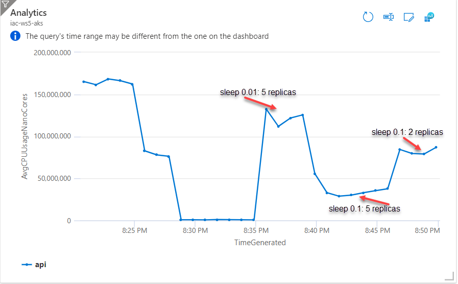

```bash
kubectl autoscale deployment guinea-pig --cpu-percent=70 --min=1 --max=10

horizontalpodautoscaler.autoscaling/guinea-pig autoscaled

```

```bash
get hpa -w
NAME         REFERENCE               TARGETS   MINPODS   MAXPODS   REPLICAS   AGE
guinea-pig   Deployment/guinea-pig   82%/70%   1         10        2          52s
guinea-pig   Deployment/guinea-pig   41%/70%   1         10        2          75s
guinea-pig   Deployment/guinea-pig   38%/70%   1         10        2          2m15s
guinea-pig   Deployment/guinea-pig   0%/70%    1         10        2          3m16s
guinea-pig   Deployment/guinea-pig   0%/70%    1         10        2          8m2s
guinea-pig   Deployment/guinea-pig   0%/70%    1         10        1          8m17s
```

```bash
get hpa -w
NAME         REFERENCE               TARGETS   MINPODS   MAXPODS   REPLICAS   AGE
guinea-pig   Deployment/guinea-pig   0%/70%    1         10        1          8m17s
guinea-pig   Deployment/guinea-pig   199%/70%   1         10        1          10m
guinea-pig   Deployment/guinea-pig   199%/70%   1         10        3          10m
guinea-pig   Deployment/guinea-pig   95%/70%    1         10        3          11m
guinea-pig   Deployment/guinea-pig   95%/70%    1         10        5          11m
guinea-pig   Deployment/guinea-pig   62%/70%    1         10        5          12m
guinea-pig   Deployment/guinea-pig   58%/70%    1         10        5          13m
```

```bash
kubectl run -i --tty load-generator --rm --image=busybox --restart=Never -- /bin/sh -c "while sleep 0.1; do wget -q -O- http://guinea-pig-service/api/highcpu; done"
```

```bash
get hpa -w
NAME         REFERENCE               TARGETS   MINPODS   MAXPODS   REPLICAS   AGE
guinea-pig   Deployment/guinea-pig   58%/70%    1         10        5          13m
guinea-pig   Deployment/guinea-pig   17%/70%    1         10        5          15m
guinea-pig   Deployment/guinea-pig   17%/70%    1         10        5          16m
guinea-pig   Deployment/guinea-pig   16%/70%    1         10        5          17m
guinea-pig   Deployment/guinea-pig   17%/70%    1         10        5          18m
guinea-pig   Deployment/guinea-pig   16%/70%    1         10        5          19m
guinea-pig   Deployment/guinea-pig   16%/70%    1         10        5          20m
guinea-pig   Deployment/guinea-pig   19%/70%    1         10        2          20m
guinea-pig   Deployment/guinea-pig   42%/70%    1         10        2          21m
guinea-pig   Deployment/guinea-pig   40%/70%    1         10        2          22m
guinea-pig   Deployment/guinea-pig   39%/70%    1         10        2          23m
guinea-pig   Deployment/guinea-pig   41%/70%    1         10        2          24m
guinea-pig   Deployment/guinea-pig   42%/70%    1         10        2          25m
guinea-pig   Deployment/guinea-pig   39%/70%    1         10        2          26m
guinea-pig   Deployment/guinea-pig   41%/70%    1         10        2          27m
```

