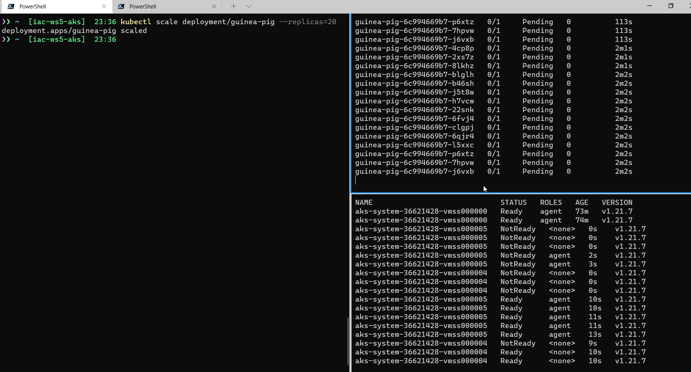

# lab-07 - use cluster autoscaler to automatically scale an AKS cluster to meet application demands

 To respond to changing pod demands, Kubernetes has a cluster autoscaler, that adjusts the number of nodes based on the requested compute resources in the node pool. By default, the cluster autoscaler checks the Metrics API server every 10 seconds for any required changes in node count. If the cluster autoscale determines that a change is required, the number of nodes in your AKS cluster is increased or decreased accordingly. 

Cluster autoscaler is typically used alongside the horizontal pod autoscaler (HPA). When combined, the horizontal pod autoscaler increases or decreases the number of pods based on application demand, and the cluster autoscaler adjusts the number of nodes as needed to run those additional pods accordingly.

## Task #1 - enable the cluster autoscaler

Since we already have a provision cluster with autoscaler disabled, we need to enable autoscaler first. Use the [az aks update](https://docs.microsoft.com/en-us/cli/azure/aks?WT.mc_id=AZ-MVP-5003837&view=azure-cli-latest#az-aks-update) command with `--enable-cluster-autoscaler` parameter, and specify a node `--min-count` and `--max-count`.

```bash
# enable the cluster autoscaler
az aks update --resource-group <your-unique-id>-rg --name <your-unique-id>-aks --enable-cluster-autoscaler --min-count 1 --max-count 3
```
## Task #2 - test autoscaler

Before we start, if your `load-generator` command is still running, stop it. If you can't find command, but your `load-generator` pod is still running, kill it.

```bash
# check if load-generator pos is up and running
kubectl get po
NAME                          READY   STATUS    RESTARTS   AGE
load-generator                1/1     Running   0          14m

# Kill load-generator pod
kubectl delete po load-generator
pod "load-generator" deleted
```
Next, let's delete HPA, because we want manually scale up number of replicas.

```bash
# delete HPA
kubectl delete hpa guinea-pig
```

If you use Windows Terminal I recommend you the following setup:

* Left window for executing commands
* Top right window to watch status changes with the pods - `kubectl get po -w`
* Bottom right window to watch status changes with nodes - `kubectl get nodes -w`




```bash
# Scale guinea-pig application up to 20 replicas
kubectl scale deployment/guinea-pig --replicas=20
```

You will see that Kubernetes will start scaling `guinea-pg` application up, will try to create 20 replicas, but you will notice that a lot of pods will be in `Pending` state. This is because there is not enough recurses available to schedule pods. 

In about 1-2 mins, you should see two more nodes created. They will first have `NotReady` state and then eventually switch into `Ready` state.

We can use the technique to scale the number of nodes down.

```bash
# Scale guinea-pig application down to two replicas
kubectl scale deployment/guinea-pig --replicas=2
```

Observe your monitoring windows. First, you will see that Kubernetes will terminate all but two `guinea-pg` pods. Then it will take some time (sometimes more than 5 min)before AKS will start draining nodes. You will notice it when nodes status will change to `NotReady`. After that nodes will be decommissioned.

## Useful links

* [Scaling options for applications in Azure Kubernetes Service (AKS)](https://docs.microsoft.com/en-us/azure/aks/concepts-scale?WT.mc_id=AZ-MVP-5003837)
* [Cluster autoscaler](https://docs.microsoft.com/en-us/azure/aks/concepts-scale?WT.mc_id=AZ-MVP-5003837#cluster-autoscaler)
* [Scale the node count in an Azure Kubernetes Service (AKS) cluster](https://docs.microsoft.com/en-us/azure/aks/scale-cluster?WT.mc_id=AZ-MVP-5003837)
* [Automatically scale a cluster to meet application demands on Azure Kubernetes Service (AKS)](https://docs.microsoft.com/en-us/azure/aks/cluster-autoscaler?WT.mc_id=AZ-MVP-5003837)
* [az aks update](https://docs.microsoft.com/en-us/cli/azure/aks?WT.mc_id=AZ-MVP-5003837&view=azure-cli-latest#az-aks-update)

## Next: deploy KEDA

[Go to lab-08](../lab-08/readme.md)
