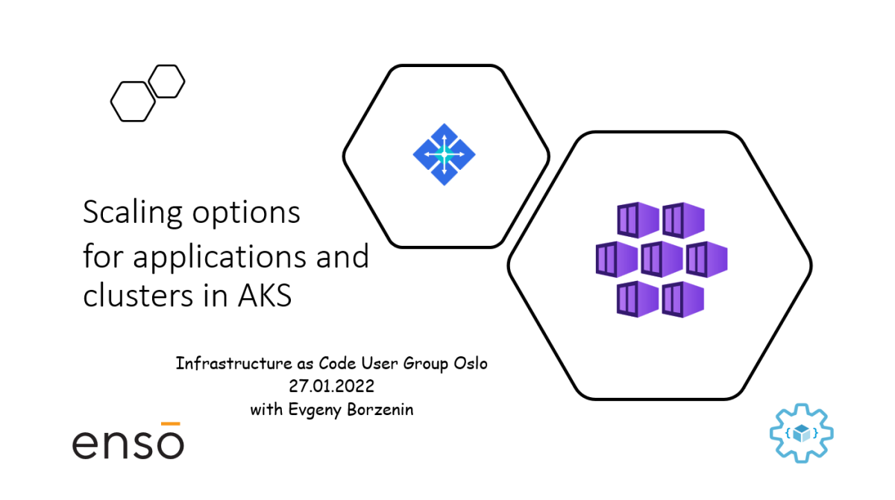

# Workshop #5 - scaling options for applications and clusters in AKS

This is an introduction level workshop that covers scaling options for applications and clusters in AKS and you will learn:

* What kind of scaling options are available for applications and clusters in AKS
* How to manually scale pods and nodes
* What is [Horizontal Pod Autoscaling](https://kubernetes.io/docs/tasks/run-application/horizontal-pod-autoscale/) (HPA) and how does it work
* How cluster autoscaler works
* What is Kubernetes-based Event Driven Autoscaler ([KEDA](https://keda.sh/)) and how to use it to scale your applications

## Agenda

Here is the preliminary agenda for the workshops (still work in progress and subject to change):
 
 * Welcome
 * [Lab-01](labs/lab-01/readme.md) - provision workshop resources (20 min)
 * Scaling applications in AKS concepts (slides)
 * [Lab-02](labs/lab-02/readme.md) - build and deploy test application (xx min)
 * [Lab-03](labs/lab-03/readme.md) - create monitoring dashboard for test application
 * Lab-03 - manually scale applications in AKS
 * Lab-04 - use Horizontal Pod Autoscaling (HPA) to automatically scale applications
 * Scaling AKS cluster concepts (slides)
 * Lab-05 - manually scale the node count in an AKS cluster 
 * Lab-06 - use cluster autoscaler to automatically scale an AKS cluster to meet application demands
 * Kubernetes Event-driven Autoscaling KEDA (slides)
 * Lab-07 - deploy KEDA
 * Lab-08 - use KEDA to autoscale application processing Azure Service Bus Queue
 * [Lab-09](labs/lab-09/readme.md) - cleaning up resources

## Links

* [Prerequisites](prerequisites.md)
* [Azure Kubernetes Service (AKS)](https://docs.microsoft.com/en-us/azure/aks/?WT.mc_id=AZ-MVP-5003837)
* [Kubernetes Event-driven Autoscaling KEDA](https://keda.sh/)
* [Horizontal Pod Autoscaling](https://kubernetes.io/docs/tasks/run-application/horizontal-pod-autoscale/)
* [Scaling options for applications in AKS](https://docs.microsoft.com/en-us/azure/aks/concepts-scale)

## Feedback

* Visit the [Github Issue](https://github.com/evgenyb/aks-workshops/issues/39) to comment on this workshop. 
