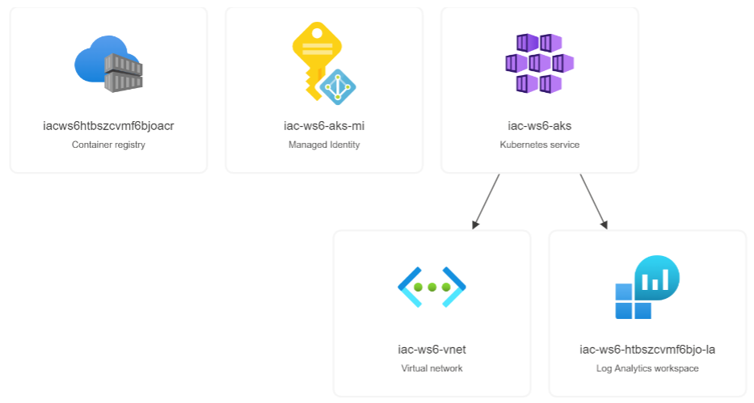
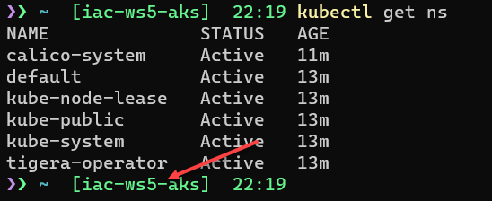

# lab-01 - provision workshop resources 

## Estimated completion time - 20 min

As always, we start with provision Azure Kubernetes Service (AKS) instance and all supported resources. We will use [Bicep](https://docs.microsoft.com/en-us/azure/azure-resource-manager/bicep?WT.mc_id=AZ-MVP-5003837) as IaC tool. AKS and supporting resources are not free and the compute power will come with some costs, but we will use the smallest Virtual Machine size for AKS nodes and we will keep number of nodes small. 

> Important! remember to delete all resources when you are finished with labs. 

Here is the list of resources we will provision:

* Resource Group
* Private Virtual Network
* Azure Container Registry (ACR)
* Azure Log Analytics
* Azure Application Insights
* Azure Kubernetes Service (AKS)

Our AKS cluster will fullfil the following requirements:

* Use [managed identities in AKS](https://docs.microsoft.com/en-us/azure/aks/use-managed-identity?WT.mc_id=AZ-MVP-5003837) to create additional resources like load balancers and managed disks in Azure
* Integrate AKS with Azure Log Analytics for monitoring
* Integrate AKS with Azure Container Registry

Here is the complete visualization of resources we will provision.



## Goals

* Provision workshop resources

## Task #1 - deploy workshop resources

All `Bicep` templates are located under `infra` folder and are split into the following modules: 

| Module name | Description |
|--|--|
| acr.bicep | Azure Container Registry resource implementation |
| aks.bicep | AKS implementation |
| appInsights.bicep | Azure Application Insights |
| attachACRToAKS.bicep | Contains code that attaches ACR to AKS instance |
| vnet.bicep | Private Virtual Network implementation |
| grantAksPermissions.bicep | Contains code that assign Network Contributor Role to AKS principal id |
| logAnalytics.bicep | Log Analytics implementation |

Deployment is orchestrated by the `deployment.bicep` template. All parameters are collected in `parameters.json` file. 

Let's provision AKS cluster.

```bash
# Select your subscription
az account set --subscription <YOUR-SUBSCRIPTION-ID>

# Deploy workshop resources
az deployment sub create --location westeurope --template-file ./deployment.bicep  --parameters './parameters.json'

# When provisioned (it takes approx. 5 min), connect to your cluster
az aks get-credentials --resource-group iac-ws6-rg --name iac-ws6-aks --overwrite-existing
```

If you already work with AKS cluster, most likely you already have `kubectl` CLI tool installed and you can skip next step. Otherwise, you need to install `kubectl`.

```bash
# Install kubectl
az aks install-cli
```

If you use PowerShell, you need to update system PATH environment variable and add new item for `%userprofile%\.azure-kubectl`. 


* Open the Start Search, type in `env`, and choose `Edit the system environment variables`
* Click the `Environment Variables…` button.
* Select `Path` variable under `System variables` section
* CLick `Edit...`
* Click `New` and set variable to `%userprofile%\.azure-kubectl`

You need to reset your PowerShell (and cmd) session(s) for change to take effect.

If you are running on WSL, you may need to use `sudo` command, in this case run 

```bash
# Install kubectl using sudo
sudo az aks install-cli
```

When `kubectl` is installed, test it by getting list of namespaces...

```bash
# Get list of namespaces
kubectl get ns
NAME              STATUS   AGE
calico-system     Active   3m51s
default           Active   6m21s
kube-node-lease   Active   6m24s
kube-public       Active   6m24s
kube-system       Active   6m24s
tigera-operator   Active   6m
```

If you use [Oh My Posh](https://ohmyposh.dev/docs/), you can configure that the name of active cluster is shown at the command line prompt, as it's shown below:



Learn how to [setup your shell (bash or PowerShell) for better AKS/kubectl experience](https://github.com/evgenyb/aks-workshops/tree/main/01-aks-and-k8s-101/labs/lab-02)


## Useful links

* [Network concepts for applications in Azure Kubernetes Service (AKS)](https://docs.microsoft.com/en-us/azure/aks/concepts-network?WT.mc_id=AZ-MVP-5003837)
* [Azure Container Registry documentation](https://docs.microsoft.com/en-us/azure/container-registry/?WT.mc_id=AZ-MVP-5003837)
* [Configure Azure CNI networking in Azure Kubernetes Service (AKS)](https://docs.microsoft.com/en-us/azure/aks/configure-azure-cni?WT.mc_id=AZ-MVP-5003837)
* [Best practices for advanced scheduler features in Azure Kubernetes Service (AKS)](https://docs.microsoft.com/en-us/azure/aks/operator-best-practices-advanced-scheduler?WT.mc_id=AZ-MVP-5003837)
* [az deployment sub create](https://docs.microsoft.com/en-us/cli/azure/deployment/sub?WT.mc_id=AZ-MVP-5003837&view=azure-cli-latest#az-deployment-sub-create)
* [az aks get-credentials](https://docs.microsoft.com/en-us/cli/azure/aks?WT.mc_id=AZ-MVP-5003837&view=azure-cli-latest#az-aks-get-credentials)

## Next: deploy test application

[Go to lab-02](../lab-02/readme.md)