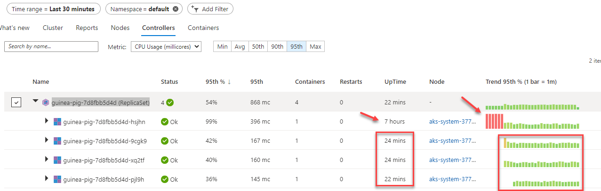

# lab-03 - monitoring AKS with Azure Container insights

Container insights gives you performance visibility by collecting memory and processor metrics from controllers, nodes, and containers that are available in Kubernetes through the Metrics API. Container logs are also collected. After you enable monitoring from Kubernetes clusters, metrics and logs are automatically collected for you through a containerized version of the Log Analytics agent for Linux. Metrics are written to the metrics store and log data is written to the logs store associated with your Log Analytics workspace.


## Goals

* To get familiar with Container insights functionality and navigation flow

## Task #1 (optional) - watch `How to monitor Kubernetes workloads with Azure Monitor for Containers` video from MS

Here is a very good compressed walk through video covering the basic functionality of Container insights. If you never worked with container insights, I recommend you to watch it. https://www.youtube.com/embed/XEdwGvS2AwA?start=333&end=1160
It should start from 5:33 and you can watch until 19:20.


## Task #2 - access custer performance from `Cluster` tab

Navigate to your cluster `Insights > Cluster` menu and do the following:

* change time range to `last 30 min` 
* add `namespace = default` filter
* at the `Node count` panel, only show nodes with status `Ready`
* enable `live` view and set refresh rate to `1 sec`

## Task #2 - work with `Reports`  

Navigate to the `Reports` tab and look at the available reports.

### Workload Details workbook

Open `Workload Details` workbook and configure it so it shows data for the last 15 min, only shows workloads from `default` namespace and only shows workload that called `guinea-pig-.....`

### Data Usage workbook

Open `Data Usage` workbook, switch to `By Table` view, set `Time range` to 15 min, and analyze how much billable data were already ingested into Log Analytics and from hat sources it was ingested from.

### Deployments workbook

Deployments workbook shows deployments and Horizontal Pod Autoscalers (HPA). If you didn't work with HPA, check this [lab](https://github.com/evgenyb/aks-workshops/blob/main/05-scaling-options-in-aks/labs/lab-05/readme.md) from [Workshop #5 - scaling options for applications and clusters in AKS](https://github.com/evgenyb/aks-workshops/tree/main/05-scaling-options-in-aks)

Let's create HPA guinea-pig deployment with 70% threshold.

```bash
# create HPA for guinea-pig deployment
kubectl autoscale deployment guinea-pig --cpu-percent=70 --min=1 --max=10
horizontalpodautoscaler.autoscaling/guinea-pig autoscaled

# Check the hpa status
kubectl get hpa -w
NAME         REFERENCE               TARGETS    MINPODS   MAXPODS   REPLICAS   AGE
guinea-pig   Deployment/guinea-pig   199%/70%   1         10        1          22s
guinea-pig   Deployment/guinea-pig   199%/70%   1         10        3          30s
guinea-pig   Deployment/guinea-pig   165%/70%   1         10        3          45s
guinea-pig   Deployment/guinea-pig   81%/70%    1         10        3          106s
guinea-pig   Deployment/guinea-pig   83%/70%    1         10        3          2m46s
guinea-pig   Deployment/guinea-pig   83%/70%    1         10        4          3m1s
guinea-pig   Deployment/guinea-pig   71%/70%    1         10        4          3m46s
guinea-pig   Deployment/guinea-pig   64%/70%    1         10        4          4m46s
```

Open `Deployments` workbook and filter deployments by `default` namespace.
Check `Deployment` tab. 
The check HPA tab. The `Current over time` should show some increase in number of replicas. 

## Task #3 - work with `Nodes`

Navigate to the `Nodes` tab.

* Expand both nodes and check how AKS managed workloads (deployed under `kube-system` namespace) and `guinea-pig` workload (`default` namespace) are distributed through the nodes.
* Select one of the nodes, note that `Overview` panel appeared at the right side of the window, and check what kind of information is available at `Overview` window. Also note that there is `Live Events` tab is available and it will show live events (I didn't get any while I was working with the labs...)  
* Configure filters so it only shows workloads from `default` namespace
* Click `View in Log analytics`. it will open Log Analytics with preloaded query.


## Task #4 - work with `Controllers`

Navigate to the `Controllers` tab.

* Configure filters so it only shows workloads from `default` namespace and only shows last 30 min of data
* Expand `guinea-pig-7d8fbb5d4d` replica set. Check that pods listed under, have different `UpTime` (because some of them were created by the HPA). Note that the oldest pod had struggled a bit with the load and only get back to normal CPU utilization after we deployed HPA. 

* Select `guinea-pig-7d8fbb5d4d` replica set and check what kind information is available in the Overview panel at the right.
* As with `Nodes`, you can go to  `View in Log analytics` and both check the Kusto query to collect events.
* Select one of the pods and check what kind information is available in the Overview panel. Navigate to  `Live Events` and check if there are any events available. 
* For selected pod, click on `Live Metrics` and observe how CPU and memory is utilized in real live. 


## Task #5 - work with `Containers`

Navigate to the `Containers` tab.

* Configure filters so it only shows workloads from `default` namespace and only shows last 30 min of data
* Select one of the `api` containers. and check what kind information is available in the Overview panel at the right.
* Open `Live Logs` and check that logs are coming in real live. Click `View on Log Analytics` and check that the same logs are shown. 
* As with `Nodes` and `Controllers` you can check `Live Events` and you can query then from Log Analytics by clicking  `View in Log analytics`.


## Useful links

* [Monitoring Azure Kubernetes Service (AKS) with Azure Monitor](https://docs.microsoft.com/en-us/azure/aks/monitor-aks?WT.mc_id=AZ-MVP-5003837)
* [Container insights overview](https://docs.microsoft.com/en-us/azure/azure-monitor/containers/container-insights-overview?WT.mc_id=AZ-MVP-5003837)
* [Enable Container insights](https://docs.microsoft.com/en-us/azure/azure-monitor/containers/container-insights-onboard?WT.mc_id=AZ-MVP-5003837)
* [How to query logs from Container insights](https://docs.microsoft.com/en-us/azure/azure-monitor/containers/container-insights-log-query?WT.mc_id=AZ-MVP-5003837)
## Next: configure scraping of Prometheus metrics with Azure Monitor

[Go to lab-04](../lab-04/readme.md)