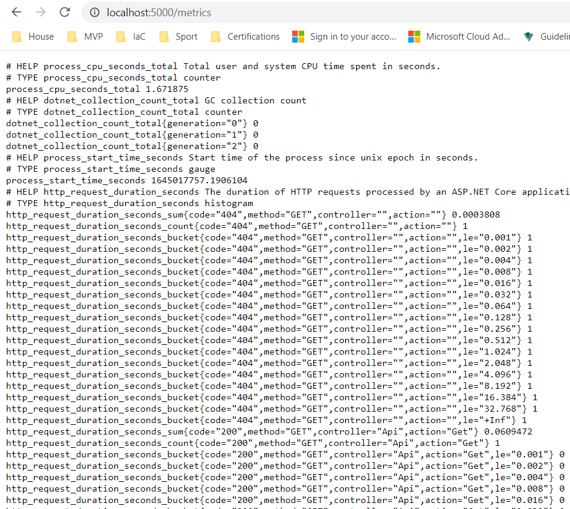

# lab-04 - configure scraping of Prometheus metrics with Azure Monitor

`Prometheus` is a popular open source metric monitoring solution and is a part of the [Cloud Native Compute Foundation](https://www.cncf.io/). Container insights provides a seamless onboarding experience to collect Prometheus metrics. 

Typically, to use Prometheus, you need to set up and manage a Prometheus server with a store. By integrating with [Azure Monitor](https://docs.microsoft.com/en-us/azure/azure-monitor/overview), a Prometheus server is not required. You just need to expose the Prometheus metrics endpoint through your exporters or pods (application), and the containerized agent for Container insights can scrape the metrics for you.


Container insights uses a containerized version of the Log Analytics agent for Linux called `omsagent`.  `omsagent` is deployed as a daemon running at each node. 

Active scraping of metrics from Prometheus in AKS is performed from one of two perspectives: `Cluster-wide` and `Node-wide`.

All metrics collected in both contexts should be defined in the ConfigMap called `ontainer-azm-ms-agentconfig` deployed into `kube-system` namespace.

For detailed documentation about how to configure ConfigMap, check this [document](https://docs.microsoft.com/en-us/azure/azure-monitor/containers/container-insights-prometheus-integration?WT.mc_id=AZ-MVP-5003837#configure-and-deploy-configmaps) 

or just read comments on the [default ConfigMap template](https://raw.githubusercontent.com/microsoft/Docker-Provider/ci_prod/kubernetes/container-azm-ms-agentconfig.yaml).

In this lab, we will configure `omsagent` to scrape Prometheus metrics from our `guinea-pig` application.

## Goals

* Learn how to enable Prometheus endpoint for asp.net core application
* Configure and deploy ConfigMaps to enable scraping of Prometheus metrics with Azure Monitor
* Query Prometheus metrics data
* Learn how to review Prometheus data usage


## Task #1 (Optional) - review how to enable prometheus endpoint at asp.net core application

If C# is like a Spanish for you, feel free to skip this task. Otherwise, here is quick step-by-step guide about how to enable Prometheus in your asp.net core app.

### Add Nuget package for ASP.NET Core middleware and stand-alone Kestrel metrics server

```powershell
Install-Package prometheus-net.AspNetCore
```

Add `endpoints.MapMetrics()` to the endpoint configuration under `app.UseEndpoints` inside `Startup.cs` file.

If you additionally want to expose HTTP request metrics, after `app.UseRouting()` add `app.UseHttpMetrics()`.

Start the project and navigate to `http://localhost:5000/metrics`. You should see bunch of metrics exposed.




## Task #2 - test that `guinea-pig` `/metrics` endpoint exposes Prometheus metrics 

We already deployed `guinea-pig` app into the cluster, so let's check if we it exposes Prometheus metrics. 

```bash
# Start curl just terminal
kubectl run curl -i --tty --rm --restart=Never --image=radial/busyboxplus:curl -- sh

[ root@curl:/ ]$ curl http://guinea-pig-service/metrics
```

Last command should print bunch of metrics.

## Task #3 - configure and deploy ConfigMaps to enable scraping of Prometheus metrics with Azure Monitor

As we already know, `omsagent` is configured using ConfigMap. Create new `container-azm-ms-agentconfig.yaml` file with the following content:

```yaml
kind: ConfigMap
apiVersion: v1
data:
  schema-version:
    #string.used by agent to parse config. supported versions are {v1}. Configs with other schema versions will be rejected by the agent.
    v1
  config-version:
    #string.used by customer to keep track of this config file's version in their source control/repository (max allowed 10 chars, other chars will be truncated)
    ver1

  prometheus-data-collection-settings: |-
    # Custom Prometheus metrics data collection settings
    [prometheus_data_collection_settings.cluster]
        # Cluster level scrape endpoint(s). These metrics will be scraped from agent's Replicaset (singleton)
        # Any errors related to prometheus scraping can be found in the KubeMonAgentEvents table in the Log Analytics workspace that the cluster is sending data to.

        #Interval specifying how often to scrape for metrics. This is duration of time and can be specified for supporting settings by combining an integer value and time unit as a string value. Valid time units are ns, us (or µs), ms, s, m, h.
        interval = "10s"

        # An array of Kubernetes services to scrape metrics from.
        kubernetes_services = ["http://guinea-pig-service.default/metrics"]

metadata:
  name: container-azm-ms-agentconfig
  namespace: kube-system
```

This is very shrinked version of the [default omsagent ConfigMap template](https://raw.githubusercontent.com/microsoft/Docker-Provider/ci_prod/kubernetes/container-azm-ms-agentconfig.yaml). 

I configured cluster-wide (`prometheus_data_collection_settings.cluster` section) metrics to be scrapped every 10 sec (`interval = "10s"`). And I want to only scrape metrics from my `guinea-pig-service` (kubernetes_services = ["http://guinea-pig-service.default/metrics"]) endpoint.

Deploy config map.

```bash
# Deploy ConfigMap
kubectl apply -f .\container-azm-ms-agentconfig.yaml
configmap/container-azm-ms-agentconfig created
```

The configuration change can take a few minutes to finish before taking effect, and all ``omsagent`` pods in the cluster will restart. The restart is a rolling restart for all omsagent pods, not all restart at the same time. 

You can check if `omsagent` pods were restarted after config map was created.

```bash
# check omsagent status
kubectl -n kube-system get po -l component=oms-agent
NAME             READY   STATUS    RESTARTS        AGE
omsagent-bj245   2/2     Running   2 (7m6s ago)    49m
omsagent-zbpc9   2/2     Running   2 (7m26s ago)   49m
```

You should see (at least) two restarts per pod. If it doesn't restart, check `omsagent` logs for more details.

```bash
# Check omsagent logs
kubectl -n kube-system logs omsagent-bj245 -c omsagent-prometheus
```

If everything works as planned, you should see message similar to `config::configmap container-azm-ms-agentconfig for settings mounted, parsing values for prometheus config map`.

## Task #4 - query Prometheus metrics data

You can run Log Analytics query either directly from under ``AKS->Monitoring->Logs`` menu. Or you can go to your Log Analytics workspace instance and run queries from there. 

To view Prometheus metrics scraped by Azure Monitor filtered by Namespace, specify `prometheus`. 

Here are two samples queries to view Prometheus metrics from `guinea-pig` app:

### number of http requests grouped by response code

We want to graph the distribution of the number of `200` versus `404` requests made to the application.

```kql
InsightsMetrics 
| where Namespace == "prometheus"
| where Name == "http_requests_received_total"
| summarize max(Val) by tostring(parse_json(Tags).code), bin (TimeGenerated, 1m)
| order by TimeGenerated asc
| render timechart   
```

### number of exceptions thrown by `guinea-pig` app

```kql
InsightsMetrics 
| where Namespace == "prometheus"
| where Name == "guinea_pig_highcpu_failed_total"
| summarize sum(Val)   
```

As you can see, here we used `guinea_pig_highcpu_failed_total` implemented inside the `guinea-pig` app.

## Task #5 - review Prometheus data usage in Azure Log Analytics

In production cluster, with high load, the cost of collecting Prometheus metrics into Log Analytics might be very high, so you should always keep your eyes on costs. 

To identify the ingestion volume of each metrics size in `GB per day` to understand if it is high, use the following query:

```kql
InsightsMetrics
| where Namespace contains "prometheus"
| where TimeGenerated > ago(24h)
| summarize VolumeInGB = (sum(_BilledSize) / (1024 * 1024 * 1024)) by Name
| order by VolumeInGB desc
| render barchart
```

To estimate what each metrics size in `GB` is for a month to understand if the volume of data ingested received in the workspace is high, use the following query:

```kql
InsightsMetrics
| where Namespace contains "prometheus"
| where TimeGenerated > ago(24h)
| summarize EstimatedGBPer30dayMonth = (sum(_BilledSize) / (1024 * 1024 * 1024)) * 30 by Name
| order by EstimatedGBPer30dayMonth desc
| render barchart
```
## Useful links

* [Configure scraping of Prometheus metrics with Container insights](https://docs.microsoft.com/en-us/azure/azure-monitor/containers/container-insights-prometheus-integration?WT.mc_id=AZ-MVP-5003837)
* [Query Prometheus metrics data](https://docs.microsoft.com/en-us/azure/azure-monitor/containers/container-insights-log-query#query-prometheus-metrics-data?WT.mc_id=AZ-MVP-5003837)
* [prometheus-net](https://github.com/prometheus-net/prometheus-net)

## Next: deploy and configure Prometheus and Grafana

[Go to lab-05](../lab-05/readme.md)