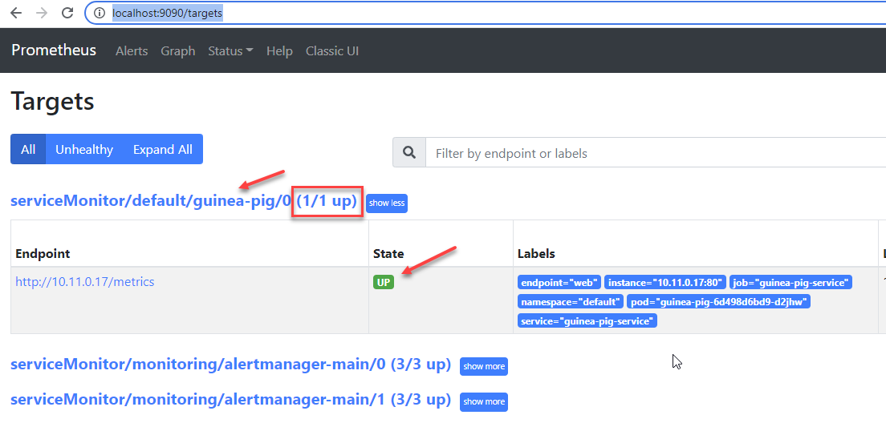

# lab-05 - deploy and configure Prometheus and Grafana

## Estimated completion time - 10 min

There are multiple distributions and ways to deploy `Prometheus` and `Grafana` into your cluster. You can use `Helm` or manifests files. It all depends on what is your post-provisioning cluster configuration strategy is. For our workshop we will use [prometheus-operator/kube-prometheus](https://github.com/prometheus-operator/kube-prometheus.git) distribution. This repository contains Kubernetes manifests, Grafana dashboards, and Prometheus rules combined with documentation and scripts to provide easy to operate end-to-end Kubernetes cluster monitoring with Prometheus using the Prometheus Operator.

This repository contains several releases. Check the [Kubernetes compatibility matrix](https://github.com/prometheus-operator/kube-prometheus#kubernetes-compatibility-matrix) and choose the correct release version for your cluster. For our workshop, as of today, we use Kubernetes version `1.22.4`, therefore we will use version from `main` branch.

## Goals

* deploy `Prometheus` and `Grafana`
* get access to `Prometheus` and `Grafana` dashboards 

## Task #1 - clone `kube-prometheus` repository and deploy kubernetes manifests 

```bash
# clone kube-prometheus repository
git clone git@github.com:prometheus-operator/kube-prometheus.git
cd kube-prometheus

# Create the namespace and CRDs
kubectl apply --server-side -f manifests/setup

# Check that Prometheus Custom Resource were created
kubectl -n monitoring get crd
NAME                                             CREATED AT
alertmanagerconfigs.monitoring.coreos.com        2022-02-11T20:45:31Z
alertmanagers.monitoring.coreos.com              2022-02-11T20:45:31Z
healthstates.azmon.container.insights            2022-02-11T20:31:32Z
podmonitors.monitoring.coreos.com                2022-02-11T20:45:31Z
probes.monitoring.coreos.com                     2022-02-11T20:45:31Z
prometheuses.monitoring.coreos.com               2022-02-11T20:45:32Z
prometheusrules.monitoring.coreos.com            2022-02-11T20:45:32Z
servicemonitors.monitoring.coreos.com            2022-02-11T20:45:32Z
thanosrulers.monitoring.coreos.com               2022-02-11T20:45:32Z
volumesnapshotclasses.snapshot.storage.k8s.io    2022-02-11T20:31:31Z
volumesnapshotcontents.snapshot.storage.k8s.io   2022-02-11T20:31:31Z
volumesnapshots.snapshot.storage.k8s.io          2022-02-11T20:31:31Z

# Deploy the remaining resources
kubectl apply -f manifests/

# Wait until all resources are created and wait until all pods are up and running
kubectl -n monitoring get po
NAME                                   READY   STATUS    RESTARTS   AGE
alertmanager-main-0                    2/2     Running   0          51s
alertmanager-main-1                    2/2     Running   0          51s
alertmanager-main-2                    2/2     Running   0          51s
blackbox-exporter-69894767d5-s8rf6     3/3     Running   0          74s
grafana-6c44468589-lq4xm               1/1     Running   0          69s
kube-state-metrics-c655879df-lrmqx     3/3     Running   0          68s
node-exporter-d9rbd                    2/2     Running   0          67s
node-exporter-zbkmk                    2/2     Running   0          67s
prometheus-adapter-6cf5d8bfcf-nwpjg    1/1     Running   0          63s
prometheus-adapter-6cf5d8bfcf-vh4sz    1/1     Running   0          63s
prometheus-k8s-0                       2/2     Running   0          51s
prometheus-k8s-1                       2/2     Running   0          51s
prometheus-operator-7b997546f8-4795v   2/2     Running   0          63s
```

The default distribution contains a lot of resources that we don't need for our workshop. The ones that we need are:

* prometheus-k8s-0 and prometheus-k8s-1 (highly available `Prometheus`)
* alertmanager-main-0 (1 and 2) - highly available `Alertmanager`
* grafana

All `Grafana` dashboards are stored as a [Kubernetes ConfigMap](https://kubernetes.io/docs/concepts/configuration/configmap/)

```bash
# get config maps
kubectl -n monitoring get cm
```

## Task #2 - access `Prometheus` and `Grafana` dashboards

`Prometheus` and `Grafana` dashboards can be accessed quickly using `kubectl port-forward` using commands below. 

### Prometheus 

```bash
# Access Prometheus dashboard
kubectl --namespace monitoring port-forward svc/prometheus-k8s 9090
```
Now you can access `Prometheus` UI via http://localhost:9090

### Grafana

```bash
# Access Grafana dashboard
kubectl --namespace monitoring port-forward svc/grafana 3000
```

Now you can access `Grafana` via http://localhost:3000

Use `admin:admin` as username and password and you will be asked to change `admin` password when you access it for the first time.

## Task #3 - deploy `guinea-pig` `ServiceMonitor`

Create new `serviceMonitor.yaml` file with the following content. 

```yaml
apiVersion: monitoring.coreos.com/v1
kind: ServiceMonitor
metadata:
  name: guinea-pig
  labels:
    team: iac
spec:
  selector:
    matchLabels:
      app: guinea-pig
  endpoints:
  - interval: 30s
    port: web
```

```bash
# deploy guinea-pig ServiceMonitor resource

kubectl apply -f serviceMonitor.yaml
servicemonitor.monitoring.coreos.com/guinea-pig created
```

Check that new `serviceMonitor/default/guinea-pig` target is shown under `Prometheus` Targets dashboard. Navigate to http://localhost:9090/targets (I assume that you still running port-forward command for `svc/prometheus-k8s` service)




## Useful links

* [prometheus-operator/kube-prometheus](https://github.com/prometheus-operator/kube-prometheus.git)
* [kubectl port-forward](https://kubernetes.io/docs/reference/generated/kubectl/kubectl-commands#port-forward)
* [Kubernetes ConfigMap](https://kubernetes.io/docs/concepts/configuration/configmap/)

## Next: monitoring AKS with Prometheus and Grafana

[Go to lab-06](../lab-06/readme.md)