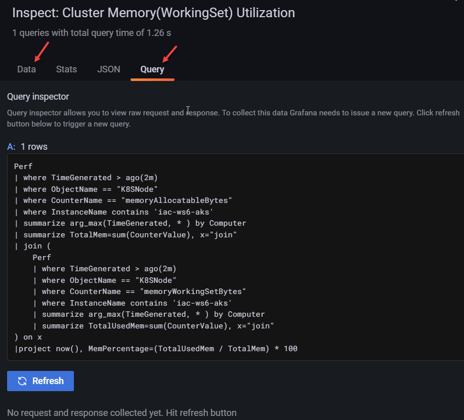

# lab-07 - use Azure Monitor Data Source in Grafana

## Estimated completion time - xx min

Grafana supports many different storage backends for your time series data (data source). Refer to [Add a data source](https://grafana.com/docs/grafana/latest/datasources/add-a-data-source/) for instructions on how to add a data source to Grafana. 

Grafana includes built-in support for Azure Monitor. The Azure Monitor data source supports visualizing data from three Azure services:

* Azure Monitor Metrics to collect numeric data from resources in your Azure account.
* Azure Monitor Logs to collect log and performance data from your Azure account, and query using the powerful Kusto Language.
* Azure Resource Graph to quickly query your Azure resources across subscriptions.


## Goals

* Create and configure Azure Monitor data source
* Explore Azure Log Analytics using Kusto query from Grafana
* Explore Azure Monitor resource metrics from Grafana
* Import AKS Monitor Container Grafana dashboard

## Task #1 - create an Azure AD application and service principal

We must create an Azure AD app registration and service principal to authenticate the data source from Grafana. 

> You must have sufficient permissions to register an application with your Azure AD tenant, and assign to the application a role in your Azure subscription.

If you are more comfortable working in the portal, [use the portal to create an Azure AD application and service principal](https://docs.microsoft.com/en-us/azure/active-directory/develop/howto-create-service-principal-portal#get-tenant-and-app-id-values-for-signing-in). 

Otherwise, use the following script:

```bash
# Get resource group resource id
az group show -n iac-ws6-rg --query id

# Create new SPN with  'Monitoring Reader' role at the iac-ws6-rg scope. Use resource group id from the previous query 
az ad sp create-for-rbac -n 'grafana-data-source-spn' --role 'Monitoring Reader' --scope <RG-ID> --years 3
```

If succeeded, you will get the following json back

```json
{
  "appId": "...",
  "displayName": "grafana-data-source-spn",
  "password": "...",
  "tenant": "..."
}
```

Don't close this window or copy result somewhere. We will need this information at the next Task when we create Azure Monitor Data Source.

## Task #2 - add Azure Monitor Data Source into Grafana

First, make sure that you still have access to your Grafana instance.

```bash
# Access Grafana dashboard
kubectl --namespace monitoring port-forward svc/grafana 3000
```

Navigate to `Data sources` http://localhost:3000/datasources and click `Add data source`


Search for `azure` and select `Azure Monitor` data source


Use `appId`, `tenant` and `password` from the `Task #1` to enter `Directory (tenant) ID`, `Application (client) ID` and `Client Secret`. 

When you enter all three fields, the `Load subscription` button will become available. Clit it and if your subscription will be loaded. 


Next, click `Save & test` and you should see that Grafana
1. Successfully queried the Azure Monitor service. 
2. Successfully queried the Azure Log Analytics service.


You can also find a list of dashboards from `GrafanaLabs` that use Azure Monitor data source. Import one called `Azure App monitoring - Application Insights`.


## Task #3 - explore data from Azure Log Analytics in grafana

With data source in place, we can can query data from Log Analytics. Navigate to `Explore` at the left menu and select `Azure Monitor` (or however you named your data source) from data source list.


We will query Log analytics, therefore select `Logs` as a `Service`. 


Click `Select resource` and select Log Analytics workspace from `iac-ws6-rg`. If you follow naming convention, it should be called `iac-ws6-uniqueid-la`. Click `Apply`.


Now you can write and execute [Kusto](https://docs.microsoft.com/en-us/azure/data-explorer/kusto/query/tutorial?WT.mc_id=AZ-MVP-5003837&pivots=azuredataexplorer) queries. Use the query below to get `cpuUsageNanoCores` metrics for our GuineaPig `api` containers.

```sql
Perf
| where $__timeFilter(TimeGenerated)    
| where ObjectName == 'K8SContainer'
| where InstanceName contains "api"
| where CounterName == 'cpuUsageNanoCores'
| order by TimeGenerated asc
| project TimeGenerated, InstanceName, CounterValue
```

Note, that it allows to choose how to format results. It supports `Table` and `Time series`.


If you select `Table`, the result will be presented as a regular table.


If you chose `Time series`, then grafana will try to visualize it as a time series (type of `Lines` by default)


## Task #4 - explore Azure metrics

You can use Azure Monitor data source to query Azure Resource metrics. The example below show how you can get `CPU Usage Millicores` metric for your AKS cluster.

Navigate to `Explore` at the left side menu. Select `Azure Monitor` as a data source and `Metrics` as a Service.


Then select the following information elements:

1. Subscription 
2. Resource group -> iac-ws6-rg
3. Resource type -> Kubernetes service
4. Resource name -> iac-ws6-aks
5. metric namespace -> `Microsoft.ContainerService/managedClusters`
6. Metric -> `CPU Usage Millicores` 


and you should get graph similar to the one below.


## Task #5 - import AKS Monitor Container dashboard

As you've just learned, you can query pretty much any type of metrics from Azure Monitor and you can compose them into Grafana dashboards. As an example, I took existing [AKS Monitor Container](ttps://grafana.com/grafana/dashboards/12817) Grafana dashboard from [GrafanaLabs dashboard library](https://grafana.com/grafana/dashboards/). I used it at one of my projects before, but now I needed to adjust it a bit, therefore we will import it from our repo, not from the original `GrafanaLabs` repo.

To import Grafana dashboard, navigate to http://localhost:3000/dashboards or click yourself via left menu `Dashboards -> Browse` and click `Import`.


Click `Upload JSON file` and select `06-monitoring-options-in-aks\dashboards\AKS Monitor Container-1644874521059.json` file.


Select folder you want this dashboard to be imported to and Azure Monitor data source and click `Import`.


If import went well, you should see the following dashboard.


If you have several Azure Monitor data sources, AKS or Log Analytics instances under your subscription, you may need to select the correct values at the top of the dashboard.


If you want to see pods or namespace specific metrics, you can change namespaces at the same menu.

## Task #6 - inspect, edit or explore dashboard elements

If you are curious what queries are used behind the panel elements. This is a very good way to learn `Kusto` and Grafana.

### Inspect Data and Query

if you just want to lok at data and query, select `Inspect->Data` or `Inspect->Query`


Depending what you select, you will end-up at the `Data` or `Query` tab of Inspect window.



### Edit panel

If you want to apply some changes to the panel, click `Edit`


You will be switched into Edit mode where you can change query, titles and adjust graphical elements of of the panel. 

You can always get back to the dashboard from the top menu.


### Explore

By clicking `Explore`, you will be switched to the `Explore` mode with preloaded query from the panel.


## Useful links

* [Azure Monitor data source](https://grafana.com/docs/grafana/latest/datasources/azuremonitor/)
* [Add a data source](https://grafana.com/docs/grafana/latest/datasources/add-a-data-source/)
* [Grafana data source as code - or how to automate deployment of Azure Monitor data sources to Grafana for multi-team setup](https://borzenin.com/grafana-data-source-as-code-or-how-to-deploy-azure-monitor-data-course-to-grafana/)
* [Use the portal to create an Azure AD application and service principal that can access resources](https://docs.microsoft.com/en-us/azure/active-directory/develop/howto-create-service-principal-portal?WT.mc_id=AZ-MVP-5003837)
* [Azure Monitor Log Analytics API Overview](https://docs.microsoft.com/en-gb/azure/azure-monitor/logs/api/overview?WT.mc_id=AZ-MVP-5003837)
* [Kusto](https://docs.microsoft.com/en-us/azure/data-explorer/kusto/query/tutorial?WT.mc_id=AZ-MVP-5003837&pivots=azuredataexplorer)

## Next: cleaning up resources

[Go to lab-08](../lab-08/readme.md)