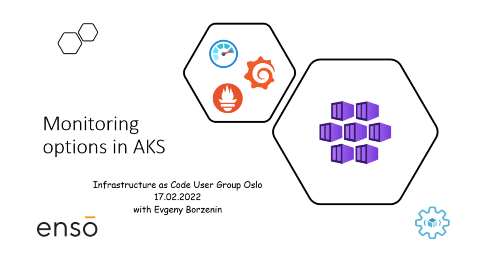

# Workshop #6 - Monitoring options in AKS

This is an introduction level workshop that covers monitoring aspects of AKS and you will learn:

* What monitoring options are available for AKS
* How to monitor AKS with Azure Monitor
* How to collect Prometheus Metrics with Azure Monitor
* How to monitor AKS with Prometheus and Grafana
* How to query Azure Monitor Metrics in Grafana

## Agenda
 
 * Welcome
 * [Lab-01](labs/lab-01/readme.md) - provision workshop resources 
 * [Lab-02](labs/lab-02/readme.md) - build and deploy test application 
 * [Lab-03](labs/lab-03/readme.md) - monitoring AKS with Azure Container insights
 * [Lab-04](labs/lab-04/readme.md) - configure scraping of Prometheus metrics with Azure Monitor
 * [Lab-05](labs/lab-05/readme.md) - deploy and configure Prometheus and Grafana
 * [Lab-06](labs/lab-06/readme.md) - monitoring AKS with Prometheus and Grafana
 * [Lab-07](labs/lab-07/readme.md) - use Azure Monitor Data Source in Grafana
 * [Lab-08](labs/lab-08/readme.md) - cleaning up resources
## Links

* [Prerequisites](prerequisites.md)
* [Azure Kubernetes Service (AKS)](https://docs.microsoft.com/en-us/azure/aks/?WT.mc_id=AZ-MVP-5003837)
* [Monitoring Azure Kubernetes Service (AKS) with Azure Monitor](https://docs.microsoft.com/en-us/azure/aks/monitor-aks?WT.mc_id=AZ-MVP-5003837)
* [Prometheus](https://prometheus.io/)
* [Grafana](https://grafana.com/grafana/)

## Feedback

* Visit the [Github Issue](https://github.com/evgenyb/aks-workshops/issues/xx) to comment on this workshop. 
